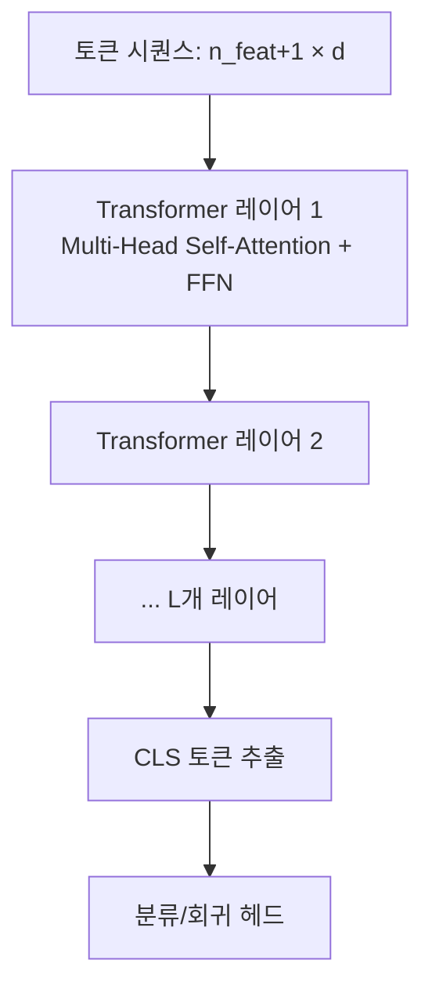
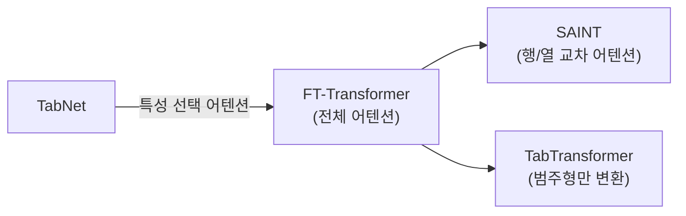

# FT-Transformer (Feature Tokenizer + Transformer)

FT-Transformer(Gorishniy et al., 2021, Yandex Research)는 테이블 데이터를 위해 [[transformer-architecture]] 를 직접 적용한 아키텍처다. 핵심 아이디어는 단순하면서 강력하다: **각 특성(feature)을 하나의 토큰으로 변환**하고, 표준 Transformer로 특성 간 상호작용을 모델링한다.

## 핵심 아이디어: 특성 토크나이제이션

NLP에서 단어를 토큰으로, 컴퓨터 비전에서 이미지 패치를 토큰으로 다루듯, FT-Transformer는 **각 열(column)을 하나의 토큰**으로 취급한다.

### Feature Tokenizer 구조

```mermaid
flowchart TD
    subgraph 수치형 특성
        N1[특성값 x_j\n스칼라] --> |W_j * x_j + b_j| E1[임베딩 e_j\nd차원 벡터]
    end
    subgraph 범주형 특성
        C1[범주 인덱스 c_j] --> |임베딩 룩업 E_j[c_j]| E2[임베딩 e_j\nd차원 벡터]
    end
    E1 & E2 --> Stack[스택: n_features × d 행렬]
    Stack --> |CLS 토큰 추가| Tokens[토큰 시퀀스\nn_features+1 × d]
```

**수치형 특성**: $e_j = x_j \cdot W_j + b_j$ (스칼라에 학습 가능 벡터를 곱해 d차원 임베딩 생성)

**범주형 특성**: 각 범주값에 대한 독립적인 임베딩 행렬 $E_j \in \mathbb{R}^{C_j \times d}$ 룩업

이 단순한 토크나이제이션으로 이종 데이터(수치형 + 범주형 혼합)를 통일된 임베딩 공간으로 가져온다.

## Transformer 적용



표준 Transformer 레이어를 그대로 사용한다:
- Multi-Head Self-Attention: 모든 특성 쌍 간 상호작용 학습
- Feed-Forward Network: 특성별 비선형 변환
- Pre-Norm (Layer Normalization 먼저 적용) 구조

CLS 토큰의 최종 표현을 예측 헤드에 입력한다.

## 핵심 장점: 특성 간 어텐션 시각화

FT-Transformer의 어텐션 행렬을 분석하면 **어떤 특성이 어떤 특성을 참조하는지** 해석할 수 있다. 이는 [[tabular-feature-interaction]] 에서 다루는 특성 상호작용의 모델 내재적 포착이다.

예를 들어, `나이` 토큰이 `소득` 토큰에 강한 어텐션을 보인다면, 이 두 특성이 예측에 함께 기여함을 시사한다.

## [[transformer-architecture]] 와의 차이

| 측면 | NLP Transformer | FT-Transformer |
|------|-----------------|----------------|
| 토큰 정의 | 단어/서브워드 | 특성 열 |
| 시퀀스 길이 | 문장 길이 (수백-수천) | 특성 수 (수십-수백) |
| 위치 인코딩 | 필요 (순서 있음) | 불필요 (특성 순서 무관) |
| 사전학습 | 대규모 코퍼스 | 없음 (도메인별 학습) |
| 어텐션 의미 | 단어 간 문맥 의존 | 특성 간 교호작용 |

위치 인코딩이 없다는 점이 흥미롭다 - 테이블 데이터에서 열 순서는 의미가 없기 때문이다.

## ResNet 기준선 대비 성능

동 논문에서 저자들은 FT-Transformer 외에 **ResNet** 기준선도 제시했다. 결과적으로:
- FT-Transformer는 ResNet을 대부분 태스크에서 앞섬
- 그러나 XGBoost/[[tabular-ml|LightGBM]] 대비 개선 폭은 데이터셋 의존적
- 특성 수가 적은 데이터에서는 오버헤드 대비 이점이 불명확

## MLP-Mixer 계열과의 비교

FT-Transformer와 유사한 시기에 여러 "Transformer for tabular" 모델이 나왔다:



- **TabTransformer**: 범주형 특성만 토크나이즈, 수치형은 그대로 연결
- **FT-Transformer**: 모든 특성 토크나이즈 (본 페이지)
- **[[saint-attention-tabular|SAINT]]**: 특성 어텐션에 더해 샘플 간 어텐션 추가

## 실용적 고려사항

**메모리**: 특성 수 $n$에 대해 어텐션이 $O(n^2)$ 메모리를 사용한다. 특성 수 수백까지는 실용적이나, 수천 특성에서는 부담이 된다.

**하이퍼파라미터**: 레이어 수(`n_layers`), 어텐션 헤드 수(`n_heads`), 임베딩 차원(`d`) 조정이 핵심이다.

**[[tabular-ml]] 실무 가이드**: 충분한 학습 데이터(수만 행 이상)와 복잡한 특성 교호작용이 있을 때 FT-Transformer가 GBDT와 경쟁할 만한 선택지가 된다.

## 관련 문서

- [[tabular-ml]] - 테이블 데이터 ML 전반 및 현대 벤치마크
- [[transformer-architecture]] - 어텐션 메커니즘 및 Transformer 구조 기초
- [[tabnet-architecture]] - 커스텀 순차 어텐션 기반 TabNet
- [[saint-attention-tabular]] - 행/열 양방향 어텐션 SAINT
- [[tabular-feature-interaction]] - 특성 교호작용 일반 개념
