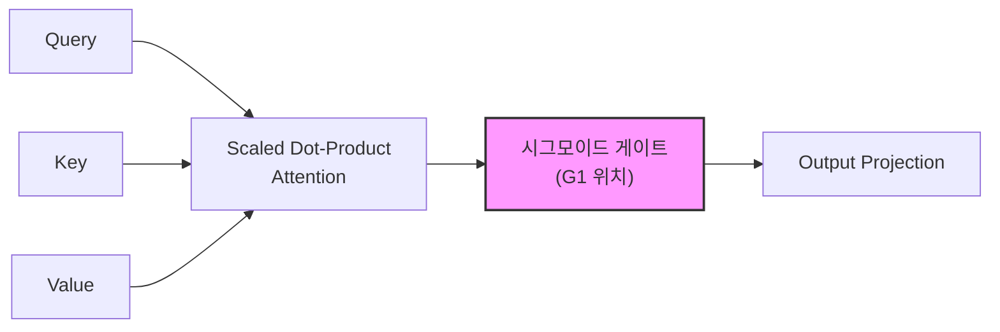

# Gated Attention

Scaled Dot-Product Attention(SDPA) 출력에 학습 가능한 시그모이드 게이트를 적용하여 비선형성, 스파시티(sparsity), 학습 안정성을 동시에 달성하는 어텐션 메커니즘. Alibaba Qwen 팀이 체계적으로 탐구했으며, NeurIPS 2025 Best Paper로 선정되었다.

## 왜 지금 중요한가

표준 트랜스포머의 어텐션은 소프트맥스 이후 추가 비선형 변환 없이 값(Value)을 가중 합산한다. Gated Attention은 이 지점에 시그모이드 게이트를 삽입하여 세 가지 구조적 문제를 해결한다: (1) 학습 중 loss spike 제거, (2) attention sink 현상 완화, (3) 장문맥(long-context) 외삽 성능 향상. Qwen3-Next-80B-A3B에 실전 적용되어 1M 토큰 컨텍스트를 안정적으로 지원한다.

## 아키텍처 상세

### 게이트 배치 위치

논문은 어텐션 블록 내 5가지 게이트 배치 위치(G1~G5)를 체계적으로 탐구했다. 가장 효과적인 위치는 **G1 -- SDPA 직후의 요소별(element-wise) 시그모이드 게이트**였다.



### 구현 변형

| 변형 | 설명 |
|---|---|
| Gate Headwise | 헤드별 스칼라 게이트 -- 각 어텐션 헤드에 하나의 게이트 값 |
| Gate Elementwise | 요소별 게이트 -- 어텐션 출력의 각 요소에 독립적 게이트 값 |

두 변형 모두 쿼리 의존적(query-dependent)으로, 입력에 따라 게이트 값이 달라진다.

### 핵심 설정 플래그

```python
# Qwen3 아키텍처 기준
config.headwise_attn_output_gate = True   # 헤드별 게이팅
config.elementwise_attn_output_gate = True # 요소별 게이팅
```

## 달성하는 세 가지 효과

### 1. 비선형성 (Non-linearity)

SDPA 출력에 시그모이드를 적용하여 어텐션 계층에 추가적 비선형 변환을 도입한다. 이는 표현력을 높이면서도 기존 어텐션의 구조를 크게 변경하지 않는다.

### 2. 입력 의존적 스파시티 (Sparsity)

시그모이드 게이트가 0에 가까운 값을 출력하면 해당 어텐션 출력이 억제된다. 이를 통해 모델이 불필요한 어텐션을 자동으로 제거하며, attention sink(특정 토큰에 어텐션이 과도하게 집중되는 현상)를 방지한다.

### 3. 학습 안정성 (Training Stability)

Gated Attention의 가장 실용적인 기여는 **학습 중 loss spike 제거**다. 이를 통해 더 큰 학습률(learning rate)을 사용할 수 있어 학습 효율이 향상된다.

## 실험 규모

NeurIPS 2025 Best Paper 선정의 근거가 된 실험은 다음과 같다:

- **30개 모델 변형** 비교
- **3.5조 토큰** 규모의 학습
- G1~G5 위치별, headwise/elementwise별 체계적 비교
- 장문맥 외삽 성능 검증

## 실전 적용: Qwen3-Next

Gated Attention은 Qwen3-Next-80B-A3B-Instruct에 통합되었다.

- 최대 1M 토큰 컨텍스트 지원
- 학습 안정성 유지
- `modeling_qwen3.py`의 `Qwen3Attention` 클래스에서 구현

1M 토큰 컨텍스트 지원은 코딩 에이전트가 대형 코드베이스 전체를 컨텍스트에 유지하는 데 직접 활용된다. [[how-coding-agents-work|코딩 에이전트 작동 원리]]에서 핵심 병목 중 하나인 "컨텍스트 일관성 유지" 문제를 게이트가 자동으로 완화해 준다.

## NeurIPS 2025 수상 정보

**논문 제목**: "Gated Attention for Large Language Models: Non-linearity, Sparsity, and Attention-Sink-Free"

**저자**: Zihan Qiu, Zekun Wang, Bo Zheng, Zeyu Huang, Kaiyue Wen, Songlin Yang, Rui Men, Le Yu, Fei Huang, Suozhi Huang, Dayiheng Liu, Jingren Zhou, Junyang Lin

NeurIPS 2025 메인 트랙 4개 Best Paper 중 하나로 선정. "SDPA 뒤에 헤드별 시그모이드 게이트를 적용하면 일관되게 성능이 향상된다"는 핵심 발견이 평가됨.

## 대표 자료

- [NeurIPS 2025 Best Paper Review: Qwen's Gated Attention (Towards Data Science)](https://towardsdatascience.com/neurips-2025-best-paper-review-qwens-systematic-exploration-of-attention-gating/)
- [Alibaba Qwen Wins NeurIPS 2025 Best Paper (Alizila)](https://www.alizila.com/alibaba-qwen-wins-neurips-2025-best-paper-award-for-breakthrough-in-attention-mechanisms/)
- [gated_attention (GitHub)](https://github.com/qiuzh20/gated_attention)
- [NeurIPS 2025 Best Paper Awards](https://blog.neurips.cc/2025/11/26/announcing-the-neurips-2025-best-paper-awards/)

## 관련 문서

- [[multi-head-latent-attention]] -- MLA, 다른 어텐션 효율화 접근
- [[superposition-neural-scaling]] -- 표현 중첩과 스케일링, 같은 NeurIPS 2025
- [[long-context-scaling]] -- 장문맥 스케일링
- [[mamba-3]] -- 선형 어텐션 대안 아키텍처
- [[how-coding-agents-work]] -- 코딩 에이전트 구조 (장문맥 안정성이 핵심 요구사항)
