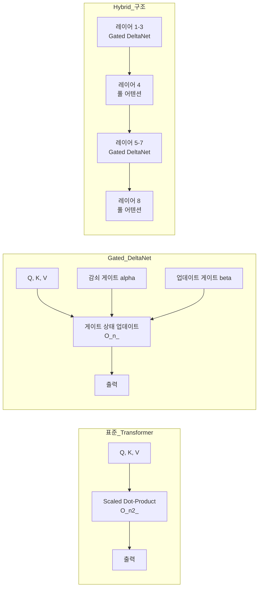

# Gated DeltaNet & Hybrid Linear Attention

Mamba2의 게이팅 메커니즘과 델타 룰(delta rule)을 결합한 선형 트랜스포머 아키텍처다. ICLR 2025에서 발표되었으며, Qwen3-Next가 75% 선형/25% 풀 어텐션 하이브리드 구조로 채택하면서 상용 모델에서의 실용성을 입증했다.

## 왜 지금 중요한가

표준 Transformer의 O(n^2) 어텐션은 긴 시퀀스에서 연산 비용이 급격히 증가한다. Gated DeltaNet은 O(n) 선형 복잡도로 이 문제를 해결하면서도, 기존 선형 어텐션의 약점이던 검색(retrieval)과 장문맥(long-context) 작업에서 크게 개선된 성능을 보인다. 2026년 현재 Qwen3-Next, Kimi Linear 등 상용 모델들이 하이브리드 선형 어텐션을 채택하며, 순수 Transformer에서 하이브리드 아키텍처로의 전환이 본격화되고 있다.

## 아키텍처 비교

## 복잡도 비교

| 항목 | 표준 MHA | Gated DeltaNet |
|------|----------|----------------|
| 시간 복잡도 | O(n^2) | O(n) |
| KV 캐시 크기 | batch x n_tokens x n_heads x d_head x 2 | batch x n_heads x d_head^2 (토큰 수 독립) |
| 메모리 스케일링 | 컨텍스트 길이에 비례 | 고정 크기 |
| 전역 컨텍스트 | 완전 접근 | 메모리 병목 존재 |

## Qwen3-Next의 하이브리드 채택

Qwen3-Next는 3:1 비율로 Gated DeltaNet과 풀 어텐션 레이어를 교차 배치한다:

- 48개 레이어 중 36개(75%)가 Gated DeltaNet (선형 어텐션)
- 12개(25%)가 표준 풀 어텐션
- 4개 연속 블록 패턴: 선형 - 선형 - 선형 - 풀 어텐션
- MoE(Mixture of Experts) 컴포넌트와 통합

이 구조는 선형 어텐션의 효율성과 풀 어텐션의 전역 컨텍스트 모델링 능력을 균형 있게 결합한다.

## 성능 결과

Gated DeltaNet은 다음 벤치마크에서 Mamba2와 DeltaNet을 일관되게 상회한다:

- **언어 모델링**: 학습 퍼플렉시티(perplexity) 개선
- **상식 추론**: 제로샷 벤치마크에서 우위
- **인컨텍스트 검색**: 기존 선형 어텐션 대비 큰 폭 개선
- **길이 외삽**: 학습 시퀀스를 초과하는 길이에서도 성능 유지
- **장문맥 이해**: NVIDIA RULER needle-in-haystack 테스트 통과

## Gated Attention과의 비교

| 항목 | Gated Attention (NeurIPS 2025) | Gated DeltaNet (ICLR 2025) |
|------|------|------|
| 기반 | SDPA + 시그모이드 게이트 | 순환 상태 업데이트 |
| 복잡도 | O(n^2) (여전히 2차) | O(n) (선형) |
| 메모리 | 컨텍스트에 비례 | 고정 크기 |
| 게이트 활성화 | Sigmoid | SiLU |
| 접근법 | 어텐션에 게이트 추가 | 어텐션 자체를 순환 구조로 대체 |

## 대표 레퍼런스

- [Gated Delta Networks: Improving Mamba2 with Delta Rule -- arXiv](https://arxiv.org/abs/2412.06464)
- [GatedDeltaNet -- NVIDIA Research (GitHub)](https://github.com/NVlabs/GatedDeltaNet)
- [Beyond Standard LLMs -- Sebastian Raschka](https://magazine.sebastianraschka.com/p/beyond-standard-llms)

## 관련 페이지

- [[mamba-3|Mamba-3: 차세대 상태 공간 모델]]
- [[long-context-scaling|Long Context Scaling]]
- [[multi-head-latent-attention|Multi-Head Latent Attention]]
- [[deepseek-sparse-attention|DeepSeek Sparse Attention]]
