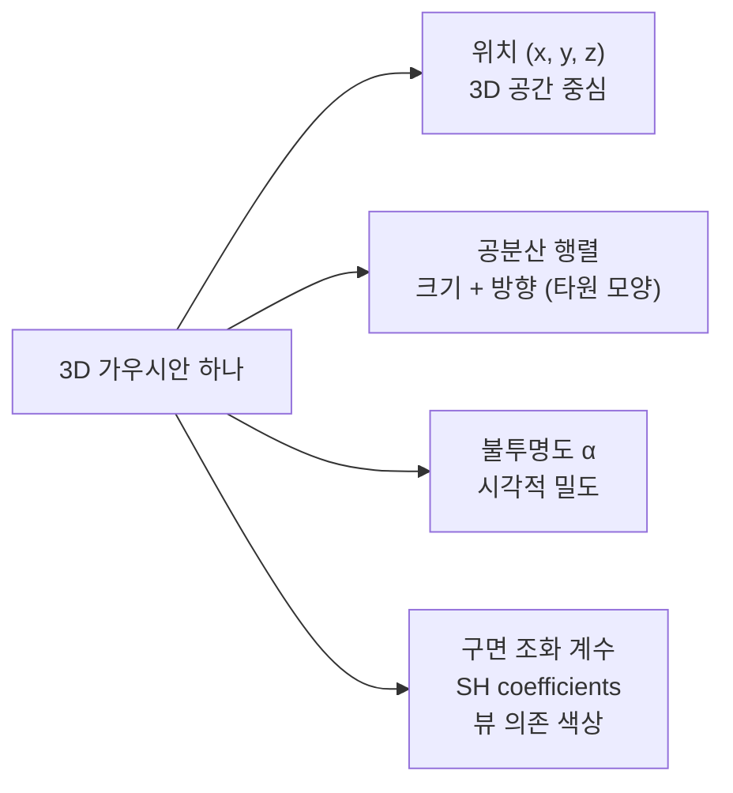
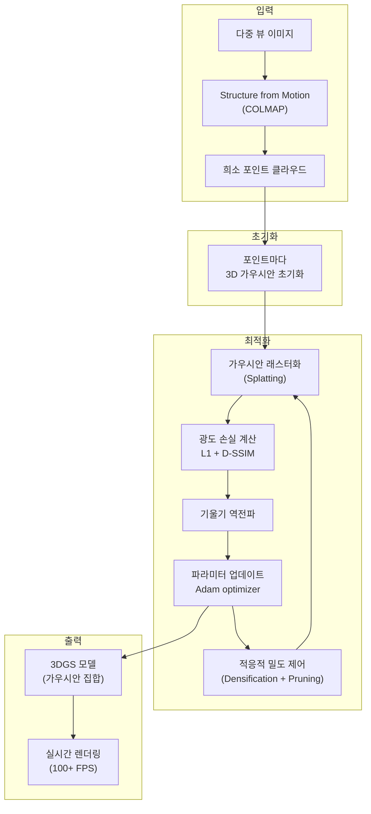
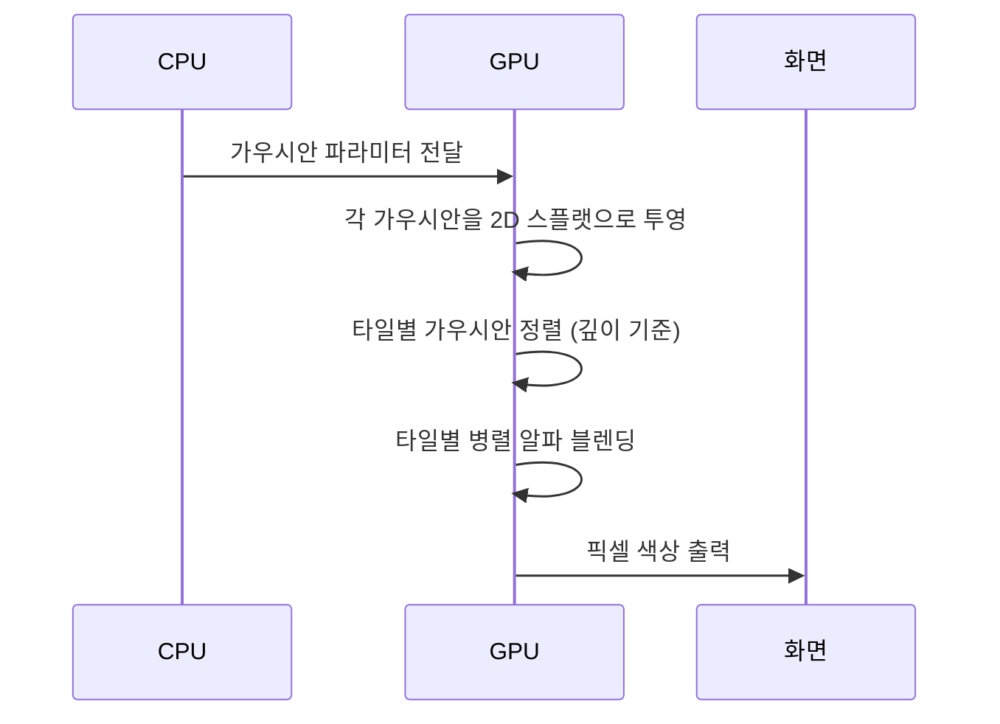
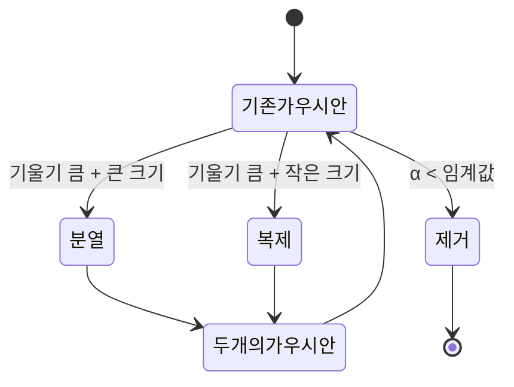
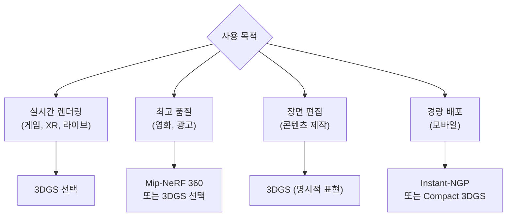

# 3D Gaussian Splatting (3DGS)

3D Gaussian Splatting(3DGS)은 3차원 장면을 수백만 개의 **가우시안(Gaussian) 타원체**로 명시적으로 표현하고, 이를 카메라 뷰 방향으로 투영(splatting)해 실시간 렌더링을 달성하는 기법이다. 2023년 SIGGRAPH에 발표되어 NeRF (Neural Radiance Fields) 이후 3D 재구성의 새로운 표준으로 부상했다.

> "3D Gaussian Splatting for Real-Time Radiance Field Rendering" (Kerbl et al., SIGGRAPH 2023)

---

## NeRF vs 3DGS: 핵심 패러다임 차이

| 항목 | [[nerf-neural-radiance-fields]] | 3D Gaussian Splatting |
|-----|--------|------------|
| 표현 방식 | 암묵적 (신경망이 연속 함수 학습) | 명시적 (가우시안 파라미터 집합) |
| 렌더링 방법 | 볼류메트릭 레이 마칭 | 래스터화 기반 투영(splatting) |
| 훈련 시간 | 수 시간 (Instant-NGP 이후 수 분) | 수십 분 |
| 렌더링 속도 | 수 초/프레임 ~ 실시간 (Instant-NGP) | **실시간 (100+ FPS)** |
| 편집 용이성 | 어려움 (암묵적 표현) | 상대적으로 쉬움 (명시적) |
| 메모리 | 모델 크기 작음 | 가우시안 수에 비례 (수 GB) |

---

## 가우시안 표현의 구조

각 3D 가우시안은 다음 파라미터를 갖는다:



**공분산 행렬 분해**

공분산 $\Sigma$는 직접 최적화 시 양정치(positive definite) 제약이 어렵다. 따라서 **스케일 행렬 S와 회전 행렬 R로 분해**해 안정적으로 학습:

$$\Sigma = R S S^T R^T$$

- $S$: 대각 행렬로 3축 스케일 (타원의 세 반축 길이)
- $R$: 쿼터니언(quaternion)으로 표현된 회전

**구면 조화 함수 (SH)**

색상을 단일 RGB가 아닌 구면 조화 계수로 저장해 뷰 방향에 따른 색 변화(반사, 광택)를 표현한다.

$$c(\mathbf{d}) = \sum_{l=0}^{L} \sum_{m=-l}^{l} c_l^m Y_l^m(\mathbf{d})$$

여기서 $Y_l^m$은 구면 조화 기저 함수, $\mathbf{d}$는 시선 방향이다.

---

## 3DGS 파이프라인



각 단계의 역할:

1. **SfM 초기화**: COLMAP으로 카메라 포즈와 희소 3D 포인트를 추정한다. 이 포인트들이 가우시안의 초기 위치가 된다.
2. **래스터화 (Splatting)**: 각 가우시안을 카메라 뷰에 투영한다. GPU 래스터 파이프라인 활용으로 고속 처리.
3. **적응적 밀도 제어**: 훈련 중 높은 기울기를 보이는 영역에 가우시안을 추가(densify)하고, 불투명도가 낮은 가우시안을 제거(prune)한다.

---

## 렌더링 과정: Splatting 상세

3DGS의 렌더링은 전통적인 레이 마칭과 다른 **타일 기반 래스터화**를 사용한다.



**알파 블렌딩 수식**

픽셀 색상은 깊이 순서로 정렬된 가우시안의 블렌딩:

$$C = \sum_{i \in N} c_i \alpha_i \prod_{j < i}(1 - \alpha_j)$$

여기서 $c_i$는 $i$번째 가우시안의 색상, $\alpha_i$는 해당 픽셀에서의 불투명도다.

---

## 적응적 밀도 제어

훈련 과정에서 가우시안 수를 동적으로 관리한다:



- **분열(Split)**: 가우시안이 너무 크고 디테일을 커버하지 못할 때 두 개로 분열
- **복제(Clone)**: 작은 가우시안이 있어야 할 영역에 복제 추가
- **제거(Prune)**: 투명한 가우시안 제거로 메모리 절약

---

## 성능 비교

실제 장면 재구성 실험 (Tanks & Temples, Mip-NeRF 360 등) 기준:

| 방법 | 학습 시간 | 렌더링 FPS | PSNR | 메모리 |
|-----|---------|----------|------|-------|
| NeRF (원본) | 1-2일 | < 1 | ~26 | 수 MB |
| Instant-NGP | 5분 | 수십 | ~29 | ~50MB |
| Mip-NeRF 360 | 수 시간 | < 1 | **~30** | 수 MB |
| **3DGS (원본)** | **35분** | **130+** | ~30 | **~1GB** |
| Scaffold-GS | 25분 | 100+ | **~31** | 수백 MB |

3DGS는 품질(PSNR)과 속도(FPS)를 동시에 달성한 점에서 혁신적이다.

---

## 주요 후속 연구

### 압축 및 효율화

| 연구 | 핵심 기여 |
|-----|---------|
| Compact3D | 벡터 양자화로 가우시안 파라미터 압축 |
| LightGaussian | 중요도 기반 가우시안 가지치기 |
| Mini-Splatting | 작은 수의 가우시안으로 동등 품질 |

### 동적 장면

| 연구 | 핵심 기여 |
|-----|---------|
| Dynamic 3DGS | 시간 축 가우시안 변형 추적 |
| 4D Gaussian Splatting | 4차원 시공간 가우시안 |
| SC-GS | 변형 가능한 가우시안으로 사람/물체 추적 |

### 생성 모델과 결합

| 연구 | 핵심 기여 |
|-----|---------|
| GaussianDreamer | Score Distillation + 3DGS로 텍스트→3D |
| DreamGaussian | 단일 이미지→3DGS 3D 재구성 |
| GaussianEditor | 텍스트 기반 3DGS 편집 |

---

## [[nerf-neural-radiance-fields]]와의 선택 기준



---

## 실무 구현

**공식 구현 (CUDA 최적화)**

```bash
# 공식 3DGS 리포지토리 클론
git clone https://github.com/graphdeco-inria/gaussian-splatting
cd gaussian-splatting

# 의존성 설치 (CUDA 11.8+ 필요)
pip install plyfile tqdm submodules/diff-gaussian-rasterization
pip install submodules/simple-knn
```

**HuggingFace Transformers 기반 gsplat**

```python
# gsplat 라이브러리 사용 (PyTorch 네이티브)
import torch
from gsplat import rasterization

# 가우시안 파라미터 초기화
means = torch.randn(10000, 3, device="cuda")       # 3D 위치
quats = torch.rand(10000, 4, device="cuda")         # 회전 쿼터니언
scales = torch.rand(10000, 3, device="cuda")        # 스케일
opacities = torch.rand(10000, device="cuda")        # 불투명도
colors = torch.rand(10000, 3, device="cuda")        # RGB 색상

# 렌더링
render_colors, render_alphas, info = rasterization(
    means=means,
    quats=quats,
    scales=scales,
    opacities=opacities,
    colors=colors,
    viewmats=viewmats,    # 카메라 뷰 행렬 [C, 4, 4]
    Ks=Ks,                # 카메라 내부 행렬 [C, 3, 3]
    width=800,
    height=600,
)
```

---

## 왜 중요한가

**3D 콘텐츠 제작의 민주화**
NeRF 이전에는 3D 재구성에 고가 장비(LiDAR, 포토그래메트리 스튜디오)가 필요했다. NeRF가 이를 스마트폰 사진으로 가능하게 했고, 3DGS는 거기에 **실시간 인터랙티브 뷰잉**을 추가했다.

**VR/AR/XR 파이프라인 혁신**
기존 VR 콘텐츠는 3D 아티스트가 수작업으로 제작한 폴리곤 메시가 필요했다. 3DGS를 통해 실제 공간을 촬영해 즉시 VR 환경으로 변환하는 workflow가 가능해졌다.

**자율주행 시뮬레이션**
LiDAR + 카메라 데이터로 3DGS를 생성하고, 이를 시뮬레이션 환경으로 활용하는 방향이 탐구되고 있다.

---

## 관련 문서

- [[nerf-neural-radiance-fields]] - 3DGS의 전임 기법, 암묵적 표현 방식
- [[3d-point-cloud]] - 3DGS의 초기화 기반이 되는 포인트 클라우드
- [[neural-rendering]] - 3DGS가 속하는 신경망 렌더링 큰 범주
- [[diffusion-models]] - 3DGS와 결합한 생성 모델 연구
- [[gaussian-process|gaussian-processes]] - 가우시안 통계적 기반
