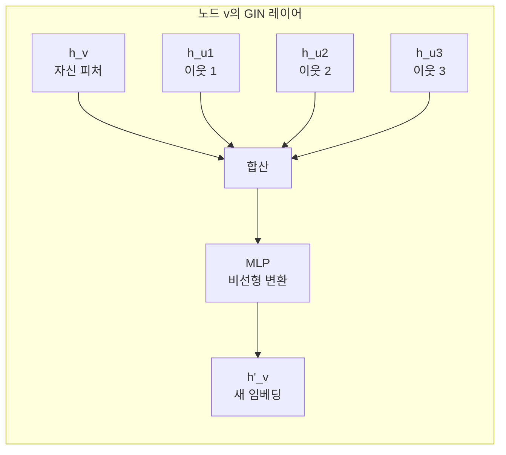

# GIN - 그래프 동형 네트워크

## 개요

GIN(Graph Isomorphism Network)은 Xu et al.(2019, MIT/Stanford)이 제안한 그래프 신경망으로, GNN의 **이론적 표현력 상한**을 분석하고 그 상한에 도달하는 아키텍처를 설계한 것이 핵심 기여다.

핵심 질문: "GNN은 두 그래프가 구조적으로 동일한지(그래프 동형, graph isomorphism) 구별할 수 있는가?"

이 논문은 대부분의 GNN(GCN, [[graphsage-inductive-gnn|GraphSAGE]] 등)이 **1-WL(Weisfeiler-Leman) 테스트**와 동등하거나 그보다 약한 표현력을 가진다는 것을 증명하고, 1-WL 테스트와 **동등한** 표현력을 가진 GNN을 설계한다.

## 왜 중요한가

GNN의 표현력은 실용적 질문과 직결된다:

- 같은 화학 구조를 가진 분자를 동일하게 인식하는가?
- 서로 다른 그래프 구조를 구별할 수 있는가?
- 어떤 집계 함수가 표현력을 최대화하는가?

GIN 이전에는 이런 질문에 이론적 답변이 없었다. GIN은 GNN 표현력의 수학적 프레임워크를 제공해 이후 수십 개 연구의 기초가 됐다.

## WL(Weisfeiler-Leman) 동형 테스트

WL 테스트는 그래프 동형 여부를 판별하는 고전적 알고리즘이다.

```mermaid
flowchart TD
    Init[모든 노드에 초기 레이블 할당] --> Iter[반복]
    Iter --> Collect[이웃 레이블 수집]
    Collect --> Hash[해시 함수로 새 레이블 생성\nlabel_v = hash(label_v, sort(label_neighbors))]
    Hash --> Check{레이블 분포\n변화 있는가?}
    Check -->|예| Iter
    Check -->|아니오| Result[최종 레이블 분포 비교\n동일하면 동형 가능성]
```

**WL 테스트의 한계**: 일부 비동형 그래프(예: 규칙적인 그래프)를 동일하게 분류하는 경우 존재. 즉, 1-WL 테스트가 구별하지 못하는 그래프는 GNN도 구별할 수 없다.

## GNN 표현력의 이론적 분석

### 집계 함수와 단사성(Injectivity)

GNN에서 메시지 전달(message passing)은 이웃 집합(multiset)을 집계 함수로 압축한다:

$$a^k_v = \text{AGGREGATE}^k\left(\{h^{k-1}_u : u \in \mathcal{N}(v)\}\right)$$

$$h^k_v = \text{COMBINE}^k\left(h^{k-1}_v, a^k_v\right)$$

논문의 핵심 정리: GNN이 그래프를 최대한 구별하려면, AGGREGATE와 COMBINE이 **단사(injective)**해야 한다 — 즉, 서로 다른 이웃 멀티셋에 서로 다른 표현을 할당해야 한다.

### 일반 집계 함수의 한계

| 집계 함수 | 멀티셋 구별 가능 여부 |
|-----------|----------------------|
| 합산(SUM) | 가능 (단사적) |
| 평균(MEAN) | 불가능 |
| 최대(MAX) | 불가능 |

**반례 - MEAN의 실패**:
- 그래프 A: 노드 v의 이웃 = {1, 1, 1} → 평균 = 1
- 그래프 B: 노드 v의 이웃 = {1} → 평균 = 1

MEAN은 이 두 경우를 구별하지 못한다. MAX도 동일한 이유로 실패한다.

**SUM이 멀티셋을 단사적으로 표현할 수 있는 이유**: 충분히 큰 임베딩 공간에서 SUM + 비선형 변환은 멀티셋의 모든 정보를 보존할 수 있음이 증명된다.

## GIN 아키텍처

### 집계 수식

$$h^k_v = \text{MLP}^k\left((1 + \epsilon^k) \cdot h^{k-1}_v + \sum_{u \in \mathcal{N}(v)} h^{k-1}_u\right)$$

- $\epsilon$: 학습 가능한 스칼라 (또는 고정값 0)
- **합산(SUM) 집계**: MEAN/MAX 대신 반드시 합산 사용
- **MLP**: 단일 선형 층이 아닌 다층 퍼셉트론으로 표현력 보장

$\epsilon=0$으로 단순화:

$$h^k_v = \text{MLP}^k\left(h^{k-1}_v + \sum_{u \in \mathcal{N}(v)} h^{k-1}_u\right)$$

### 구조 시각화



GCN과의 결정적 차이: GCN은 이웃을 **정규화 평균**하지만, GIN은 **합산 후 MLP 적용**.

## 그래프 수준 표현 (Graph-level Readout)

그래프 분류 태스크에서 각 노드 임베딩을 집약해 그래프 수준 임베딩을 만든다. GIN은 단순 합산이나 평균 대신, **각 레이어의 임베딩을 모두 활용**하는 readout을 제안한다:

$$h_G = \text{CONCAT}\left(\text{READOUT}\left(\{h^k_v : v \in G\}\right) \mid k=0,1,...,K\right)$$

각 레이어가 다른 구조적 특성(로컬 vs. 글로벌)을 포착하므로, 모든 레이어를 결합하면 더 풍부한 표현이 된다. 이는 DenseNet의 피처 재사용과 유사한 발상이다.

## 성능

분자 그래프·소셜 네트워크 등 표준 그래프 분류 벤치마크에서 GIN이 당시 SOTA를 달성했다. 특히 화학 분자 분류(MUTAG, PTC, RDT-B 등)에서 두드러진 성능을 보였다.

## 이론적 한계와 고차 WL

GIN은 1-WL 테스트와 동등하지만, 1-WL 테스트 자체가 모든 비동형 그래프를 구별하지 못한다. 예를 들어 동일한 degree sequence를 가진 정규 그래프들은 구별 불가능.

이를 극복하기 위한 후속 연구:

| 방법 | 아이디어 |
|------|---------|
| k-WL GNN | 노드 튜플(k-tuple) 사용으로 고차 표현력 |
| [[graph-transformer\|Graph Transformer]] | 위치 인코딩 + 트랜스포머로 전역 구조 파악 |
| Distance Encoding | 노드 쌍의 거리 정보 주입 |
| Random Features | 랜덤 노드 ID로 대칭성 파괴 |

## GraphSAGE와의 비교

| 속성 | [[graphsage-inductive-gnn\|GraphSAGE]] | GIN |
|------|-----------|-----|
| 집계 함수 | 평균/LSTM/최대 | **합산 + MLP** |
| 표현력 | 1-WL 이하 | **1-WL 동등** |
| 귀납적 학습 | 핵심 강점 | 가능하나 초점 아님 |
| 주요 사용처 | 대규모 추천 시스템 | 그래프 분류, 화학 |
| 이론 기반 | 경험적 성능 | **수학적 표현력 분석** |

## 실무 코드 (PyG)

```python
from torch_geometric.nn import GINConv
import torch.nn.functional as F

class GIN(torch.nn.Module):
    def __init__(self, in_channels, hidden_channels, num_classes):
        super().__init__()
        # 각 conv에 사용할 MLP 정의
        nn1 = torch.nn.Sequential(
            torch.nn.Linear(in_channels, hidden_channels),
            torch.nn.ReLU(),
            torch.nn.Linear(hidden_channels, hidden_channels)
        )
        nn2 = torch.nn.Sequential(
            torch.nn.Linear(hidden_channels, hidden_channels),
            torch.nn.ReLU(),
            torch.nn.Linear(hidden_channels, num_classes)
        )
        self.conv1 = GINConv(nn1, eps=0, train_eps=True)
        self.conv2 = GINConv(nn2, eps=0, train_eps=True)

    def forward(self, x, edge_index, batch):
        x = self.conv1(x, edge_index)
        x = F.relu(x)
        x = self.conv2(x, edge_index)

        # 그래프 수준 readout (합산 풀링)
        from torch_geometric.nn import global_add_pool
        x = global_add_pool(x, batch)
        return x
```

## 관련 문서

- [[graph-neural-networks]] - GNN 전반 개요
- [[graphsage-inductive-gnn]] - 귀납적 GNN, 평균 집계
- [[graph-attention-network]] - 어텐션 가중치 집계
- [[graph-transformer]] - 트랜스포머 기반 그래프 모델
- [[spectral-gnn]] - 스펙트럼 도메인 GCN
