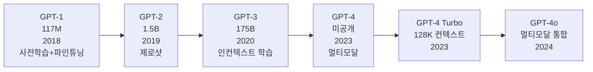

# GPT 아키텍처 계보 (GPT Architecture Lineage)

GPT(Generative Pre-trained Transformer) 계열은 디코더 전용(decoder-only) Transformer를 대규모 텍스트로 사전학습한 뒤, 다운스트림 태스크에 적용하는 방향으로 발전해왔다. 세대마다 핵심 혁신이 달랐으며, 그 누적이 현재 대형 언어 모델(LLM)의 기반을 형성한다.

## 세대별 핵심 혁신

### GPT-1 (2018, 117M)
- 사전학습(unsupervised) + 파인튜닝(supervised)의 2단계 패러다임 정립
- 12층 Transformer 디코더, BPE 토크나이저
- 태스크별 입력 변환(task-specific input transformation)으로 단일 모델이 다수 태스크 처리
- 의의: "사전학습 표현이 전이된다"는 것을 실증

### GPT-2 (2019, 1.5B)
- 스케일 10배 증가, 웹 크롤 데이터(WebText) 40GB
- 제로샷(zero-shot) 능력 최초 시연 — 파인튜닝 없이 번역·요약·QA 수행
- 출시 당시 "위험하다"는 이유로 단계적 공개 (사회적 논의 촉발)
- 아키텍처: LayerNorm 위치를 Pre-LN으로 이동, 컨텍스트 길이 1024

### GPT-3 (2020, 175B)
- 파라미터 100배 이상 증가, 데이터 570GB
- 퓨샷(few-shot) / 인컨텍스트 학습(in-context learning) 체계화
- 그래디언트 업데이트 없이 프롬프트만으로 새 태스크 적응
- Emergent Ability: 특정 규모 이상에서 갑자기 나타나는 능력

### GPT-4 (2023, 파라미터 미공개)
- MoE(Mixture of Experts) 구조 추정 (공식 미확인) [교차검증 필요]
- 멀티모달(이미지 입력) 지원
- RLHF + Constitutional AI 계열 정렬 기법 적용
- 컨텍스트 32K -> 128K 토큰으로 확장

## GPT 계보 타임라인

## Causal Mask의 수학적 의미

자기회귀(autoregressive) 언어 모델은 토큰 $t$ 예측 시 이전 토큰 $t_{<t}$만 참조해야 한다. 어텐션 행렬에 하삼각(lower-triangular) 마스크를 적용해 이를 구현한다.

$$A_{ij} = \begin{cases} \text{softmax}(QK^T / \sqrt{d_k})_{ij} & \text{if } i \geq j \\ -\infty & \text{if } i < j \end{cases}$$

$-\infty$는 소프트맥스 후 0이 되어 미래 토큰 정보가 차단된다.

## 디코더 전용 구조의 장점

| 항목 | 디코더 전용 | 인코더-디코더 |
|------|-----------|------------|
| 학습 목표 | 다음 토큰 예측(단일) | 마스크드 LM + 다음 토큰 |
| 프롬프트 유연성 | 매우 높음 | 낮음 (인코더/디코더 분리) |
| 생성 태스크 | 자연스러운 확장 | 추가 설계 필요 |
| 스케일링 효율 | 단순 → 스케일 용이 | 두 컴포넌트 조율 필요 |

## 관련 문서
- [[encoder-decoder-architectures|인코더-디코더 아키텍처]]
- [[transformer-architecture|Transformer 아키텍처]]
- [[self-attention-mechanism|셀프 어텐션]]
- [[pre-ln-vs-post-ln|Pre-LN vs Post-LN]]
- [[mixture-of-experts|Mixture of Experts]]
