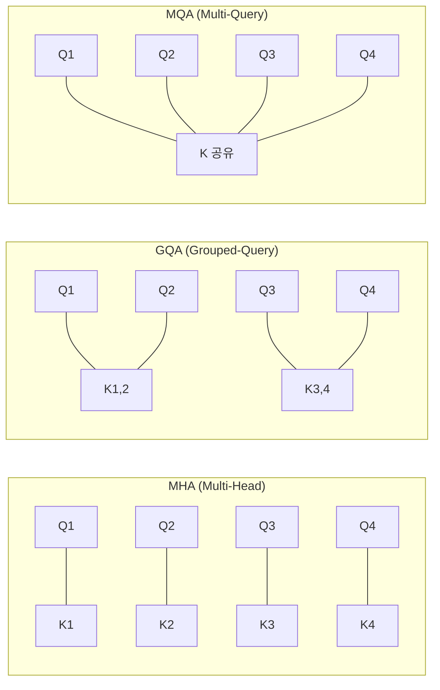

# GQA / MQA (Grouped-Query & Multi-Query Attention)

## 개요

Multi-Query Attention(MQA)과 Grouped-Query Attention(GQA)은 표준 Multi-Head Attention(MHA)에서 **Key-Value 헤드를 공유**하여 추론 시 KV 캐시 크기와 메모리 대역폭 사용을 줄이는 어텐션 변형이다. GQA는 MHA(모든 헤드 독립)와 MQA(단일 KV 헤드) 사이를 **연속적으로 보간**하는 일반화된 프레임워크다. Llama 2 70B, Llama 3, Gemma 등 주요 LLM이 GQA를 채택했다.

## 어텐션 방식 비교

| 방식 | Q 헤드 수 | KV 헤드 수 | KV 캐시 크기 | 품질 | 추론 속도 |
|---|---|---|---|---|---|
| MHA | h | h | 기준 (1x) | 최고 | 기준 |
| GQA | h | g (1 < g < h) | g/h | MHA 근접 | 빠름 |
| MQA | h | 1 | 1/h | 저하 가능 | 최고 |

GQA에서 g = h이면 MHA, g = 1이면 MQA와 동일하다. 즉 GQA는 MHA와 MQA의 **일반화(generalization)**이다.

## MQA (Multi-Query Attention)

Shazeer (2019)가 제안했다. 모든 Query 헤드가 **단일 Key-Value 쌍**을 공유한다.

**장점:**
- KV 캐시 크기가 1/h로 감소 (h = 헤드 수)
- 메모리 대역폭 병목 완화로 디코딩 속도 대폭 향상
- 배치 크기를 늘릴 수 있어 처리량(throughput) 개선

**단점:**
- 품질 저하: 모든 헤드가 동일한 K, V를 공유하므로 다양한 어텐션 패턴을 포착하는 능력이 감소
- 학습 불안정성이 발생할 수 있음

## GQA (Grouped-Query Attention)

Ainslie et al. (2023, EMNLP)이 제안했다. Query 헤드를 **그룹**으로 나누고, 각 그룹이 하나의 Key-Value 헤드를 공유한다.

### 업트레이닝 (Uptraining)

기존 MHA 체크포인트를 GQA로 변환하는 효율적 방법을 제안했다:
1. MHA 모델의 KV 헤드를 그룹별로 **평균 풀링(mean pooling)**하여 초기화
2. 원래 사전학습 연산의 **약 5%**만으로 업트레이닝
3. MHA에 근접한 품질을 MQA에 근접한 속도로 달성

### KV 캐시 절약 효과

헤드 수 h = 32, GQA 그룹 수 g = 8인 경우:
- MHA 대비 KV 캐시 **75% 감소** (8/32)
- MQA 대비 **8x 더 많은 KV 용량** (품질 보존)
- 추론 속도는 MQA에 근접

## MLA와의 관계

[[multi-head-latent-attention|MLA(Multi-Head Latent Attention)]]는 GQA/MQA의 "KV 헤드 공유" 접근과는 근본적으로 다른 전략을 취한다. MLA는 KV를 저랭크 잠재 벡터로 **압축**하여 캐시에 저장하고 추론 시 복원한다. 성능-메모리 트레이드오프 관점에서 비교하면:

| 방식 | 전략 | 성능 | KV 캐시 |
|---|---|---|---|
| MQA | KV 헤드 1개로 축소 | 저하 | 최소 |
| GQA | KV 헤드 그룹 공유 | MHA 근접 | 감소 |
| [[multi-head-latent-attention\|MLA]] | 저랭크 압축 + 동적 복원 | MHA 근접 | 최소 |

MLA는 메모리 절감과 성능 유지를 동시에 달성하지만, 압축-복원 연산 오버헤드가 추가된다. 소형 모델에서는 GQA가 더 실용적이고, 100B+ 규모에서는 MLA의 이점이 극대화된다.

## 실무 적용 현황

| 모델 | 어텐션 방식 | KV 헤드 구성 |
|---|---|---|
| GPT-3 | MHA | 96 KV 헤드 |
| Falcon-40B | MQA | 1 KV 헤드 |
| Llama 2 70B | GQA | 8 KV 그룹 (64 Q 헤드) |
| Llama 3 | GQA | 8 KV 그룹 |
| Gemma | GQA | 다양한 그룹 수 |
| DeepSeek-V2/V3 | MLA | 저랭크 잠재 벡터 |

## 관련 문서

- [[multi-head-latent-attention]] -- 저랭크 분해 기반 어텐션 효율화 (GQA/MQA의 대안)
- [[kv-cache]] -- GQA/MQA가 직접 영향을 주는 캐시 구조
- [[flash-attention-fundamentals]] -- 어텐션 연산의 IO 최적화 (GQA와 직교적으로 결합)
- [[sparse-attention-patterns]] -- 어텐션 범위 축소로 효율화하는 다른 축
- [[kv-cache-inference]] -- 추론 최적화에서 GQA의 역할

## 참고 자료

- [GQA: Training Generalized Multi-Query Transformer Models from Multi-Head Checkpoints (EMNLP 2023)](https://arxiv.org/abs/2305.13245)
- [Fast Transformer Decoding: One Write-Head is All You Need (Shazeer, 2019)](https://arxiv.org/abs/1911.02150)
- [What is Grouped Query Attention (IBM)](https://www.ibm.com/think/topics/grouped-query-attention)
