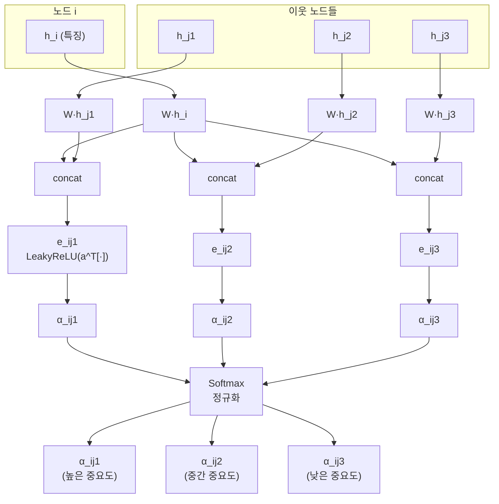
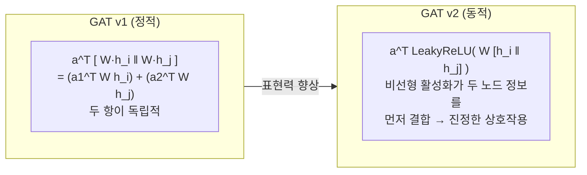
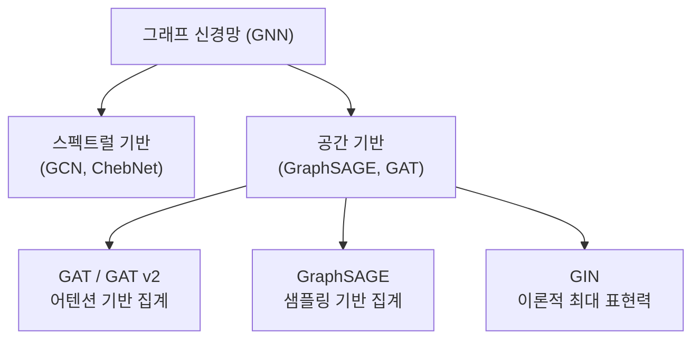

# 그래프 어텐션 네트워크 (GAT)

## 개요

그래프 어텐션 네트워크(Graph Attention Network, GAT)는 [[graph-neural-networks]](GNN)에 [[attention-mechanism-overview]](어텐션 메커니즘)을 적용한 아키텍처다. 기존 GNN이 이웃 노드의 특징을 단순 평균하거나 고정 가중치로 합산하는 것과 달리, GAT는 각 이웃에 **학습 가능한 어텐션 가중치**를 부여해 중요한 이웃의 정보를 더 많이 반영한다. Velickovic et al.(2018)이 제안했으며, 노드 분류, 링크 예측, 그래프 분류 등 다양한 그래프 태스크에서 표준 베이스라인으로 사용된다.

## GNN의 이웃 집계 문제

기존 Graph Convolutional Network(GCN)는 이웃 노드를 정규화된 합으로 집계한다.

$$h_i^{(l+1)} = \sigma\left(\sum_{j \in \mathcal{N}(i)} \frac{1}{\sqrt{d_i d_j}} W h_j^{(l)}\right)$$

여기서 $d_i$는 노드 i의 차수다. 이 방식은 **모든 이웃이 동일한 중요도**를 가진다고 가정하는데, 실제 그래프에서는 노드마다 중요한 이웃이 다르다. 예를 들어 소셜 네트워크에서 관심사가 비슷한 친구가 그렇지 않은 친구보다 중요한 영향을 미친다.

## GAT의 어텐션 메커니즘

### 어텐션 계수 계산

노드 i에서 이웃 j로의 어텐션 계수 $\alpha_{ij}$를 다음과 같이 계산한다.

1. 선형 변환: $Wh_i$ (파라미터 행렬 W 적용)
2. 어텐션 에너지: $e_{ij} = \text{LeakyReLU}(\mathbf{a}^T [Wh_i \| Wh_j])$
3. 정규화: $\alpha_{ij} = \text{softmax}_j(e_{ij}) = \frac{\exp(e_{ij})}{\sum_{k \in \mathcal{N}(i)} \exp(e_{ik})}$

### 집계

어텐션 가중치를 적용해 새 노드 표현을 계산한다.

$$h_i^{\prime} = \sigma\left(\sum_{j \in \mathcal{N}(i)} \alpha_{ij} W h_j\right)$$

### 멀티 헤드 어텐션

[[attention-mechanism-overview]]의 멀티 헤드 어텐션처럼, GAT도 K개의 독립적인 어텐션 헤드를 사용한다.

$$h_i^{\prime} = \|_{k=1}^{K} \sigma\left(\sum_{j \in \mathcal{N}(i)} \alpha_{ij}^k W^k h_j\right)$$

여러 어텐션 패턴을 동시에 학습해 표현력을 높인다.

## GAT v2 - 동적 어텐션

GAT의 원래 어텐션은 **정적(static)** 이라는 문제가 있다. 어텐션 계수 계산에서 $a^T[Wh_i \| Wh_j]$는 $Wh_i$와 $Wh_j$를 단순 연결 후 선형 결합하므로, 실제로는 두 노드 특징의 **선형 독립적** 스코어에 불과하다. 즉, 특정 이웃이 항상 중요하게 (또는 중요하지 않게) 평가될 수 있다.

GAT v2(Brody et al., 2022)는 이를 수정한다.

$$e_{ij} = \mathbf{a}^T \text{LeakyReLU}\left(W [h_i \| h_j]\right)$$

원래 GAT는 연결 후 선형 변환 → LeakyReLU 순서이지만, GAT v2는 **먼저 선형 변환 → 비선형 활성화 → 선형 스코어** 순서다. 이 변경으로 어텐션이 진정으로 **동적(dynamic)**이 된다. 노드 i의 중요도가 어떤 이웃 j를 기준으로 보느냐에 따라 달라질 수 있다.

## [[graph-neural-networks]]와의 위치

GAT는 공간 기반 GNN의 대표 아키텍처로, 스펙트럴 방법과 달리 귀납적(inductive) 학습이 가능해 학습 시 없던 새 노드도 처리할 수 있다.

## 수식 비교 요약

| 모델 | 집계 방식 | 어텐션 |
|------|----------|--------|
| GCN | $D^{-1/2}AD^{-1/2}H$ | 없음 (차수 정규화) |
| GraphSAGE | MEAN/MAX/LSTM 집계 | 없음 |
| GAT | 어텐션 가중 합산 | 정적 어텐션 |
| GAT v2 | 어텐션 가중 합산 | 동적 어텐션 |
| GT (Graph Transformer) | 글로벌 어텐션 | 전체 노드 쌍 |

## 실무 적용

- **추천 시스템**: 사용자-아이템 이분 그래프에서 중요 상호작용 학습 (Pinterest PinSage)
- **분자 속성 예측**: 원자-결합 그래프에서 특정 결합의 중요도 학습
- **지식 그래프**: 관계 유형별 어텐션으로 추론 경로 학습
- **교통 예측**: 도로망 그래프에서 인접 링크의 중요도 동적 평가
- **코드 분석**: AST(추상 구문 트리) 기반 취약점 탐지

## 한계

- **계산 복잡도**: 이웃 수에 비례 → 고차수 노드(허브)에서 병목
- **글로벌 관계 무시**: 직접 연결되지 않은 먼 노드 정보 접근 불가 (Graph Transformer로 해결 시도)
- **방향 그래프 처리**: 유향 그래프에서 어텐션 방향성 설계 필요

## 관련 문서
- [[temporal-graph-learning]] -- 시간 그래프 학습

- [[graph-neural-networks]] - GNN 전반적 개요와 유형
- [[attention-mechanism-overview]] - 어텐션 메커니즘의 기반 원리
- [[self-attention-mechanism]] - 트랜스포머 어텐션과 GAT 어텐션 비교
- [[transformer-architecture]] - 그래프 트랜스포머(GT) 연결점
