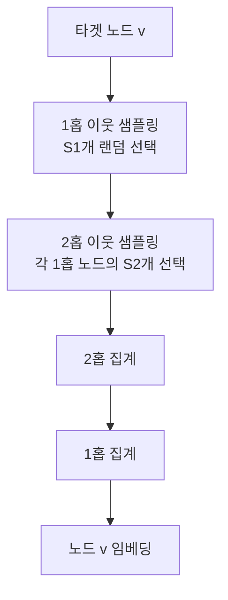
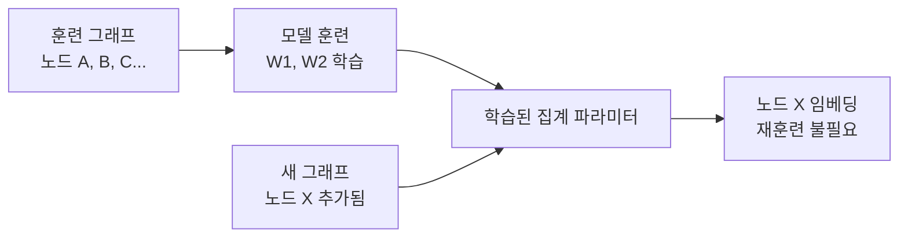

# GraphSAGE - 귀납적 그래프 표현 학습

## 개요

GraphSAGE(Graph Sample and AggreGatE)는 Hamilton et al.(2017, Stanford)이 제안한 귀납적 그래프 신경망(Inductive Graph Neural Network)이다. 기존 GCN(Graph Convolutional Network)이 **트랜스덕티브(transductive)** — 즉 훈련 시 보지 못한 노드에 대한 임베딩을 계산할 수 없는 — 방식이었던 것에 비해, GraphSAGE는 **훈련 중 보지 못한 새 노드에도 즉시 임베딩을 생성**할 수 있다.

이 귀납적 능력은 실시간으로 새 사용자·아이템이 추가되는 산업 그래프(Pinterest, Uber, Twitter 등)에 결정적이다.

## 왜 중요한가

기존 GCN의 핵심 한계:

1. **전체 그래프 라플라시안 계산 필요**: 노드가 수십억 개인 그래프에서 비현실적
2. **트랜스덕티브 학습**: 훈련 후 새 노드가 추가되면 재훈련 필요
3. **미니배치 학습 어려움**: 전체 인접 행렬이 메모리에 들어가야 함

GraphSAGE는 세 가지 혁신으로 이를 해결한다:
- 이웃 **샘플링**: 전체 이웃이 아닌 고정 수의 이웃만 사용
- 학습 가능한 **집계 함수**: 이웃 피처를 압축하는 함수 파라미터화
- **귀납적 집계**: 노드 피처만으로 임베딩 생성 (그래프 구조 전체 불필요)

## 알고리즘

### 기본 아이디어

각 노드의 임베딩을 계산할 때, 그 노드의 이웃을 **샘플링**하고, 이웃 임베딩을 **집계(aggregate)**하고, 자신의 임베딩과 **결합(concatenate)**한 뒤 비선형 변환을 거친다.

### 수식

$K$개의 집계 레이어에 대해:

$$h^k_{\mathcal{N}(v)} = \text{AGGREGATE}_k\left(\{h^{k-1}_u : u \in \mathcal{N}(v)\}\right)$$

$$h^k_v = \sigma\left(W^k \cdot \text{CONCAT}(h^{k-1}_v, h^k_{\mathcal{N}(v)})\right)$$

최종 임베딩: $z_v = h^K_v / \|h^K_v\|_2$ (L2 정규화)

### 이웃 샘플링 전략



전형적인 샘플링 크기: $S_1=25, S_2=10$ (논문 기준).

## 집계 함수 (Aggregator)

GraphSAGE는 세 가지 집계 함수를 제안한다:

### 1. 평균 집계 (Mean Aggregator)

$$h^k_{\mathcal{N}(v)} = \text{MEAN}\left(\{h^{k-1}_u : u \in \mathcal{N}(v)\}\right)$$

GCN의 스펙트럼 규칙과 가장 가깝다. 단순하고 효과적이나 이웃 집합의 크기 정보 손실.

### 2. LSTM 집계 (LSTM Aggregator)

$$h^k_{\mathcal{N}(v)} = \text{LSTM}\left([h^{k-1}_u : u \in \pi(\mathcal{N}(v))]\right)$$

무작위 순열 $\pi$로 이웃을 정렬 후 LSTM 처리. 순서 불변성이 없으나 표현력 높음.

### 3. 풀링 집계 (Pooling Aggregator)

$$h^k_{\mathcal{N}(v)} = \text{MAX}\left(\{\sigma(W_\text{pool} h^{k-1}_u + b) : u \in \mathcal{N}(v)\}\right)$$

각 이웃에 MLP를 적용한 후 원소별 최대값(max pooling). 논문에서 가장 좋은 성능을 보이는 경우가 많음.

| 집계 함수 | 순서 불변성 | 표현력 | 계산 비용 |
|-----------|------------|--------|-----------|
| 평균 | O | 낮음 | 낮음 |
| LSTM | X (무작위 순열) | 높음 | 중간 |
| 풀링 | O | 중간 | 중간 |

## 귀납적 추론

GraphSAGE의 핵심 강점은 집계 함수의 파라미터 $\{W^k, \text{AGGREGATE}_k\}$가 특정 노드 ID에 의존하지 않는다는 것이다. 따라서:



새 노드 X가 추가됐을 때:
1. X의 이웃을 샘플링
2. 이미 학습된 $W^k$로 집계
3. 즉시 임베딩 생성

## 손실 함수 (비지도 학습)

레이블이 없는 경우 그래프 구조를 자기지도 신호로 활용:

$$\mathcal{L} = -\log\left(\sigma(z_v^T z_u)\right) - Q \cdot \mathbb{E}_{u_n \sim P_n(v)} \log\left(\sigma(-z_v^T z_{u_n})\right)$$

- $u$: 랜덤 워크로 같이 방문된 이웃 (양성 샘플)
- $u_n$: 랜덤 샘플 (음성 샘플)
- $Q$: 음성 샘플 수

이는 Node2Vec·DeepWalk와 유사한 넥스트 노드 예측 목적식이지만, 집계 함수 덕분에 귀납적이다.

## PinSage - 산업 규모 GraphSAGE

Pinterest가 GraphSAGE를 수십억 노드 그래프에 적용한 PinSage(Ying et al., 2018)는 산업 GNN의 이정표다.

| 속성 | GraphSAGE | PinSage |
|------|-----------|---------|
| 규모 | 수천만 노드 | 30억 핀 + 180억 엣지 |
| 이웃 샘플링 | 균일 랜덤 | 중요도 기반 랜덤 워크 |
| 임베딩 용도 | 일반 | 핀 추천 (클릭/저장 예측) |
| 하드 네거티브 | 없음 | 있음 (유사 핀 구분) |

PinSage의 추가 기여:
- **중요도 기반 이웃 샘플링**: 단순 균일 랜덤 대신 랜덤 워크 방문 빈도로 이웃 중요도 결정
- **하드 네거티브 마이닝**: 쉬운 음성 샘플 대신 어려운 음성 샘플로 표현력 향상

## GCN과의 비교

| 속성 | GCN | GraphSAGE |
|------|-----|-----------|
| 학습 방식 | 트랜스덕티브 | **귀납적** |
| 이웃 처리 | 전체 이웃 정규화 합산 | 샘플링 + 집계 |
| 미니배치 | 어려움 | 자연스러운 지원 |
| 새 노드 대응 | 재훈련 필요 | 즉시 임베딩 생성 |
| 집계 종류 | 평균만 | 평균/LSTM/풀링 선택 |

## 한계와 후속 발전

- **[[graph-attention-network|GAT(Graph Attention Network)]]**: 집계 시 이웃에 학습 가능한 어텐션 가중치 부여 → GraphSAGE 평균 집계의 표현력 한계 극복
- **[[gin-graph-isomorphism|GIN(Graph Isomorphism Network)]]**: 이론적 표현력 상한(WL 테스트 등가)을 명시적으로 달성하도록 설계
- **GraphSAINT**: 노드·엣지·무작위 워크 기반 서브그래프 샘플링으로 대규모 훈련 최적화

## 실무 코드 (PyG)

```python
from torch_geometric.nn import SAGEConv
import torch.nn.functional as F

class GraphSAGE(torch.nn.Module):
    def __init__(self, in_channels, hidden_channels, out_channels):
        super().__init__()
        self.conv1 = SAGEConv(in_channels, hidden_channels)
        self.conv2 = SAGEConv(hidden_channels, out_channels)

    def forward(self, x, edge_index):
        x = self.conv1(x, edge_index)
        x = F.relu(x)
        x = F.dropout(x, p=0.5, training=self.training)
        x = self.conv2(x, edge_index)
        return x
```

## 관련 문서

- [[graph-neural-networks]] - GNN 전반 개요
- [[graph-attention-network]] - 어텐션 기반 이웃 집계
- [[gin-graph-isomorphism]] - 이론적 최대 표현력 GNN
- [[graph-transformer]] - 트랜스포머 기반 그래프 모델
- [[spectral-gnn]] - 스펙트럼 기반 GCN 계열
