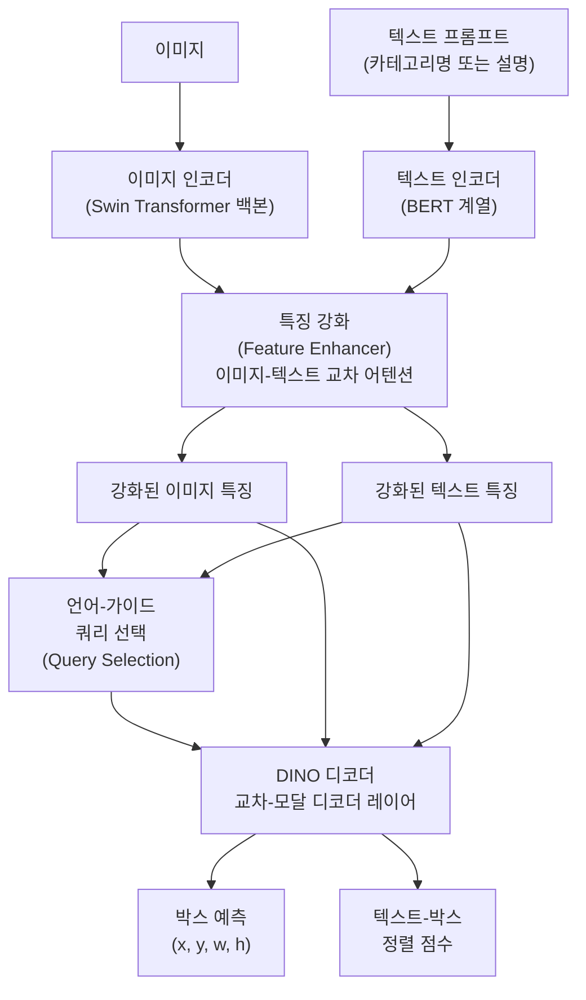
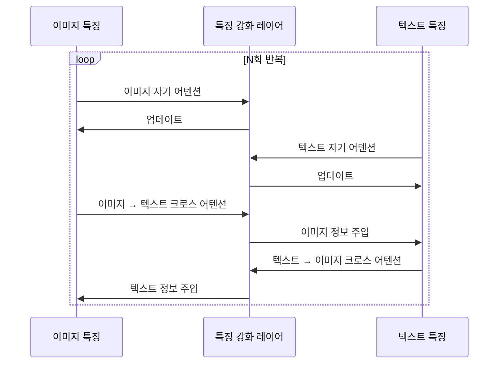
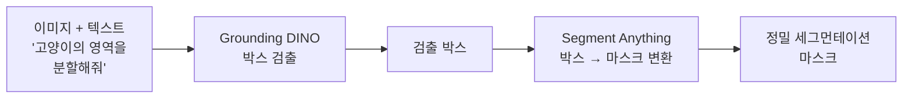

# Grounding DINO - 개방 집합 객체 검출

## 개요

Grounding DINO(2023, Liu et al., IDEA Research)는 텍스트 프롬프트로 임의의 객체를 검출할 수 있는 **개방 집합(open-set) 객체 검출** 모델이다. 기존 폐쇄 집합(closed-set) 검출기는 사전에 정의된 클래스만 검출할 수 있었지만, Grounding DINO는 자연어 설명으로 새로운 카테고리를 즉시 검출한다. [[detr-detection-transformer]](DETR) 기반 아키텍처와 [[clip]] 스타일의 비전-언어 융합을 결합한 것이 핵심이다.

## 등장 배경

DINO(2022)는 DETR 계열의 최고 성능 검출기로, 비교적 적은 학습 반복으로 높은 정확도를 달성했다. 그러나 DINO를 포함한 모든 기존 검출기는 학습 시 사용한 카테고리(COCO 80개, Objects365 등)만 검출 가능했다. Grounding DINO는 이 제약을 제거해 "파란 줄무늬 고양이"나 "오른쪽에 있는 사람" 같은 임의의 자연어 쿼리를 처리한다.

## 아키텍처

### 전체 파이프라인

핵심 혁신은 **언어-가이드 쿼리 선택(Language-Guided Query Selection)**이다. DETR 계열에서 학습 가능한 쿼리를 이미지 특징으로 초기화하는 대신, Grounding DINO는 텍스트 프롬프트와 이미지 특징 모두를 고려해 관련도 높은 위치의 쿼리를 선택한다.

### 교차 모달 특징 강화

이미지와 텍스트 특징을 단순 연결(concat)하는 것이 아니라 **양방향 크로스 어텐션**으로 융합한다.

이 양방향 융합으로 "빨간 사과"처럼 속성-객체 관계를 이미지 특징이 인식할 수 있게 된다.

## [[detr-detection-transformer]]와의 관계

Grounding DINO는 [[detr-detection-transformer]] 계열의 최신 버전인 DINO에서 출발한다. DINO의 기여인 **대조적 디노이징 학습(Contrastive Denoising Training)**과 **혼합 쿼리 선택(Mixed Query Selection)**을 계승하면서 언어 조건을 추가한다.

| 기능 | DETR | DINO | Grounding DINO |
|------|------|------|----------------|
| 쿼리 초기화 | 학습 가능 | 이미지 기반 | 언어+이미지 기반 |
| 검출 카테고리 | 폐쇄 집합 | 폐쇄 집합 | 개방 집합 |
| 언어 입력 | 없음 | 없음 | 자연어 프롬프트 |

## [[clip]]과의 관계

[[clip]]이 이미지-텍스트 정렬을 글로벌 임베딩 수준에서 학습한다면, Grounding DINO는 **지역(region) 수준**에서 텍스트와 이미지 영역을 정렬한다. CLIP은 "이미지 전체가 고양이 사진인가"를 판단하지만, Grounding DINO는 "이미지 내 어느 위치에 고양이가 있는가"를 정확히 localize한다.

## 성능

- **COCO 제로샷**: COCO 학습 없이도 46.7 AP (기존 지도 학습 검출기에 근접)
- **ODinW(Object Detection in the Wild)**: 13개 다양한 도메인 평가에서 SOTA
- **언어 관계 이해**: "왼쪽 사람", "손에 들고 있는 컵" 같은 공간적 관계 표현 처리

## Grounding DINO 1.5 / 2.0

후속 버전들은 다음을 개선한다.

- **더 큰 텍스트 인코더**: T5/LLaMA 계열 언어 모델 사용으로 복잡한 지시 이해 향상
- **비디오 확장**: 시간 축으로 확장한 비디오 객체 검출 및 추적
- **대화형 검출**: 사용자와 대화하며 점진적으로 검출 범위 좁히기

## SAM과의 통합

Grounding DINO + [[segment-anything]] 조합이 실무에서 많이 사용된다.

Grounding DINO가 "어디에"를 잡고, SAM이 "정확히 어떤 모양인가"를 처리한다.

## 실무 활용

- **레이블링 자동화**: 새 카테고리의 학습 데이터를 자연어 쿼리로 자동 라벨링
- **시각적 질의 응답(VQA)**: "이미지에서 X가 어디 있나요?" 유형 질문
- **로보틱스 그래스핑**: 자연어 명령으로 파지 대상 특정 ("빨간 컵을 집어줘")
- **의료 영상**: 새로운 이상 부위를 사전 정의 없이 텍스트로 검출

## 관련 문서

- [[detr-detection-transformer]] - Grounding DINO의 기반 검출 아키텍처
- [[clip]] - 비전-언어 정렬 사전학습 방법론
- [[segment-anything]] - 세그먼테이션 파트너 모델
- [[vision-language-model-architectures]] - 비전-언어 모델 전반 개요
