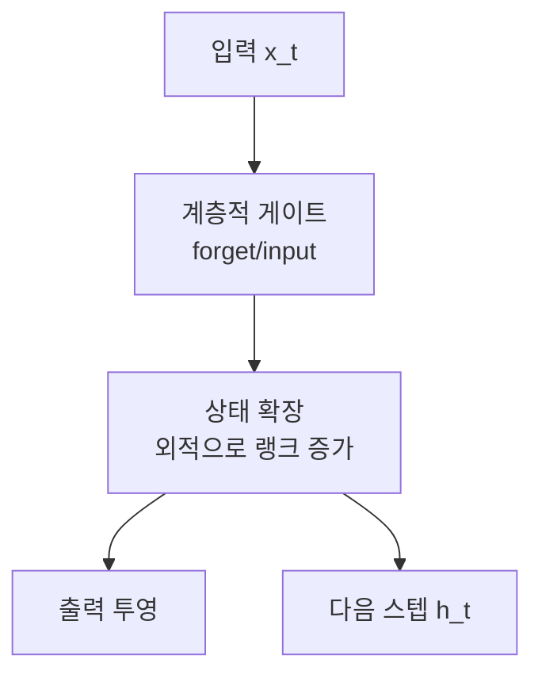

# HGRN2

Qin et al. (2024)의 계층적 게이팅 선형 순환 네트워크 2세대. **상태 확장(state expansion)** 메커니즘으로 선형 RNN의 표현력을 강화하면서, [[gated-deltanet|Gated DeltaNet]]과 함께 Transformer 대안 선형 모델의 최전선에 위치한다.

## 핵심: 상태 확장

HGRN 1세대의 한계는 상태가 벡터(1차원)라 표현력이 부족한 것. HGRN2는 입력과 키의 **외적(outer product)**으로 상태를 행렬로 확장하여, [[mamba-3|Mamba]]의 선택적 SSM에 필적하는 표현력을 달성한다.

## [[linear-recurrence-unified|선형 RNN 통합 관점]]에서

| 모델 | 상태 전이 | 상태 크기 | 특성 |
|------|----------|----------|------|
| RWKV | 대각 | 벡터 | 시간 감쇠 |
| Mamba | 대각, 입력 의존 | 벡터 | 선택적 |
| **HGRN2** | **계층 게이팅** | **행렬 (외적)** | **상태 확장** |

## 관련 문서

- [[gated-deltanet]] -- Gated DeltaNet
- [[rwkv]] -- RWKV
- [[mamba-3]] -- Mamba-3
- [[linear-recurrence-unified]] -- 선형 RNN 통합
