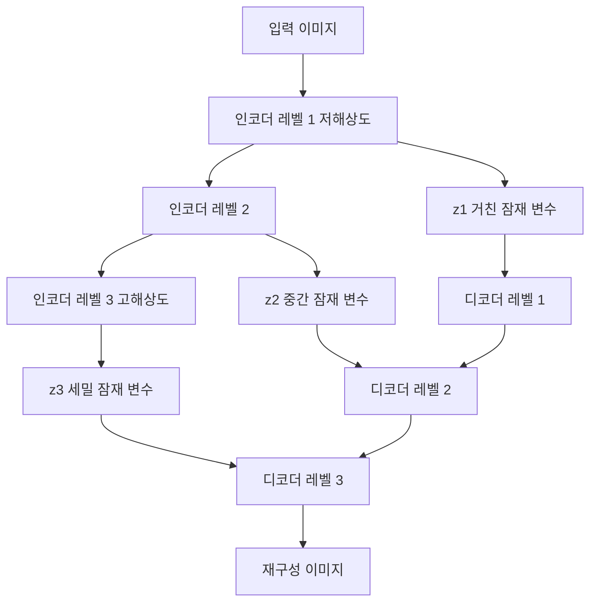

# 계층적 VAE

다중 스케일 잠재 변수 계층을 사용하는 VAE 변형. [[autoencoders-vae|표준 VAE]]의 후방 붕괴(posterior collapse) 문제를 완화하고 고해상도 이미지 생성 품질을 높인다.

## 구조

상위 레벨은 전체 구조(포즈, 배경)를, 하위 레벨은 세부 텍스처를 인코딩한다.

## 대표 모델

| 모델 | 특징 |
|------|------|
| NVAE (2020) | 깊은 잔차 셀, BN 대신 spectral regularization, 256x256 생성 |
| VD-VAE (2020) | 매우 깊은 계층(78레벨), top-down 추론, 후방 붕괴 완화 |

## [[latent-diffusion-model|잠재 확산 모델]]과의 관계

Stable Diffusion의 VAE는 계층적이지 않지만, 확산 과정 자체가 다중 스케일 노이즈 제거로 계층적 생성을 구현한다. 계층적 VAE의 아이디어가 확산 모델 설계에 영향.

## 관련 문서

- [[autoencoders-vae]] -- 오토인코더와 VAE
- [[latent-diffusion-model]] -- 잠재 확산 모델
- [[vq-vae]] -- VQ-VAE
- [[diffusion-models]] -- 확산 모델
