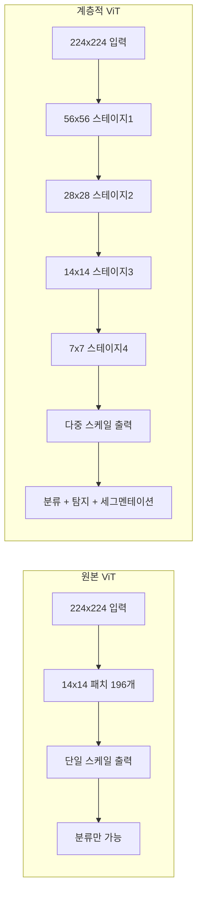
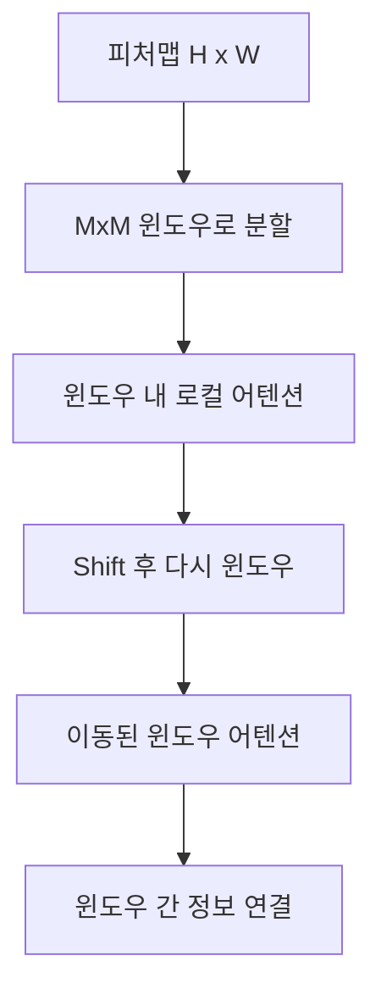
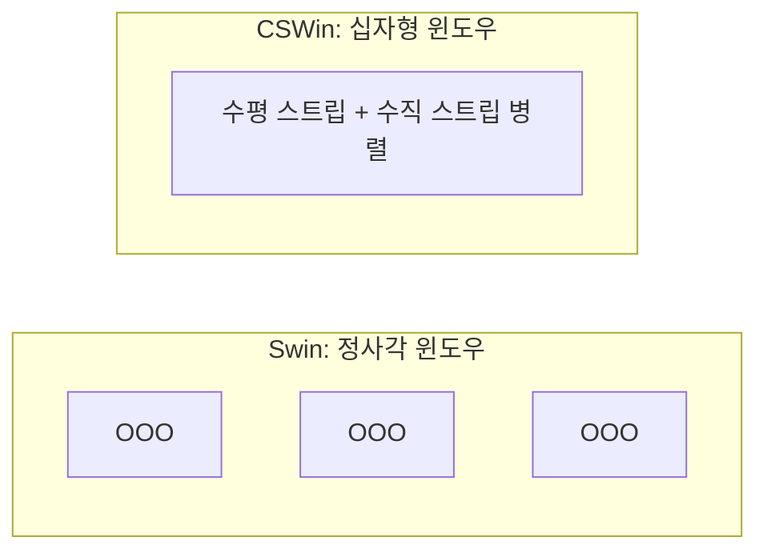
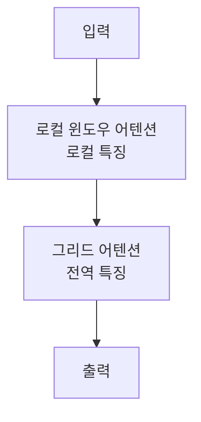

# 계층적 ViT 설계 패턴 - Swin, CSWin, MaxViT

## 개요

계층적 ViT(Hierarchical Vision Transformer)는 [[vision-transformer]] 원본의 단일 스케일 한계를 극복하기 위해 CNN처럼 **다중 해상도 피처맵**을 생성하는 설계 패턴이다. [[swin-transformer]]를 필두로 CSWin, MaxViT 등 다양한 변형이 등장했다. 객체 탐지, 세그멘테이션 같은 밀집 예측(dense prediction) 태스크에서 원본 ViT보다 강력한 성능을 보인다.

## 왜 계층적 설계가 필요한가

원본 ViT는 초기 패치화 이후 해상도를 유지하므로:
1. 고해상도 입력에서 어텐션의 이차(quadratic) 비용이 너무 큼
2. 다중 스케일 특징을 요구하는 탐지/세그멘테이션에 직접 적용 어려움
3. FPN(Feature Pyramid Network) 등 기존 탐지 파이프라인과 통합 곤란

## Swin Transformer: 계층적 ViT의 선구자

[[swin-transformer]]의 두 가지 핵심 기여:

### 1. 윈도우 어텐션 (Window Attention)

- 피처맵을 7x7 윈도우로 분할, 각 윈도우 내에서만 어텐션
- 복잡도: $O(N^2)$ → $O(N \cdot M^2)$ (M: 윈도우 크기)
- **Shifted Window**: 윈도우를 절반씩 이동해 인접 윈도우 간 연결

### 2. 패치 병합 (Patch Merging)

스테이지 간 전환 시 인접 2x2 패치를 하나로 합쳐 해상도를 절반으로 줄이고 채널 수를 늘린다. CNN의 스트라이드 컨볼루션과 유사한 역할.

| 스테이지 | 해상도 | 채널 수 | 역할 |
|--------|--------|--------|------|
| 1 | H/4 x W/4 | C | 로컬 특징 |
| 2 | H/8 x W/8 | 2C | 중간 특징 |
| 3 | H/16 x W/16 | 4C | 고수준 특징 |
| 4 | H/32 x W/32 | 8C | 최고 추상화 |

## CSWin Transformer: 십자형 윈도우

CSWin은 Swin의 윈도우 어텐션을 **십자형(cross-shaped) 윈도우**로 대체한다.

- 수평 스트립과 수직 스트립을 병렬로 처리
- 단일 어텐션 레이어에서 더 넓은 수용 영역
- 같은 파라미터로 Swin 대비 더 나은 성능

## MaxViT: 그리드 어텐션과 윈도우 어텐션 결합

MaxViT는 두 종류의 어텐션을 교차 적용한다:

**그리드 어텐션**: 피처맵을 균일한 간격으로 서브샘플링해 전역적인 토큰 집합 구성. 로컬 어텐션 비용으로 전역 수용 영역 달성.

| 어텐션 타입 | 수용 영역 | 복잡도 | 특징 |
|-----------|---------|--------|------|
| 윈도우 어텐션 | 로컬 | $O(NM^2)$ | 세부 정보 |
| 그리드 어텐션 | 전역 | $O(NM^2)$ | 전역 문맥 |

## 방법론 비교

| 항목 | Swin | CSWin | MaxViT |
|------|------|-------|--------|
| 전역 어텐션 | 이동 윈도우 간접 | 십자형 직접 | 그리드 직접 |
| 수용 영역 | 간접적 전역 | 중간 | 직접 전역 |
| 복잡도 | $O(NM^2)$ | $O(NM^2)$ | $O(NM^2)$ |
| ImageNet 성능 | 강함 | 더 강함 | 매우 강함 |
| 탐지 성능 | 강함 | 강함 | 강함 |

## 공통 설계 원칙

계층적 ViT들이 공유하는 설계 원칙:

1. **4단계 계층**: 4개 스테이지로 해상도를 순차적으로 절반씩 감소
2. **국소성 편향 도입**: 제한된 어텐션 범위로 초기 레이어에서 지역 특징 학습
3. **패치 임베딩 오버랩**: 초기 다운샘플링에 오버랩 컨볼루션 활용 추세
4. **ConvNeXt 영향**: CNN 설계 원칙(레이어 정규화, GELU 등)을 ViT에 통합

## [[self-supervised-learning]]과의 결합

계층적 ViT에 마스크 이미지 모델링을 적용하는 연구도 활발하다. [[masked-image-modeling-survey|SimMIM]]은 Swin을 백본으로 사용해 계층적 ViT의 자기지도 학습 가능성을 입증했다.

## 관련 문서

- [[swin-transformer]] - Swin Transformer 상세
- [[vision-transformer]] - 원본 ViT
- [[masked-image-modeling-survey]] - MIM 방법론 (SimMIM 포함)
- [[mobilevit-efficient-vit]] - 경량 하이브리드 ViT
- [[vit-register-tokens]] - ViT 아티팩트 억제 기법
