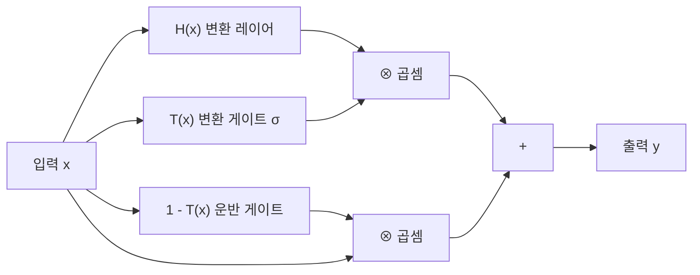

# 하이웨이 네트워크 (Highway Networks)

## 배경과 문제 의식

2015년 이전까지 매우 깊은 신경망(20층 이상)을 학습시키는 것은 극도로 어려운 문제였다. 핵심 원인은 **그래디언트 소멸(vanishing gradient)**과 **그래디언트 폭발(exploding gradient)** 문제였다.

당시의 해결책들은 다음과 같은 한계가 있었다.

- **세심한 가중치 초기화**: Xavier, He 초기화 등이 제안됐지만 여전히 10층을 넘기면 학습이 불안정했다
- **배치 정규화**: 2015년 제안됐지만 여전히 100층 이상에서는 효과가 제한적이었다
- **층별(greedy layer-wise) 사전학습**: RBM/DBN 기반으로 레이어를 하나씩 학습하는 방식이었으나 과정이 복잡하고 현실적이지 않았다

ETH Zurich의 Srivastava, Greff, Schmidhuber(2015)는 이 문제를 **LSTM의 게이팅 메커니즘(gating mechanism)**에서 영감을 받아 해결하는 **하이웨이 네트워크(Highway Networks)**를 제안했다. 하이웨이 네트워크는 ResNet(2015)과 거의 동시에 발표됐으며, ResNet의 직계 선행 연구로 평가받는다.

## 아키텍처: 게이팅 메커니즘

### 하이웨이 블록

기존 피드포워드 레이어의 변환은 단순히 입력에 $H$를 적용한다.

$$y = H(x, W_H)$$

하이웨이 네트워크는 두 개의 추가 게이트를 도입한다.

- **변환 게이트(Transform Gate)** $T$: 변환된 신호가 얼마나 통과할지 결정
- **운반 게이트(Carry Gate)** $C$: 원본 신호가 얼마나 그대로 전달될지 결정

$$y = H(x, W_H) \cdot T(x, W_T) + x \cdot C(x, W_C)$$

논문에서는 단순화를 위해 $C = 1 - T$로 설정한다.

$$y = H(x, W_H) \cdot T(x, W_T) + x \cdot (1 - T(x, W_T))$$

여기서 변환 게이트 $T$는 시그모이드(sigmoid)를 활성함수로 사용한다.

$$T(x, W_T) = \sigma(W_T^T x + b_T)$$

$T = 1$이면 완전 변환, $T = 0$이면 원본 신호 그대로 전달된다.

### 초기화 전략

게이트 편향 $b_T$를 음수(예: -1, -2, -3)로 초기화하는 것이 중요하다. 이렇게 하면 학습 초기에 $T \approx \sigma(-3) \approx 0.05$로 게이트가 거의 닫혀 있어, 원본 신호가 거의 그대로 전달된다. 이는 **학습 초기에 그래디언트 흐름을 보장**하는 역할을 한다.

## ResNet과의 비교

하이웨이 네트워크와 ResNet([[resnet-skip-connections]])은 같은 문제를 다른 방식으로 해결한다.

| 특징 | 하이웨이 네트워크 | ResNet |
|------|-----------------|--------|
| 스킵 경로 | 게이팅 (학습 가능, 적응적) | 항등 함수 (고정) |
| 게이트 | 변환 게이트 T, 운반 게이트 C | 없음 (항상 더함) |
| 추가 파라미터 | $W_T$, $b_T$ 추가 필요 | 없음 |
| 해석 | 동적: 입력에 따라 경로 선택 | 정적: 항상 잔차만 학습 |
| 수렴 속도 | 상대적으로 느림 | 빠름 |

**ResNet의 직관적 단순함이 핵심 장점이다.** ResNet은 게이트 없이 단순히 잔차를 더하는 방식으로 하이웨이보다 간단하면서 같거나 더 좋은 성능을 보였다. 이 때문에 ResNet이 빠르게 주류가 됐고, 하이웨이 네트워크는 역사적 선행 연구로 자리매김했다.

## LSTM 연결고리

하이웨이 네트워크의 게이팅 메커니즘은 LSTM의 게이트와 직접적인 유사성이 있다.

LSTM의 셀 업데이트:
$$c_t = f_t \odot c_{t-1} + i_t \odot \tilde{c}_t$$

- $f_t$: 망각 게이트 (carry gate와 대응)
- $i_t \odot \tilde{c}_t$: 입력 게이트 × 후보값 (transform gate와 대응)

저자 Schmidhuber는 LSTM 발명자 중 한 명으로, 시간 방향이 아닌 **공간(레이어) 방향**으로 같은 아이디어를 적용한 것이 하이웨이 네트워크라고 볼 수 있다.

## 성질: 적응적 경로 선택

하이웨이 네트워크의 흥미로운 특성은 게이트가 **입력에 따라 경로를 동적으로 선택**한다는 점이다. 분석 결과, 하이웨이 네트워크의 특정 레이어들은 특정 유형의 입력에 대해 선택적으로 활성화된다. 이는 ResNet의 고정 항등 경로보다 더 유연한 정보 흐름을 허용한다.

이 특성은 이후 **MoE(Mixture of Experts)**나 **조건부 계산(conditional computation)** 연구의 영감이 됐다.

## 성능 결과

하이웨이 네트워크는 당시 기준으로 매우 깊은 모델(50층, 100층, 900층+)을 안정적으로 학습할 수 있음을 보였다.

| 모델 | CIFAR-10 오류율 |
|------|----------------|
| 일반 50층 DNN (무 게이팅) | 학습 실패 |
| 하이웨이 네트워크 50층 | 7.72% |
| 하이웨이 네트워크 100층 | 7.54% |
| ResNet-110 (같은 시기) | 6.43% |

## 역사적 의의

하이웨이 네트워크는 **ResNet 이전에 매우 깊은 신경망이 학습 가능함을 처음으로 보인 연구**다. 그 의의는 다음과 같다.

1. **스킵 연결(skip connection)의 중요성 최초 실증**: 정보 흐름의 단축 경로가 깊은 학습에 필수적임을 보였다
2. **레이어 깊이의 상한 제거**: 게이팅으로 수백 층의 학습이 가능함을 증명
3. **ResNet 설계에 직접적 영감 제공**: He et al.은 하이웨이 네트워크를 인용하며 더 단순한 항등 스킵 연결로 나아갔다

## 관련 문서

- [[resnet-skip-connections]] - 하이웨이 네트워크의 후계, 더 단순한 스킵 연결
- [[wide-resnet]] - ResNet 계열의 너비 방향 발전
- [[transformer-architecture]] - Transformer의 잔차 연결도 같은 계보
- [[batch-norm-layer-norm]] - 깊은 네트워크 학습 안정화의 또 다른 축
