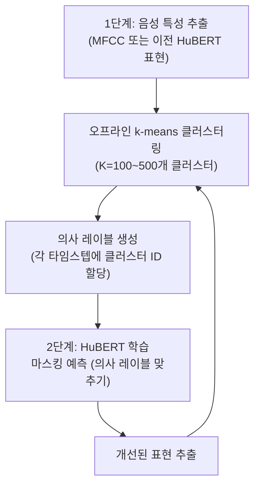
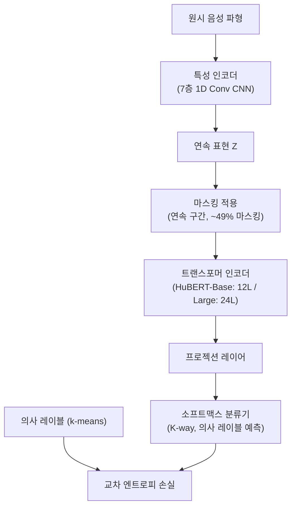

# HuBERT - 클러스터링 기반 음성 자기지도 사전학습

## 배경과 문제 의식

[[wav2vec-2-speech|Wav2Vec 2.0]]은 자기지도 음성 학습의 가능성을 열었지만, 대조 학습 방식에는 구조적 어려움이 있다.

- **온라인 양자화 불안정성**: 코드북을 학습 중 동시에 업데이트하므로 초기 학습이 불안정하다
- **코드북 붕괴 위험**: 일부 코드 벡터만 집중 사용되는 패턴이 발생할 수 있다
- **다양성 손실 튜닝 필요**: 코드북 활용률을 높이기 위한 추가 손실 항이 필요하다
- **멀티태스크 한계**: 단일 대조 손실로 음성의 다양한 특성(음소, 화자, 운율 등)을 포착하기 어렵다

Facebook AI Research의 Hsu et al.(2021)은 **HuBERT(Hidden-Unit BERT)**로 이 문제를 해결했다. 핵심 아이디어는 대조 학습 대신 **오프라인 클러스터링으로 생성한 의사 레이블(pseudo-label)로 BERT 방식의 마스킹 예측**을 수행하는 것이다.

## 핵심 아이디어: 의사 레이블과 반복 개선

HuBERT의 학습은 두 단계가 반복되는 EM(Expectation-Maximization) 유사 과정이다.



### 1단계: 의사 레이블 생성 (오프라인 클러스터링)

학습 전 또는 이전 반복의 HuBERT 표현을 사용하여 **오프라인으로** k-means 클러스터링을 수행한다. 각 25ms 음성 프레임에 클러스터 ID를 할당하여 이산 의사 레이블 시퀀스를 만든다.

**초기 반복**: MFCC(Mel-Frequency Cepstral Coefficients) 같은 전통적 특성으로 클러스터링. K=100 사용.
**이후 반복**: 이전 반복에서 학습된 HuBERT의 중간 레이어 표현으로 클러스터링. K=500 사용.

의사 레이블이 완벽히 정확하지 않아도 된다. 잡음이 있는(noisy) 레이블도 충분히 유용한 표현 학습을 이끈다는 것이 핵심 발견이다.

### 2단계: 마스킹 예측 학습

의사 레이블을 정답으로 삼아 BERT의 마스킹 언어 모델링(MLM)과 동일한 방식으로 학습한다.

$$\mathcal{L}_m = -\sum_{t \in \mathcal{M}} \log p(z_t | \tilde{X}, t)$$

- $\mathcal{M}$: 마스킹된 타임스텝 집합
- $\tilde{X}$: 마스킹이 적용된 입력 시퀀스
- $z_t$: 타임스텝 $t$의 의사 레이블 클러스터 ID

**중요**: 손실은 마스킹된 타임스텝에 대해서만 계산한다. 이를 통해 모델이 **컨텍스트에서 보이지 않는 부분을 예측하는 능력**을 학습한다.

## 아키텍처 구조



### 모델 크기

| 변형 | 트랜스포머 레이어 | 히든 차원 | 파라미터 수 |
|------|----------------|----------|-------------|
| HuBERT-Base | 12 | 768 | 94M |
| HuBERT-Large | 24 | 1024 | 317M |
| HuBERT-X-Large | 48 | 1280 | 964M |

## Wav2Vec 2.0과의 비교

| 측면 | Wav2Vec 2.0 | HuBERT |
|------|-------------|--------|
| 학습 목표 | 대조 손실 (온라인 양자화) | 마스킹 예측 (오프라인 k-means) |
| 레이블 생성 | 학습 중 실시간 (Gumbel-Softmax) | 학습 전 오프라인 k-means |
| 학습 안정성 | 코드북 붕괴 위험 있음 | 안정적 (오프라인 클러스터) |
| 반복 개선 | 없음 | 의사 레이블 반복 개선 |
| 접근법 기반 | 대조 학습 | BERT 마스킹 예측 |

## 성능 결과

### ASR (음성 인식)

| 모델 | LibriSpeech test-clean WER | 레이블 조건 |
|------|---------------------------|-------------|
| Wav2Vec 2.0 Large | 1.9% | 960시간 |
| HuBERT Large | 1.9% | 960시간 |
| HuBERT Large | 3.4% | 10분 |
| HuBERT X-Large | 1.5% | 960시간 |

동일한 레이블 조건에서 HuBERT가 Wav2Vec 2.0과 동등하거나 더 좋은 성능을 보였다.

### SUPERB 벤치마크

SUPERB(Speech processing Universal PERformance Benchmark)는 음성 인식뿐 아니라 화자 인식, 감정 인식, 키워드 탐지 등 10개 태스크를 포괄적으로 평가한다.

HuBERT는 SUPERB의 대부분 태스크에서 Wav2Vec 2.0보다 우수한 성능을 보이며, **단일 사전학습 모델로 다양한 음성 태스크를 처리하는 능력**이 더 뛰어남을 입증했다.

## HuBERT의 중간 레이어 분석

흥미로운 발견은 HuBERT의 각 레이어가 서로 다른 음성 속성에 특화된다는 점이다.

- **하위 레이어 (1-4층)**: 음향(acoustic) 특성 - 피치, 에너지, 스펙트럼
- **중간 레이어 (5-9층)**: 음성학적(phonetic) 특성 - 음소, 조음
- **상위 레이어 (10-12층)**: 화자(speaker) 특성 - 화자 ID, 감정

이 계층적 특성 때문에 다운스트림 태스크에 따라 어느 레이어를 사용할지 선택하는 것이 중요하다.

## 음악 및 노래 확장

HuBERT의 학습 방식은 순수 음성을 넘어 **음악 표현 학습**으로도 확장됐다.

- **MusicHuBERT**: 음악 신호에 적용한 자기지도 모델
- **EnCodec+HuBERT**: 신경 오디오 코덱과 결합하여 음악 생성에 활용

## 실무 적용 관점

**범용 음성 특성 추출기**: ASR에 국한되지 않고 화자 인식, 감정 인식, 언어 식별 등 다양한 음성 태스크의 백본으로 활용한다.

**레이어 선택**: 태스크에 맞는 레이어를 선택하는 것이 중요하다. 음소 분류는 중간 레이어, 화자 인식은 상위 레이어가 좋다.

**파인튜닝 레시피**:
- ASR: CTC 헤드 추가 후 특성 인코더 동결, 트랜스포머만 파인튜닝
- 화자 인식: 평균 풀링 + 분류 헤드
- 저자원 언어: 다국어 HuBERT 활용

**HuggingFace 지원**: `facebook/hubert-large-ls960-ft`, `facebook/hubert-base-ls960` 등 공개 체크포인트 활용.

```python
from transformers import HubertForCTC, Wav2Vec2Processor

model = HubertForCTC.from_pretrained("facebook/hubert-large-ls960-ft")
processor = Wav2Vec2Processor.from_pretrained("facebook/hubert-large-ls960-ft")
```

## 관련 문서

- [[wav2vec-2-speech]] - HuBERT의 선행 연구, 대조 학습 방식
- [[wavlm-speech-processing]] - HuBERT를 기반으로 다중 태스크로 확장한 후속
- [[self-supervised-learning]] - 자기지도 학습의 일반 개념
- [[masked-autoencoder-mae]] - 비전 영역에서의 마스킹 예측 유사 접근
- [[transformer-architecture]] - HuBERT 컨텍스트 네트워크의 기반
- [[whisper]] - 대규모 지도 학습 방식의 음성 인식 (대조적 접근)
- [[encodec-audio-tokenizer]] - 오디오 이산 표현과의 연관성
