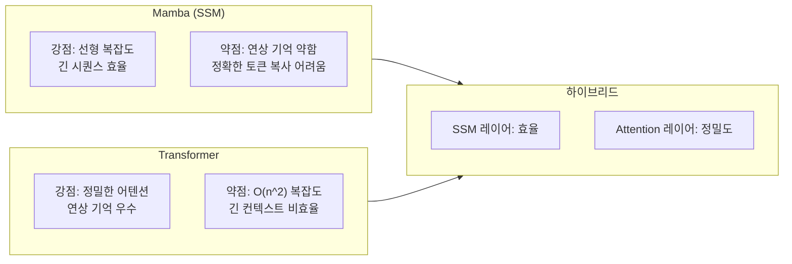
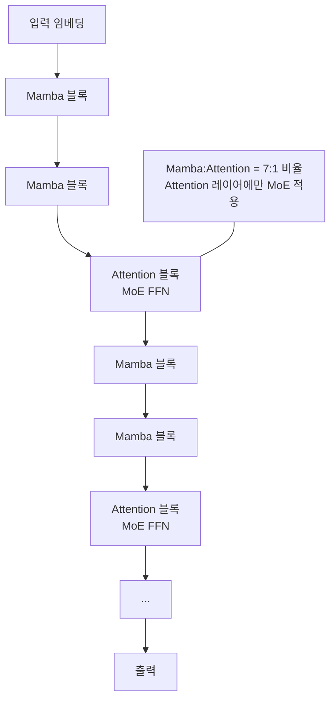
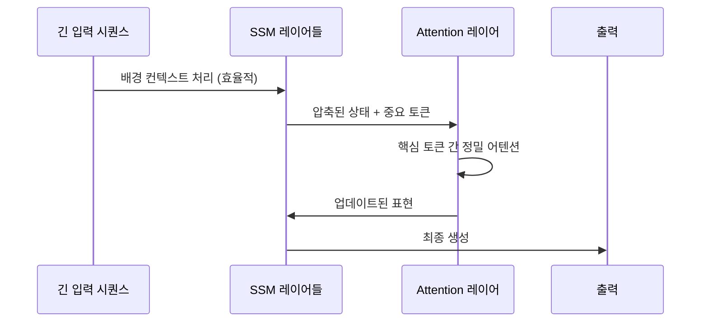

# 하이브리드 Mamba-Transformer - 선택적 SSM과 어텐션의 결합

## 개요

하이브리드 Mamba-Transformer는 [[mamba-3]] 계열의 상태 공간 모델(SSM)과 [[transformer-architecture]]의 어텐션 메커니즘을 한 모델 안에 통합한 아키텍처다. 두 기법을 단순히 병렬로 두는 것이 아니라, **레이어 수준에서 교대 배치**하여 SSM의 선형 시간 추론 효율과 Transformer의 정밀한 연상 기억(associative recall) 능력을 동시에 확보한다. 대표적 구현으로 Jamba (AI21 Labs, 2024), Zamba, MambaFormer 등이 있다.

## 동기: Mamba와 Transformer 각각의 한계



| 특성 | 순수 Mamba | 순수 Transformer | 하이브리드 |
|------|-----------|-----------------|-----------|
| 긴 시퀀스 메모리 | O(1) 상태 | O(n) KV 캐시 | O(k) (k = Attn 레이어 수) |
| 추론 속도 | 빠름 | 컨텍스트 길수록 느림 | 중간 |
| 연상 기억 | 약함 | 강함 | 중간~강함 |
| 학습 병렬성 | 중간 | 높음 | 높음 |

## Jamba 아키텍처

AI21 Labs의 Jamba(2024)는 최초로 실제 서비스 규모에 배포된 하이브리드 Mamba-Transformer 모델이다.



**Jamba 핵심 설계:**
- **Mamba:Attention 비율 7:1**: 대부분의 레이어를 Mamba로 처리하여 긴 컨텍스트 효율 확보
- **MoE(Mixture of Experts) 통합**: Attention 레이어에 MoE FFN을 결합하여 활성 파라미터 대비 용량 증대
- **규모**: 52B 총 파라미터, 활성 파라미터 12B
- **컨텍스트**: 256K 토큰 (표준 GPU 메모리에서)

## 왜 교대 배치인가

순수 SSM과 순수 Transformer 대비 교대 배치가 효과적인 이유는 두 메커니즘의 **상보성(complementarity)**에 있다.

**SSM이 잘 하는 것:**
- 전반적인 시퀀스 패턴, 흐름, 구조 포착
- 긴 거리 의존성을 압축된 상태에 저장
- 연속적이고 점진적인 정보 처리

**어텐션이 잘 하는 것:**
- 정확한 토큰-수준 연상 기억 ("이 단어는 몇 줄 전의 저 단어를 지칭함")
- 다두(multi-head) 병렬 패턴 탐색
- 드문드문 등장하는 핵심 정보 포인트 집중



## 비율 선택 전략

어텐션 레이어 비율(r = Attn / Total)은 모델 성능에 핵심적인 영향을 미친다.

- **r = 0 (순수 Mamba)**: 연상 기억 태스크에서 성능 저하
- **r = 0.125~0.25 (Jamba 범위)**: 실용적 균형점 - 대부분의 태스크에서 좋은 성능
- **r = 1.0 (순수 Transformer)**: 연상 기억 최강, 긴 컨텍스트 비효율

Zamba(2024)는 **단일 공유 어텐션 레이어**를 여러 Mamba 레이어에서 반복 재사용하는 변형으로, 파라미터 효율을 극대화한다.

## 성능 비교

**Jamba (52B) vs 경쟁 모델 (2024년 기준):**

| 벤치마크 | Jamba-52B | Mixtral-8x7B | LLaMA-2-70B |
|---------|-----------|--------------|-------------|
| MMLU | 67.4 | 70.6 | 69.8 |
| HellaSwag | 87.1 | 89.2 | 87.3 |
| 추론 처리량 (토큰/초) | 가장 빠름 | 중간 | 느림 |
| 256K 컨텍스트 | 가능 | 불가 | 불가 |

**핵심 우위**: 동급 파라미터 수에서 긴 컨텍스트 처리와 추론 처리량이 Transformer 전용 모델 대비 3배 이상 빠름.

## 구현 고려사항

```python
# 하이브리드 모델 블록 설계 (개념 코드)
from mamba_ssm import Mamba
import torch.nn as nn

class HybridBlock(nn.Module):
    def __init__(self, d_model, use_attention=False, num_heads=8):
        super().__init__()
        self.use_attention = use_attention
        if use_attention:
            self.mixer = nn.MultiheadAttention(d_model, num_heads)
        else:
            self.mixer = Mamba(d_model=d_model, d_state=16, d_conv=4)
        self.norm = nn.RMSNorm(d_model)
        self.ffn = nn.Sequential(
            nn.Linear(d_model, 4 * d_model),
            nn.SiLU(),
            nn.Linear(4 * d_model, d_model)
        )

    def forward(self, x, attn_mask=None):
        residual = x
        x = self.norm(x)
        if self.use_attention:
            x, _ = self.mixer(x, x, x, attn_mask=attn_mask)
        else:
            x = self.mixer(x)
        return self.ffn(x + residual) + x + residual


def build_hybrid_model(n_layers, d_model, attn_every=8):
    """매 n 레이어마다 어텐션 배치."""
    blocks = []
    for i in range(n_layers):
        use_attn = (i % attn_every == attn_every - 1)
        blocks.append(HybridBlock(d_model, use_attention=use_attn))
    return nn.Sequential(*blocks)
```

## 최신 동향

- **Jamba-1.5** (2024): 52B -> 더 큰 규모, 명령 튜닝 추가
- **Zamba2**: 단일 공유 Attention + Mamba-2 블록 조합
- **MambaByte**: 바이트 레벨 처리에 하이브리드 구조 적용
- VLA([[vla-models]]) 로봇 모델에도 하이브리드 SSM-Attn 탐색 중

## 한계

- **최적 비율 불명확**: 태스크마다 최적 Attn:SSM 비율이 다름 - 자동화된 NAS 없이 수동 실험 필요
- **KV 캐시 불균일**: Attention 레이어만 KV 캐시 사용 - 서빙 인프라 최적화 복잡
- **사전학습 비용**: 완전히 새로운 아키텍처이므로 기존 Transformer 체크포인트 재활용 불가

## 관련 문서

- [[mamba-3]] - 하이브리드 모델에 통합되는 SSM 기반 블록의 최신 진화
- [[transformer-architecture]] - Attention 블록의 수학적 기초
- [[mixture-of-experts]] - Jamba에서 Attention 레이어와 함께 사용하는 MoE 구조
- [[state-space-models-general]] - SSM 계열의 전반적인 이론 배경
