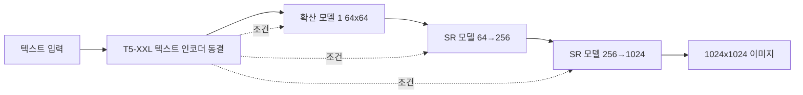

# Imagen - Google 텍스트-이미지 생성 모델

## 배경

Imagen(Saharia et al., Google Brain, 2022)은 Google이 발표한 텍스트-이미지 생성 시스템이다. 핵심 통찰은 이미지 생성 모델 자체보다 **텍스트 인코더의 품질**이 최종 이미지 품질과 텍스트 정렬에 더 큰 영향을 미친다는 발견이다.

특히 순수 언어 모델로 사전 훈련된 **T5-XXL**(110억 파라미터)을 동결 상태로 텍스트 인코더로 사용하는 전략이 CLIP 등 시각-언어 모델 기반 인코더보다 우수함을 보였다.

DrawBench 평가에서 DALL-E 2와 GLIDE를 능가하며 사실적 이미지 생성의 새로운 기준을 세웠다.

## 아키텍처 구조

Imagen은 세 단계의 **캐스케이드 확산 모델(cascaded diffusion model)**로 구성된다:

### 단계 1: 64x64 기본 이미지 생성

- **텍스트 조건 확산 모델**: T5-XXL 임베딩을 조건으로 64x64 이미지 생성
- **구조**: U-Net 기반. [[cross-attention]]으로 텍스트 임베딩을 각 해상도 레이어에 주입
- **클래스 없는 가이던스(Classifier-Free Guidance)**: 텍스트-이미지 정렬 강화

### 단계 2 & 3: 초해상도 (SR)

- **64x64 → 256x256**: 조건부 초해상도 확산 모델
- **256x256 → 1024x1024**: 두 번째 조건부 초해상도 확산 모델
- 각 SR 단계에도 동일한 T5-XXL 텍스트 조건 적용 (텍스트-이미지 정렬 유지)

### 효율적 U-Net (Efficient U-Net)

Imagen의 기본 64x64 생성 모델은 메모리와 속도 효율을 위한 **Efficient U-Net** 구조를 사용한다:

- 낮은 해상도 스킵 연결 제거 (계산 비용 절감)
- 모델 깊이가 아닌 채널 수 증가로 확장
- 선행 업샘플링 + 후행 다운샘플링 패턴

## 텍스트 인코더: T5-XXL의 역할

### T5 vs CLIP 비교

| 항목 | CLIP 텍스트 인코더 | T5-XXL |
|------|-----------------|--------|
| 사전학습 목표 | 이미지-텍스트 대조 | 텍스트 재구성 (T5) |
| 언어 이해 깊이 | 중간 | 매우 깊음 |
| 파라미터 | ~125M | ~11B |
| 최대 시퀀스 길이 | 77 토큰 | 512 토큰 |
| 동결 여부 | 보통 미세조정 | 완전 동결 |

T5-XXL의 풍부한 언어 표현 덕분에 복잡한 장면 설명, 공간 관계, 속성 바인딩(attribute binding)에서 CLIP 기반 모델보다 우수하다.

### 동결 전략의 이점

- 텍스트 인코더 훈련 비용 없음
- 대규모 언어 모델의 언어 이해 능력 그대로 활용
- 이미지 생성 모델만 훈련 → 효율적

## 학습

### 데이터셋

- **내부 데이터 460M 이미지-텍스트 쌍** (Google 내부)
- LAION-400M 외부 데이터 추가 활용

### 노이즈 조건화 증강 (Noise Conditioning Augmentation)

SR 모델 훈련의 핵심 기법:

- 저해상도 입력에 가우시안 노이즈를 추가하여 SR 모델 훈련
- 노이즈 강도를 조건 변수로 모델에 제공
- 추론 시 노이즈 강도 하이퍼파라미터로 품질 조절 가능

### 동적 임계값 (Dynamic Thresholding)

높은 가이던스 스케일에서 이미지가 포화(saturation)되는 문제를 해결:

일반 정적 임계값:
$$\hat{x} = \text{clip}(x_0, -1, 1)$$

동적 임계값 (Imagen 제안):
$$\hat{x} = \text{clip}(x_0, -s, s) / s$$

여기서 $s$는 현재 배치의 절대값 백분위수 $p$ (예: 99번째 백분위수). 이를 통해 높은 가이던스 스케일에서도 이미지 품질 유지가 가능하다.

## 가이던스 전략

### 클래스 없는 가이던스 (Classifier-Free Guidance, CFG)

$$\hat{\epsilon} = \epsilon_\theta(x_t, \varnothing) + w \cdot (\epsilon_\theta(x_t, c) - \epsilon_\theta(x_t, \varnothing))$$

- $\varnothing$: 빈 텍스트 조건 (10% 확률로 텍스트 드롭아웃하여 학습)
- $w$: 가이던스 스케일 (Imagen에서 7.5 사용)
- 높은 $w$: 텍스트 정렬 강화 but 다양성 감소

## 성능 및 평가

### DrawBench 비교 (2022년 기준)

DrawBench는 Google이 제안한 11개 카테고리, 200개 프롬프트 평가 세트:

| 모델 | DrawBench 선호도 |
|------|---------------|
| **Imagen** | **DALL-E 2 대비 선호** |
| DALL-E 2 | - |
| GLIDE | Imagen에 뒤짐 |
| VQ-Diffusion | Imagen에 뒤짐 |

- 텍스트 정렬 및 사실적 표현에서 인간 평가자 선호
- 특히 복잡한 장면 설명에서 우위

### 한계

- **비공개 모델**: 내부 데이터로 훈련하여 공개 API만 제공 (완전 오픈소스 아님)
- **추론 속도**: 3단계 캐스케이드로 단일 모델 대비 느림
- **텍스트 렌더링**: 이미지 내 텍스트 생성은 DALL-E 3에 비해 부정확

## Imagen 2와 이후 발전

구글은 이후 Imagen 2, Imagen 3을 발표:

| 버전 | 주요 개선 |
|------|---------|
| Imagen | T5-XXL + 캐스케이드 확산 |
| Imagen 2 | 멀티모달 입력, 인페인팅 강화 |
| Imagen 3 | 텍스트 렌더링 개선, 사진 품질 향상 |
| Imagen Video | 텍스트-비디오 확산 |

## 실무 영향

Imagen의 주요 기여:
1. **동결 대형 언어 모델을 텍스트 인코더로 활용** - 이후 모델들이 따라가는 패턴
2. **동적 임계값** - 높은 CFG 스케일 사용 가능하게 함
3. **노이즈 조건화 증강** - 캐스케이드 SR 훈련 표준화

## 관련 문서

- [[dalle-3-architecture]]
- [[stable-diffusion-3-mmdit]]
- [[parti-autoregressive-image]]
- [[muse-masked-image]]
- [[diffusion-models]]
- [[latent-diffusion-model]]
- [[t5-text-to-text]]
- [[clip]]
- [[u-net]]
- [[cross-attention]]
- [[flow-matching]]
