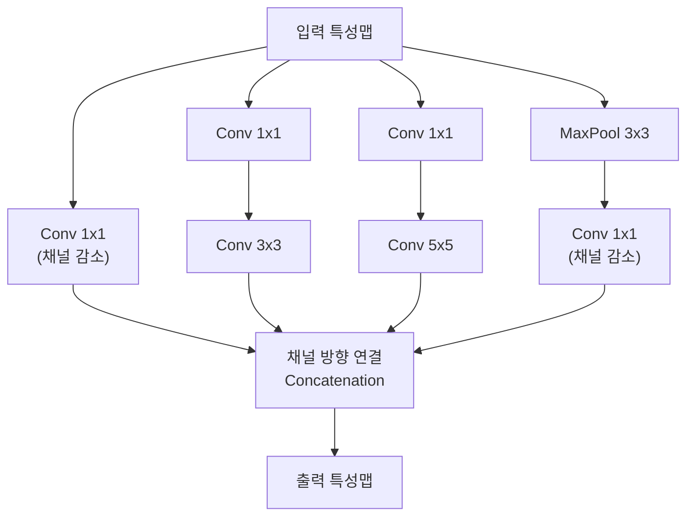
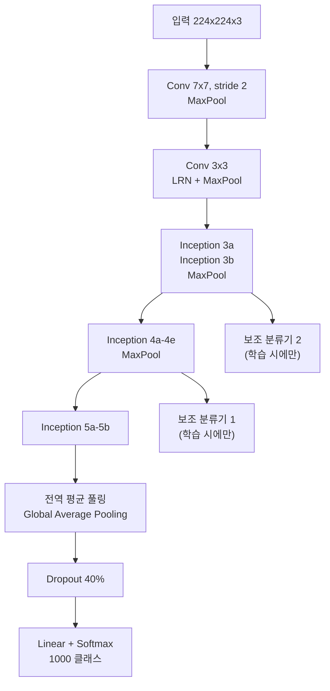
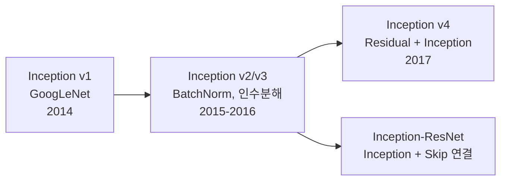

# Inception 모듈과 GoogLeNet

Inception(Szegedy et al., CVPR 2015)은 **여러 크기의 합성곱 필터를 병렬로 적용한 뒤 결과를 연결(concatenate)**하는 모듈 기반 CNN 아키텍처다. 단일 크기의 필터를 반복하는 [[vgg-deep-nets]]와 달리, 같은 레이어에서 다양한 스케일의 특성을 동시에 추출함으로써 파라미터 효율과 표현력 모두를 높인다. ILSVRC 2014 우승 모델이다.

## 핵심 아이디어: 다중 스케일 병렬 처리

이미지 내 객체는 다양한 크기로 나타난다. 고양이가 사진 전체를 차지할 수도 있고, 먼 배경의 작은 점처럼 보일 수도 있다. 단일 크기 필터는 특정 스케일에 편향된다.

Inception 모듈은 이 문제를 **같은 레이어에서 1x1, 3x3, 5x5 합성곱을 병렬 실행**하여 해결한다:

네 경로의 출력을 채널 방향으로 이어붙인 것이 다음 레이어의 입력이 된다.

## 1x1 합성곱의 역할: 병목 구조 (Bottleneck)

직관적으로 보면 1x1 합성곱이 의미 없어 보이지만, 이는 **차원 축소(dimensionality reduction)** 역할을 한다:

- 3x3이나 5x5 합성곱을 직접 적용하면 채널 수가 많을 때 연산량이 폭증
- 1x1 합성곱으로 채널 수를 먼저 줄인 뒤 큰 필터를 적용하면 연산량이 크게 감소

**예시 연산량 비교** (입력 28x28x256, 출력 28x28x128):

| 구성 | 연산량 |
|------|--------|
| 5x5 직접 적용 | $28 \times 28 \times 128 \times 5 \times 5 \times 256 \approx 1.2\text{B}$ |
| 1x1(→32ch) + 5x5 | $28 \times 28 \times 32 \times 256 + 28 \times 28 \times 128 \times 5^2 \times 32 \approx 0.18\text{B}$ |

1x1 병목 구조로 약 **7배 연산 절감**.

## GoogLeNet 전체 구조

**총 22개 레이어** (파라미터 있는 레이어 기준), 파라미터 수 약 **5M** (VGG-16의 138M 대비 1/28 수준).

## 전역 평균 풀링 (Global Average Pooling)

GoogLeNet의 또 다른 혁신은 VGG의 거대한 FC 레이어를 제거하고 **전역 평균 풀링**으로 대체한 것이다:

- VGG-16: 합성곱 출력 → Flatten → FC(4096) → FC(4096) → FC(1000) → 약 102M 파라미터
- GoogLeNet: 합성곱 출력(7x7x1024) → 전역 평균 풀링 → 1024차원 벡터 → FC(1000) → 약 1M 파라미터

각 채널의 공간 평균값 하나만 취하므로 위치 불변성(translation invariance)도 자연스럽게 강화된다.

## 보조 분류기 (Auxiliary Classifiers)

22층의 깊이에서 기울기 소실 문제에 대응하기 위해 **중간 레이어에서도 손실을 계산**한다:

$$\mathcal{L}_{total} = \mathcal{L}_{main} + 0.3 \times \mathcal{L}_{aux1} + 0.3 \times \mathcal{L}_{aux2}$$

보조 분류기는 훈련 시에만 활성화되고, 추론 시에는 제거된다. 이 아이디어는 이후 [[resnet-skip-connections]]의 스킵 연결이 기울기 소실을 더 깔끔하게 해결하면서 사라졌다.

## Inception 버전 진화

**Inception v3의 개선사항:**
- 5x5 합성곱 → 두 개의 3x3으로 인수분해 (파라미터 절감)
- 7x7 → 1x7 + 7x1 비대칭 합성곱
- 배치 정규화(Batch Normalization) 도입
- 레이블 스무딩(Label Smoothing) 적용

## VGGNet, ResNet과의 비교

| 항목 | VGGNet | GoogLeNet | ResNet-50 |
|------|--------|-----------|-----------|
| 파라미터 수 | 138M | 5M | 25.6M |
| GFLOPs | 15.5 | 1.5 | 4.1 |
| Top-5 오류율 | 7.4% | 6.7% | 5.3% |
| 구조 복잡도 | 단순 반복 | 병렬 모듈 | 잔차 블록 |

GoogLeNet은 파라미터 대비 성능이 가장 효율적이었으나, Inception 모듈의 복잡한 구조로 인해 커스터마이징이 어려워 연구자들 사이에서는 ResNet이 더 널리 채택됐다.

## 관련 문서

- [[cnn]] - 합성곱 신경망 기본 구조
- [[resnet-skip-connections]] - 잔차 연결로 기울기 소실을 해결한 ResNet
- [[vgg-deep-nets]] - 단순한 3x3 필터 반복으로 깊이를 추구한 VGGNet
- [[gradient-descent-backpropagation]] - 기울기 소실과 역전파
