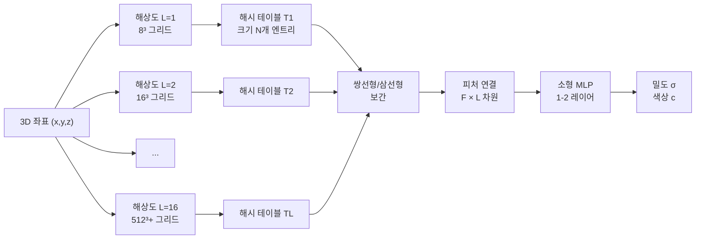

# Instant-NGP - 해시 인코딩 기반 초고속 NeRF

## 개요

Instant-NGP(Instant Neural Graphics Primitives)는 NVIDIA Research(Thomas Muller 외, 2022)에서 발표한 신경 표현(neural representation) 가속화 기법이다. 기존 [[nerf-neural-radiance-fields|NeRF]]가 수십 시간의 학습 시간을 필요로 했던 것과 달리, Instant-NGP는 **수 초에서 수 분** 만에 동등한 품질의 NeRF를 학습한다. 핵심 혁신은 **다해상도 해시 인코딩(multiresolution hash encoding)**이며, 이는 [[implicit-neural-representations]]의 병목이었던 위치 인코딩 연산을 근본적으로 재설계한 것이다.

## 기존 NeRF의 병목

표준 NeRF는 3D 좌표 $(x, y, z)$를 푸리에 피처(positional encoding)로 변환한 뒤 대형 MLP에 입력한다. 문제는 두 가지다:

1. **위치 인코딩이 표현력을 제한**: 고정된 주파수 기반 인코딩은 세밀한 디테일 표현에 비효율적
2. **대형 MLP 연산이 느림**: 픽셀마다 수십 번의 MLP forward pass 필요

Instant-NGP는 두 문제를 모두 학습 가능한 해시 테이블로 해결한다.

## 다해상도 해시 인코딩 원리

각 해상도에서 공간 좌표를 격자 꼭짓점에 매핑하고, 해당 꼭짓점들의 학습 가능한 피처 벡터를 보간하여 합친다.

## 해시 함수와 충돌 처리

고해상도 격자의 경우 격자 꼭짓점 수($512^3$이면 약 1.3억 개)가 해시 테이블 크기($N$, 일반적으로 $2^{14}$ ~ $2^{24}$)를 초과한다. 이때 **해시 충돌(hash collision)**이 발생하지만, 실험적으로 이 충돌이 학습에 큰 지장을 주지 않음이 확인됐다. 이유는:

- 저해상도 레벨에서는 충돌이 거의 없어 거시적 구조를 정확히 포착
- 고해상도 레벨의 충돌은 네트워크가 암묵적으로 해소하도록 학습됨

해시 함수는 XOR 기반 공간 해싱을 사용한다:

$$h(x) = \left(\bigoplus_{i=1}^{d} x_i \cdot \pi_i \right) \mod N$$

$\pi_i$는 소수(prime number), $d$는 공간 차원수.

## 성능 비교

| 방법 | 학습 시간 | PSNR (NeRF-Synthetic) | 렌더링 속도 |
|------|----------|-----------------------|------------|
| 원본 NeRF | ~24시간 | 31.0 dB | ~1 FPS |
| mip-NeRF | ~48시간 | 33.1 dB | ~0.5 FPS |
| TensoRF | ~30분 | 33.1 dB | 실시간 |
| Instant-NGP | **수 초 - 5분** | 33.2 dB | **실시간** |

## CUDA 최적화

Instant-NGP는 CUDA 커널 수준의 최적화를 포함한다. 해시 테이블 조회와 보간을 GPU 병렬 처리로 실행하며, tiny-cuda-nn 라이브러리를 통해 소형 MLP를 half-precision(FP16)으로 고속 실행한다.

이는 [[nerf-neural-radiance-fields|NeRF]] 연구를 **연구용 방법론에서 실시간 응용**으로 끌어올린 전환점이 됐다.

## 다양한 적용 분야

Instant-NGP가 제안한 해시 인코딩은 NeRF 이외에도 여러 [[implicit-neural-representations]] 태스크에 적용된다:

- **SDF(Signed Distance Fields)**: 메쉬 표면 표현
- **이미지 압축**: 2D 이미지를 고속으로 신경망으로 압축
- **신경 방사선(Neural Radiance)**: 학습 가능한 볼륨 렌더링
- **[[volume-rendering-differentiable]]**: 미분 가능 렌더링 파이프라인과 결합

## 이후 발전에 미친 영향

- **3D Gaussian Splatting([[3d-gaussian-splatting]])**: NeRF와는 다른 방향이지만 Instant-NGP가 개척한 "실시간 3D 재구성" 영역을 계승
- **NeRF Studio**: Instant-NGP를 기반으로 한 모듈형 NeRF 연구 프레임워크
- **도메인별 특화 NeRF**: 실내 장면(NeRFacto), 야외 대규모 장면(Mega-NeRF) 등 모두 해시 인코딩 채택

## 실무 적용

- **디지털 트윈**: 스마트폰 사진만으로 수 분 내 3D 장면 재구성 가능
- **AR/VR 콘텐츠 제작**: 실물 촬영 → 빠른 NeRF 학습 → 가상 환경 삽입
- **자율주행 시뮬레이션**: 실제 도로 장면의 신경 표현으로 데이터 증강

## 관련 문서
- [[mip-nerf]] -- Mip-NeRF - 안티앨리어싱 신경 방사 필드

- [[nerf-neural-radiance-fields|NeRF]] - Instant-NGP가 가속화하는 원본 NeRF 기법
- [[implicit-neural-representations]] - 신경 암묵 표현의 일반 개념
- [[volume-rendering-differentiable]] - 미분 가능 볼륨 렌더링 원리
- [[3d-gaussian-splatting]] - Instant-NGP와 다른 방향의 실시간 3D 표현
