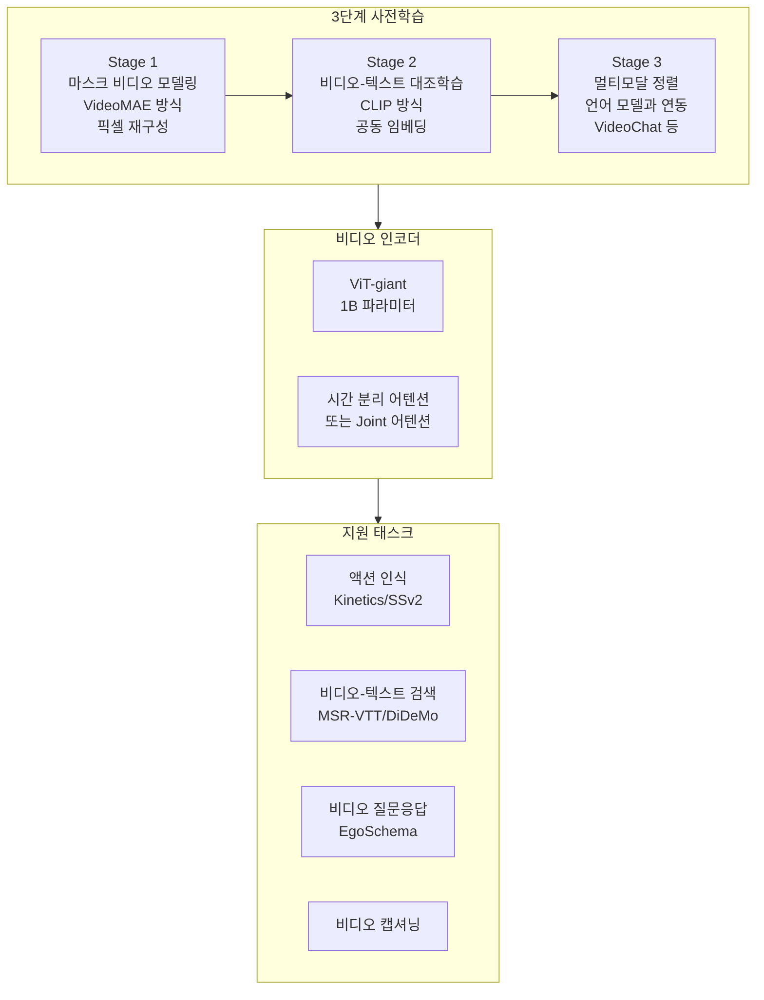

# InternVideo2 - 멀티모달 비디오 파운데이션 모델

## 개요

InternVideo2는 상하이 AI 연구소(Shanghai AI Laboratory)와 중국과학기술대학교(USTC) 등이 공동 개발한 **대규모 멀티모달 비디오 파운데이션 모델**이다(2024년 공개). 비디오 이해, 비디오-텍스트 검색, 비디오 질문응답(VideoQA) 등 광범위한 비디오 태스크에서 최고 수준의 성능을 달성했다. 핵심 설계 철학은 [[videomae-masked-video]] 기반 비디오 마스크 자기지도학습과 [[clip]] 기반 비디오-텍스트 대조학습을 **단일 파이프라인에서 공동 훈련**하여 두 접근법의 장점을 결합하는 것이다.

## 아키텍처 개요

## 핵심 설계: 2단계 마스크-대조 결합 사전학습

### 1단계: 마스크 비디오 모델링

[[videomae-masked-video]] 방식을 그대로 적용한다. 비디오 토큰의 90%를 마스킹한 뒤 픽셀 재구성을 목표로 ViT 인코더를 학습한다. 이 단계에서 시각적 패턴, 시공간 구조, 세밀한 동작 표현을 학습한다.

### 2단계: 비디오-텍스트 대조 정렬

1단계로 학습된 비디오 인코더와 텍스트 인코더를 [[clip]] 방식의 InfoNCE 손실로 추가 정렬한다. 대규모 비디오-캡션 쌍(HowTo100M, WebVid 등)을 활용한다. 이 단계에서 언어와의 의미 정렬을 강화한다.

### 3단계: 대규모 언어모델 연동

InternLM 등 언어 모델을 비디오 인코더와 연결하여 VideoChat2 같은 멀티모달 대화 시스템 구축에 활용한다.

## 모델 규모 스펙

| 컴포넌트 | 세부 사항 |
|----------|----------|
| 비디오 인코더 | ViT-giant (1B 파라미터) |
| 텍스트 인코더 | CoCa 기반 대형 트랜스포머 |
| 입력 해상도 | 224×224 또는 448×448 |
| 입력 프레임 수 | 8 ~ 16 프레임 |
| 사전학습 데이터 | 약 12M 비디오 (HowTo100M 서브셋 + Kinetics + WebVid) |

## 벤치마크 성능

InternVideo2는 공개 당시 20개 이상의 비디오 벤치마크에서 최고 성능을 달성했다:

| 벤치마크 | 태스크 | InternVideo2 | 이전 SOTA |
|----------|--------|--------------|----------|
| Kinetics-400 | 액션 인식 Top-1 | 92.1% | 91.7% |
| Something-Something V2 | 액션 인식 Top-1 | 77.2% | 76.3% |
| MSR-VTT R@1 | 텍스트→비디오 검색 | 57.3% | 54.5% |
| EgoSchema | 자아중심 비디오 QA | 65.4% | 60.1% |
| MSVD-QA | 비디오 질문응답 | 75.7% | 73.1% |

Something-Something V2처럼 시간적 인과관계가 중요한 벤치마크에서의 향상이 특히 두드러진다. 이는 [[videomae-masked-video]]의 높은 마스킹 비율 사전학습이 기여한 결과로 분석된다.

## VideoMAE와 CLIP의 시너지

두 사전학습 방식의 상보성이 InternVideo2 성공의 핵심이다:

| 특성 | VideoMAE 단독 | CLIP 단독 | InternVideo2 (결합) |
|------|--------------|----------|-------------------|
| 세밀한 동작 구분 | 강함 | 약함 | 강함 |
| 텍스트 기반 검색 | 약함 | 강함 | 강함 |
| 제로샷 분류 | 약함 | 강함 | 강함 |
| 시간 추론 | 강함 | 약함 | 강함 |

## 멀티모달 확장: VideoChat2

InternVideo2 비디오 인코더 위에 InternLM 언어 모델을 연결한 **VideoChat2**는 자연어로 비디오에 대한 대화가 가능하다:

- "이 비디오에서 어떤 요리를 만들고 있나요?"
- "두 번째 장면에서 선수가 어떤 실수를 했나요?"
- "이 강의 내용을 3줄로 요약해줘"

이는 순수 분류/검색에서 **대화형 비디오 이해**로의 전환을 보여준다.

## 연구 생태계와 후속 작업

InternVideo 시리즈는 InternLM, InternImage 등과 함께 상하이 AI 연구소의 "Intern" 모델 패밀리를 구성한다:

- **InternVideo(1세대, 2022)**: ViT-L 기반, VideoMAE + CLIP 기초 결합
- **InternVideo2(2024)**: ViT-giant 스케일, 3단계 학습, VideoChat2 통합
- **InternVideo2.5 / 3(예정)**: 더 큰 언어 모델과의 결합, 긴 비디오 처리

## 실무 활용

- **콘텐츠 플랫폼**: 비디오 자동 분류/태깅/자막 생성
- **교육 기술**: 강의 영상 자동 요약, 핵심 구간 추출
- **보안/감시**: 이상 행동 탐지 (제로샷 정의 가능)
- **스포츠 분석**: 전술 분석, 하이라이트 자동 생성

## 관련 문서

- [[videomae-masked-video]] - 1단계 마스크 사전학습 기반 기법
- [[clip]] - 2단계 비디오-텍스트 대조학습 기반 기법
- [[video-clip-contrastive]] - 비디오-텍스트 대조학습 개념 상세
- [[timesformer-divided-attention]] - 비디오 인코더 설계 참고 아키텍처
- [[optical-flow-deep-learning]] - InternVideo 이전 세대의 비디오 표현
