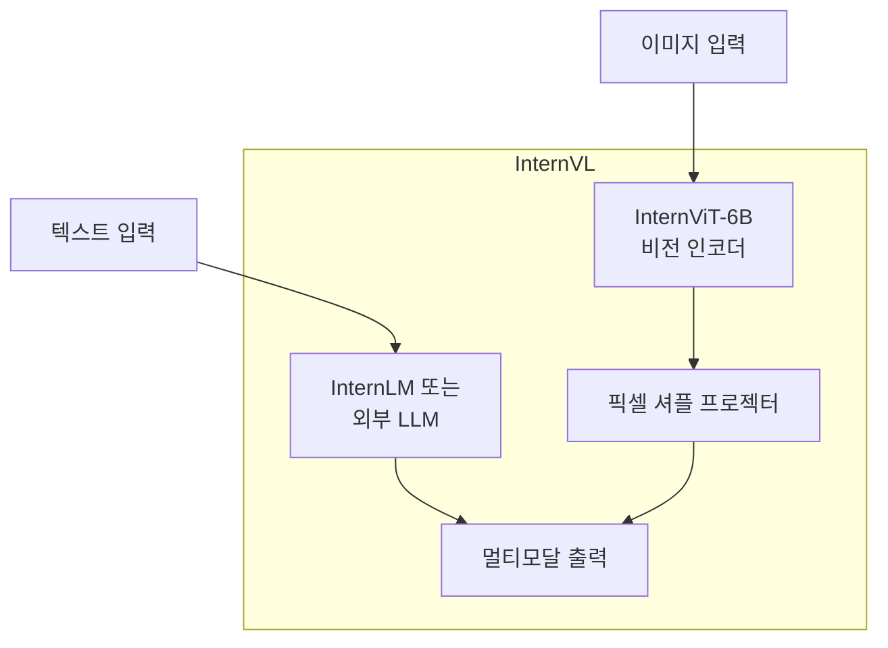
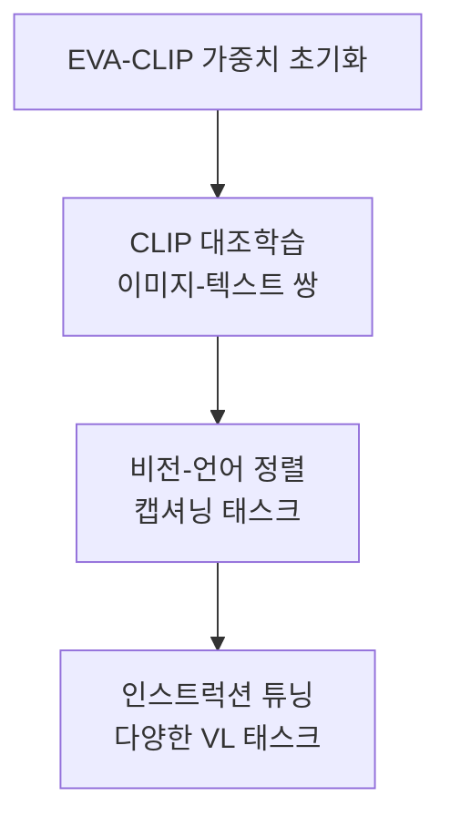

# InternViT-6B - InternVL의 6B 비전 인코더

## 개요

InternViT-6B는 Shanghai AI Laboratory가 개발한 InternVL(Internal Vision-Language) 프레임워크의 핵심 비전 인코더다. 60억(6B) 파라미터를 가진 대규모 [[vision-transformer]] 기반 인코더로, 기존 [[clip|CLIP]] 계열 비전 인코더를 크게 뛰어넘는 시각 표현 능력을 목표로 설계되었다. LLM과 결합해 강력한 멀티모달 이해 능력을 달성한다.

## InternVL 프레임워크에서의 위치

InternVL 아키텍처의 세 구성 요소:
1. **InternViT-6B**: 시각 정보를 처리하는 비전 인코더
2. **프로젝터(Projector)**: 비전-언어 특징 정렬 모듈
3. **LLM**: 언어 생성 및 추론 담당

## 왜 6B 규모인가

기존 비전 인코더(CLIP ViT-L, 307M 파라미터)와 언어 모델(수십억 파라미터) 사이의 **규모 불균형**이 멀티모달 모델의 병목이 된다는 문제의식에서 출발한다.

| 비전 인코더 | 파라미터 | 비고 |
|-----------|---------|------|
| CLIP ViT-L | 307M | 표준 CLIP |
| EVA-CLIP-8B | 8B | 대규모 CLIP |
| InternViT-6B | 6B | InternVL 전용 |
| EVA-CLIP-18B | 18B | 최대 규모 CLIP |

6B 규모의 비전 인코더를 사용함으로써 언어 모델과의 표현력 균형을 맞추고, 더 풍부한 시각 특징을 언어 모델에 제공한다.

## 아키텍처 세부사항

| 항목 | 값 |
|------|-----|
| 파라미터 수 | 6B |
| 레이어 수 | 48 |
| 히든 차원 | 3200 |
| 어텐션 헤드 | 25 |
| 패치 크기 | 14x14 |
| 입력 해상도 | 224x224 ~ 448x448 |

## 학습 전략

InternViT-6B는 단계적 학습을 거친다:

1. **초기화**: EVA-CLIP 계열 가중치로 초기화 (처음부터 학습하지 않음)
2. **CLIP 대조학습**: 대규모 이미지-텍스트 쌍으로 정렬
3. **다운스트림 정렬**: VQA, 캡셔닝 등 다양한 태스크로 파인튜닝

## 고해상도 처리: Dynamic Resolution

InternViT-6B의 중요한 특징 중 하나는 **동적 해상도(Dynamic Resolution)** 처리다.

- 입력 이미지를 여러 448x448 타일로 분할
- 각 타일을 InternViT-6B로 독립 처리
- 결과 특징들을 연결해 LLM에 입력
- 고해상도 문서, 차트, 텍스트 이미지 처리에 효과적

## 성능 및 활용

InternVL2 시리즈에서 InternViT-6B를 활용한 모델들이 다양한 멀티모달 벤치마크에서 경쟁력을 보였다:

- **MMBench**: 멀티모달 이해 벤치마크
- **MathVista**: 수학적 시각 추론
- **DocVQA**: 문서 이해 VQA
- **ChartQA**: 차트 이해

특히 고해상도 처리가 필요한 문서/차트 이해 태스크에서 강점을 보인다.

## InternVL 버전 진화

| 버전 | 비전 인코더 | LLM | 주요 특징 |
|------|-----------|-----|---------|
| InternVL 1.0 | InternViT-6B | InternLM | 첫 공개 |
| InternVL 1.5 | InternViT-6B | InternLM2 | 동적 해상도 도입 |
| InternVL 2.0 | InternViT-6B | 다양한 LLM | 외부 LLM 지원 강화 |
| InternVL2.5 | InternViT-6B | InternLM2.5 | 추론 능력 강화 |

## 오픈소스 생태계에서의 의미

InternVL과 InternViT-6B는 완전 오픈소스로 공개되어 있어, 대규모 상용 모델(GPT-4V, Gemini) 대비 경쟁력 있는 오픈소스 멀티모달 모델 생태계 형성에 기여한다.

Hugging Face에서 모델 가중치를 직접 다운로드해 사용할 수 있으며, 다양한 커뮤니티 파인튜닝 사례가 존재한다.

## 관련 문서

- [[vision-transformer]] - 기반 ViT 아키텍처
- [[clip]] - CLIP 대조학습 방법론
- [[eva-clip-scaling]] - EVA-CLIP (InternViT 초기화 기반)
- [[hierarchical-vit-design]] - 대형 ViT 설계 패턴
- [[masked-image-modeling-survey]] - 비전 인코더 사전학습 비교
