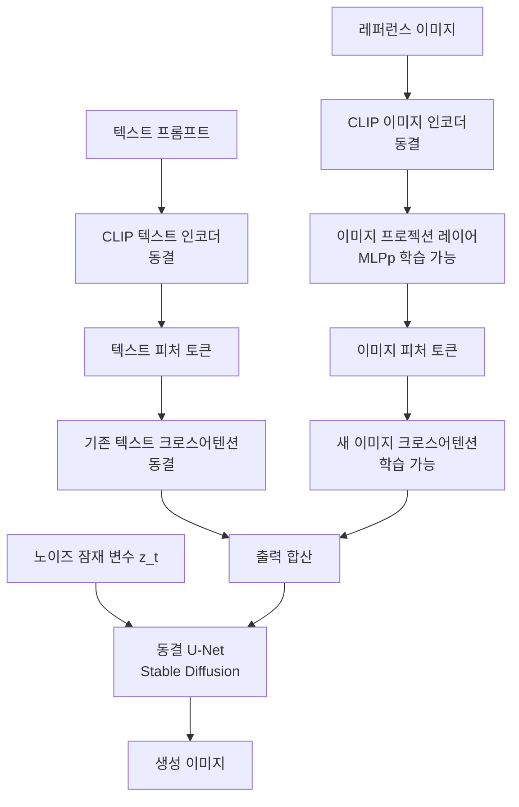

# IP-Adapter - 이미지 프롬프팅 어댑터

## 개요

IP-Adapter(Image Prompt Adapter)는 텍스트 프롬프트 대신(또는 함께) **이미지 자체를 프롬프트**로 사용하여 확산 모델의 생성을 안내하는 경량 어댑터다. Ye et al.(2023, Tencent)이 제안했으며, 별도의 파인튜닝 없이 레퍼런스 이미지의 스타일·콘텐츠를 새 이미지에 이식할 수 있다.

핵심 전략은 **분리된 크로스어텐션(decoupled cross-attention)**이다. 텍스트 피처를 처리하는 기존 크로스어텐션 레이어를 건드리지 않고, 이미지 피처만을 위한 별도 크로스어텐션 레이어를 병렬로 추가한다.

## 왜 중요한가

텍스트만으로는 특정 스타일이나 시각적 느낌을 정확히 전달하기 어렵다. "반 고흐 스타일로" 같은 프롬프트는 근사치일 뿐이다. IP-Adapter는 이 한계를 해결한다:

- **제로샷 스타일 이전**: 레퍼런스 이미지 1장으로 스타일 복제
- **얼굴 일관성**: 특정 인물의 외모를 유지하며 다른 장면 생성
- **객체 외관 이전**: 특정 물체의 색상·질감을 새 구도로 재배치
- **[[controlnet-conditioning|ControlNet]]과 결합**: 구도(ControlNet) + 스타일(IP-Adapter) 동시 제어

## 아키텍처

### 전체 구조



U-Net의 모든 크로스어텐션 레이어에 이미지 크로스어텐션이 병렬 추가된다. 두 어텐션의 출력을 더하는 방식으로 텍스트·이미지 조건이 함께 작동한다.

### 분리된 크로스어텐션 (Decoupled Cross-Attention)

기존 [[cross-attention]]이 텍스트 피처 $F_t$를 쿼리 $Q$에 투영하고 키-값으로 분해하는 것처럼, 이미지 피처 $F_i$도 동일한 구조로 별도 처리한다:

$$\text{Attn}(Q, K_t, V_t) = \text{Softmax}\left(\frac{Q K_t^T}{\sqrt{d}}\right) V_t$$

$$\text{Attn}(Q, K_i, V_i) = \text{Softmax}\left(\frac{Q K_i^T}{\sqrt{d}}\right) V_i$$

최종 출력:

$$\text{Output} = \text{Attn}(Q, K_t, V_t) + \lambda \cdot \text{Attn}(Q, K_i, V_i)$$

$\lambda$는 이미지 조건의 강도를 조절하는 스케일 파라미터다. $\lambda=0$이면 순수 텍스트 생성, $\lambda=1$이면 이미지 조건 최대치.

### 이미지 인코딩 경로

1. CLIP 이미지 인코더로 레퍼런스 이미지 → 피처 추출 (동결)
2. 경량 MLP 프로젝션으로 피처를 U-Net 임베딩 차원으로 변환 (학습 가능)
3. 토큰 수: 텍스트처럼 가변 길이가 아닌 고정 4-16개 토큰

## 학습 파라미터

| 구성요소 | 상태 | 파라미터 수 |
|----------|------|-------------|
| CLIP 이미지 인코더 | 동결 | - |
| CLIP 텍스트 인코더 | 동결 | - |
| U-Net (SD) | 동결 | - |
| 이미지 프로젝션 레이어 | 학습 | ~22M |
| 이미지 크로스어텐션 | 학습 | ~500M |

전체 SD 1.5 기준 약 22M 파라미터만 학습하며, 학습 데이터는 이미지-텍스트 쌍 수십만 개로 충분하다.

## 변형 모델

### IP-Adapter-Full

원본 논문의 표준 버전. CLIP ViT-H 인코더 사용.

### IP-Adapter-Plus

글로벌 피처 대신 **패치 피처(patch-level feature)**를 활용해 더 세밀한 디테일 이전. CLIP의 CLS 토큰 대신 모든 패치 임베딩을 투영해 16개 토큰으로 압축.

### IP-Adapter-FaceID

얼굴 인식 모델(ArcFace) 임베딩을 사용해 얼굴 동일성(identity) 유지에 특화. LoRA와 조합해 더 강력한 얼굴 일관성 달성.

### IP-Adapter for SDXL

SDXL 백본 지원. 더 높은 해상도와 더 나은 품질.

## 실무 활용

- **제품 광고 이미지**: 실제 제품 사진 → 다양한 배경·조명으로 재배치
- **캐릭터 일관성**: 소설·만화 캐릭터를 다양한 장면에서 외모 유지
- **인테리어 스타일 이전**: 참조 방 사진 → 새 구도에 동일 스타일 적용
- **[[controlnet-conditioning|ControlNet]] 조합**: 포즈 고정(ControlNet) + 참조 스타일(IP-Adapter)
- **패션 시착**: 의류 참조 이미지를 다른 모델에 입히기

```python
# ComfyUI/diffusers 유사 패턴 (실제 API는 구현마다 다름)
from diffusers import StableDiffusionPipeline
# IP-Adapter 가중치 로드 후 pipeline.load_ip_adapter() 사용
# 레퍼런스 이미지와 텍스트를 함께 전달
output = pipeline(
    prompt="a photo of a cat",
    ip_adapter_image=reference_image,
    ip_adapter_scale=0.6,  # 이미지 조건 강도
)
```

## [[controlnet-conditioning|ControlNet]]과의 비교

| 속성 | ControlNet | IP-Adapter |
|------|-----------|------------|
| 조건 유형 | 공간적 구조(엣지, 포즈, 깊이) | 외관·스타일 |
| 학습 파라미터 | 인코더 사본 전체 | 크로스어텐션 레이어만 |
| 조건 표현 | 픽셀 수준 맵 | 이미지 임베딩 벡터 |
| 결합 가능 여부 | IP-Adapter와 병렬 사용 가능 | ControlNet과 병렬 사용 가능 |

## 한계

- 레퍼런스 이미지에서 텍스트가 있으면 생성 결과에 혼입될 수 있음
- 얼굴 동일성 유지는 FaceID 특화 버전 필요 (일반 버전은 완벽하지 않음)
- CLIP 임베딩 공간의 제약: CLIP이 잘 표현하지 못하는 시각 속성은 이전 불완전

## 관련 문서

- [[controlnet-conditioning]] - 공간적 조건 제어 어댑터
- [[cross-attention]] - IP-Adapter의 핵심 메커니즘
- [[latent-diffusion-model]] - 기반 확산 모델
- [[clip]] - 이미지 인코딩에 사용하는 비전-언어 모델
- [[animatediff-motion-modules]] - 비디오로 확장 시 함께 사용
- [[dit-diffusion-transformer]] - DiT 기반 최신 확산 백본
