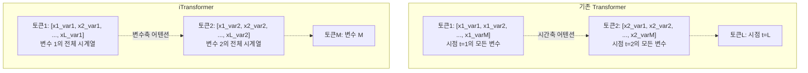
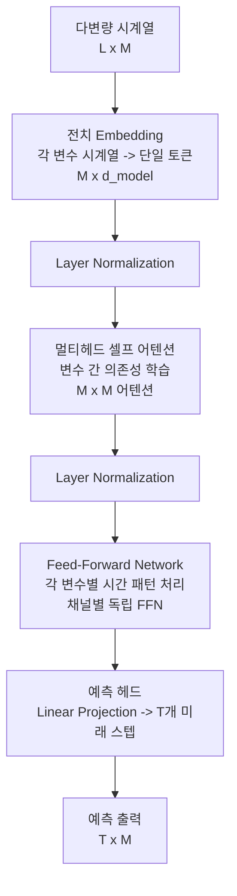
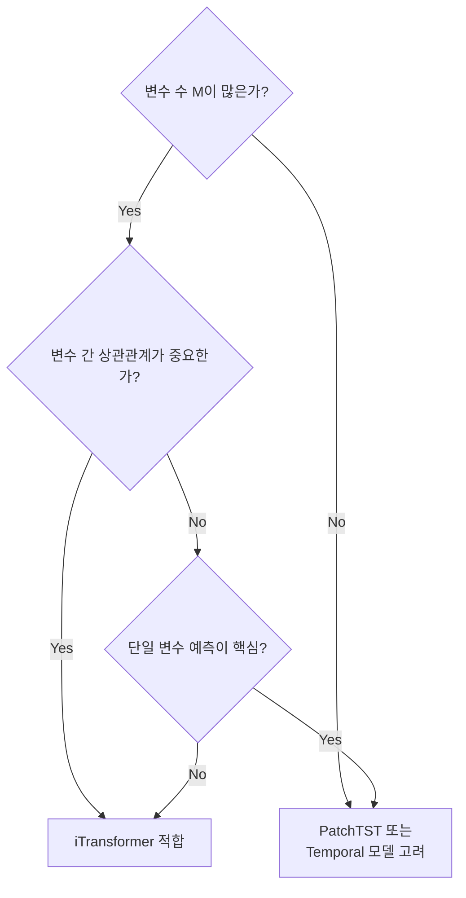

# iTransformer

iTransformer(Inverted Transformer)는 2023년 Liu 외 연구진이 발표한 다변량 시계열 예측 모델이다. 기존 Transformer 기반 시계열 모델들이 **시간축을 따라** 어텐션을 계산하던 것을 뒤집어(invert), **변수(채널)를 토큰으로** 처리하고 변수 간 의존성을 어텐션으로 모델링한다. 이 단순한 전치(transposition) 아이디어가 당시 SOTA를 크게 갱신했으며, [[time-series-forecasting-dl]]에서 "왜 기존 Transformer가 단순 선형 모델에도 뒤지는가"라는 질문에 대한 새로운 답을 제시했다.

## 핵심 아이디어: 전치

기존 Transformer 기반 시계열 모델의 문제 인식에서 출발한다.

**기존 방식의 문제**: 각 타임스텝 $t$에서 모든 변수의 값을 묶어 하나의 토큰 $x_t \in \mathbb{R}^M$으로 만든다. 그러면 시퀀스 길이 L에 대한 어텐션이 `L x L` 행렬을 계산한다. 이 방식은 시간 패턴을 포착하지만, 변수 간 상관관계는 각 토큰의 내부(임베딩 차원)로 암묵적으로 밀려나 충분히 모델링되지 않는다.

**iTransformer의 전치**: 각 변수(채널) $m$의 전체 시계열 `[x_1^m, x_2^m, ..., x_L^m]`을 하나의 토큰으로 만든다. 그러면 `M x M` 어텐션으로 변수 간 의존성을 직접 포착한다.

## 아키텍처 상세

### 어텐션 vs. FFN 역할 분리

iTransformer의 중요한 통찰은 어텐션과 FFN의 역할을 명확히 분리한 것이다.

- **어텐션(Multi-head Self-Attention)**: 변수 간 상관관계(multivariate correlations) 포착
- **FFN(Feed-Forward Network)**: 각 변수 내의 시간적 패턴(temporal patterns) 학습

FFN은 채널별로 독립적으로 적용되기 때문에 실질적으로 각 변수의 시계열 표현을 독자적으로 처리한다.

## 수식

입력 $\mathbf{X} \in \mathbb{R}^{L \times M}$에서 변수별 토큰 $\mathbf{H} \in \mathbb{R}^{M \times d}$로 임베딩:

$$\mathbf{H} = \text{Embedding}(\mathbf{X}^T) = \mathbf{X}^T \mathbf{W}_\text{emb} + \mathbf{b}_\text{emb}$$

변수 간 셀프 어텐션:

$$\mathbf{H}' = \text{MultiheadAttn}(\mathbf{H}, \mathbf{H}, \mathbf{H})$$

FFN으로 각 변수 표현 정제:

$$\mathbf{H}'' = \text{FFN}(\mathbf{H}')$$

최종 예측 ($T$개 미래 타임스텝):

$$\hat{\mathbf{Y}} = \mathbf{H}'' \mathbf{W}_\text{out} + \mathbf{b}_\text{out}$$

## 성능 비교

ETT, Weather, Solar-Energy, PEMS, ECL, Traffic 등 표준 벤치마크에서 비교했다.

| 예측 길이 | iTransformer | PatchTST | DLinear | TimesNet |
|---------|------------|---------|---------|---------|
| 96 | 0.454 | 0.370 | 0.386 | 0.384 |
| 336 | 0.501 | 0.422 | 0.433 | 0.449 |
| 720 | 0.548 | 0.447 | 0.477 | 0.491 |

(ETTh1 MSE 기준. ETTh1은 단일 변수 특성이 강해 PatchTST가 유리)

변수 수 M이 많을수록 iTransformer의 이점이 두드러진다. 변수 간 상관관계가 복잡한 Solar-Energy나 PEMS 데이터셋에서 특히 우수하다.

## [[patchtst]]와의 비교

두 모델은 "어디에 어텐션을 쓰는가"라는 핵심 설계에서 상반된다.

| 항목 | iTransformer | [[patchtst]] |
|------|------------|---------|
| 토큰 단위 | 변수(채널) | 시간 패치 |
| 어텐션 의미 | 변수 간 상관관계 | 시간 패턴 |
| 채널 처리 | 혼합(mixing) | 독립(independence) |
| 강점 도메인 | 변수 많고 상관 강한 데이터 | 채널 독립 경향 데이터 |
| 메모리 | O(M^2) | O((L/S)^2) |

## 적용 적합성 판단

## 한계

**계산 비용**: 변수 수 M에 대해 $O(M^2)$ 어텐션 비용이 발생한다. M이 수백~수천인 경우 메모리/시간 부담이 크다.

**시간 국소성 손실**: 각 변수의 전체 시계열을 단일 토큰으로 처리하기 때문에, 짧은 지역 패턴이나 급격한 변화점(change point) 탐지에는 패치 기반 모델보다 불리하다.

**이종 입력 미지원**: [[temporal-fusion-transformer]]처럼 정적 메타데이터나 미래 알려진 공변수를 처리하는 메커니즘이 없다.

## 관련 문서

- [[time-series-forecasting-dl]] - 딥러닝 시계열 예측 전체 맥락
- [[transformer-architecture]] - iTransformer의 기반 아키텍처
- [[patchtst]] - 시간 패치 기반 상반된 접근법
- [[temporal-fusion-transformer]] - 이종 입력과 해석 가능성을 갖춘 시계열 모델
