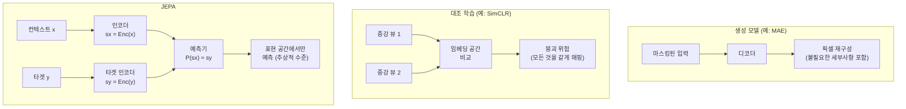
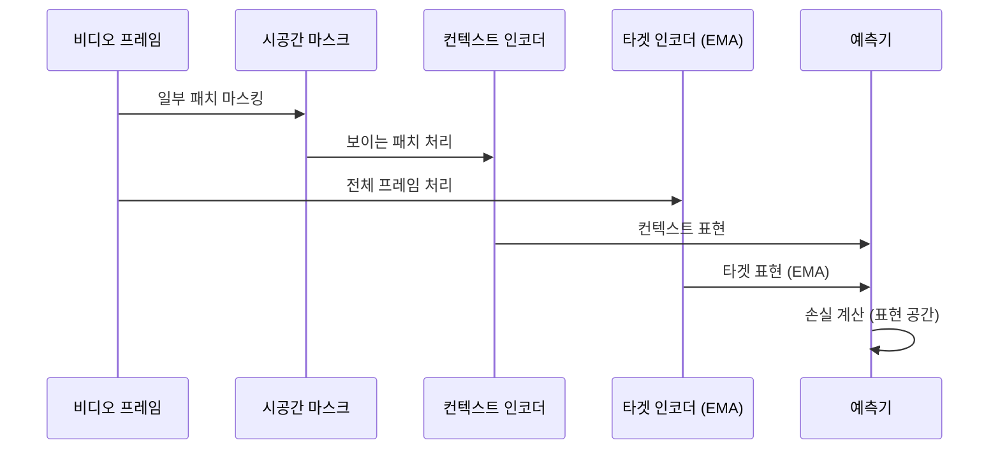

# JEPA (Joint Embedding Predictive Architecture)

JEPA(Joint Embedding Predictive Architecture)는 얀 르쿤(Yann LeCun)이 2022년 제안한 자기지도 학습(self-supervised learning) 프레임워크다. 르쿤의 세계 모델(world model) 비전의 핵심 구성 요소로, **픽셀 공간이 아닌 표현(representation) 공간에서 예측**하는 방식으로 대조 학습의 붕괴(collapse) 문제를 우회한다.

## 핵심 아이디어: 표현 공간 예측

기존 생성 모델과 대조 학습의 한계를 이해하면 JEPA의 혁신이 명확해진다:

JEPA는 마스킹된 입력 $x$로부터 전체 입력 $y$의 표현을 예측한다. 픽셀을 복원하려 하지 않기 때문에 배경 텍스처, 조명 등 예측에 불필요한 세부사항을 무시하는 방향으로 학습된다.

## 수식

$$\min_{\theta, \phi} \| P_\theta(s_x) - \text{sg}(s_y) \|^2$$

- $s_x = \text{Enc}_\theta(x)$: 컨텍스트 인코더 출력
- $s_y = \text{Enc}_\xi(y)$: 타겟 인코더 출력 (EMA로 업데이트되는 momentum 인코더)
- $P_\theta$: 예측기 네트워크
- $\text{sg}(\cdot)$: stop-gradient (타겟 인코더 그래디언트 차단)

타겟 인코더를 Exponential Moving Average(EMA)로 업데이트하는 방식은 [[contrastive-learning]]에서 BYOL 등이 사용한 momentum encoder와 유사하다.

## I-JEPA: 이미지 도메인

I-JEPA(Image JEPA)는 Vision Transformer([[swin-transformer]] 관련 개념)를 백본으로 하며, 이미지 패치를 마스킹하여 마스킹된 영역의 표현을 예측하도록 훈련한다.

- ViT-H 모델이 ImageNet에서 우수한 표현 품질 달성
- 픽셀 재구성 없이 의미론적(semantic) 표현 학습
- MAE 대비 동일 계산량에서 더 풍부한 표현

## V-JEPA: 비디오 도메인

V-JEPA는 비디오 시퀀스에서 시공간 마스킹을 적용한다. 비디오 클립의 일부 프레임/패치를 가리고 나머지로부터 표현을 예측함으로써, **물리적 세계의 동역학(dynamics)**을 학습한다.

## 세계 모델로서의 JEPA

르쿤의 자율 AI 비전에서 JEPA는 **세계 모델(World Model)**의 지각 부분을 담당한다. 세계 모델은 다음을 수행해야 한다:

1. 현재 상태 인식 (JEPA의 인코더)
2. 행동의 결과 예측 (JEPA의 예측기)
3. 목표 달성을 위한 계획 수립

이 프레임워크에서 JEPA는 [[self-supervised-learning]] 방식으로 레이블 없이 세계 동역학을 학습한다.

## 대조 학습과의 차이점

[[contrastive-learning]]은 같은 이미지의 두 증강 뷰를 가깝게, 다른 이미지는 멀게 만든다. JEPA는 **명시적 음성 샘플(negative samples) 없이** 표현 붕괴를 방지한다 - EMA 타겟 인코더와 stop-gradient가 그 역할을 한다.

| 특성 | 대조 학습 | JEPA |
|------|-----------|------|
| 음성 샘플 | 필요 (대규모 배치) | 불필요 |
| 예측 공간 | 표현 공간 유사도 | 표현 공간 내용 |
| 붕괴 방지 | 음성 쌍으로 | EMA + stop-grad |
| 의미 수준 | 인스턴스 수준 | 추상적 표현 |

## 관련 문서

- [[self-supervised-learning]] - JEPA의 학습 패러다임
- [[contrastive-learning]] - JEPA가 극복하려는 대안 방식
- [[masked-autoencoder-mae]] - 생성 기반 자기지도 학습
- [[vision-transformer]] - JEPA의 주요 백본 아키텍처
- [[dinov2]] - Meta의 또 다른 자기지도 비전 표현 학습
