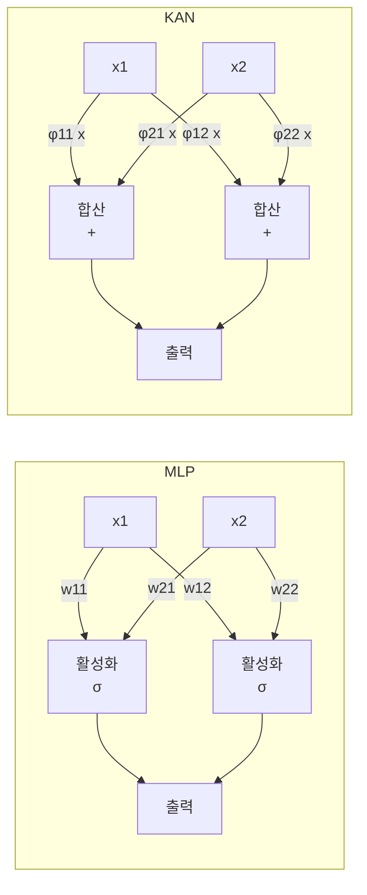
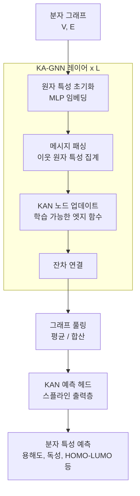

# KA-GNN - 콜모고로프-아놀드 분자 GNN

## 배경: KAN이란

**KAN(Kolmogorov-Arnold Network)**은 2024년 MIT 팀(Liu et al.)이 제안한 신경망 아키텍처로, 전통적인 MLP의 대안이다. 핵심 차이는 다음과 같다:

- **MLP**: 노드에 고정된 활성화 함수, 엣지에 학습 가능한 가중치
- **KAN**: 노드에 항등 함수, **엣지에 학습 가능한 스플라인(spline) 함수**

이는 수학적으로 **콜모고로프-아놀드 표현 정리(Kolmogorov-Arnold Representation Theorem)**에 기반한다: 임의의 다변수 연속 함수는 단변수 함수들의 합성과 합으로 표현할 수 있다.

$$f(x_1, \ldots, x_n) = \sum_{q=0}^{2n} \Phi_q\left(\sum_{p=1}^{n} \phi_{q,p}(x_p)\right)$$

여기서 $\phi_{q,p}$와 $\Phi_q$가 학습 가능한 단변수 함수다.

## KAN의 핵심 특성

| 항목 | MLP | KAN |
|------|-----|-----|
| 엣지 | 스칼라 가중치 | 학습 가능한 함수 (B-스플라인) |
| 노드 | 활성화 함수 | 합산 (항등) |
| 해석가능성 | 낮음 | 높음 (엣지 함수 시각화 가능) |
| 파라미터 효율 | 깊으면 비효율 | 소규모 문제에서 더 효율적 |
| 학습 속도 | 빠름 | 상대적으로 느림 |

## KA-GNN: 분자 그래프에의 적용

**KA-GNN**은 KAN 레이어를 그래프 신경망(GNN, Graph Neural Network)의 노드 업데이트 함수에 적용한 분자 특성 예측 모델이다. 2025년 Nature Machine Intelligence에 게재되었다.

### 분자 그래프 표현

분자를 그래프로 표현하는 방법:
- **노드**: 원자 (원소 종류, 원자가, 수소 결합 여부 등 특성)
- **엣지**: 화학 결합 (단결합, 이중결합, 방향족 등)
- **입력 형태**: SMILES 문자열 또는 3D 좌표 + 결합 정보

### KA-GNN 구조

### 기존 MLP 기반 GNN과의 차이

전통적인 GNN 노드 업데이트:
$$h_v^{(l+1)} = \sigma\left(W^{(l)} \cdot \text{AGG}(\{h_u^{(l)} : u \in \mathcal{N}(v)\})\right)$$

KA-GNN 노드 업데이트:
$$h_v^{(l+1)} = \sum_{u \in \mathcal{N}(v)} \phi_{vu}^{(l)}(h_u^{(l)}) + \phi_{self}^{(l)}(h_v^{(l)})$$

여기서 $\phi_{vu}^{(l)}$는 학습 가능한 B-스플라인 함수다. 이 함수를 시각화하면 **어떤 원자 상호작용이 예측에 기여했는지**를 직접 볼 수 있다.

## 핵심 장점: 화학적 해석가능성

KA-GNN의 가장 큰 차별점은 **해석가능성(interpretability)**이다:

1. **엣지 함수 시각화**: 학습된 스플라인 곡선을 그리면 원자 간 상호작용 패턴 파악
2. **중요 결합 식별**: 어떤 결합 유형이 특정 특성에 기여하는지 정량화
3. **화학적 지식과 대조**: 알려진 구조-특성 관계(SAR)와 학습된 함수 비교 가능

이는 신약 개발에서 특히 중요하다. "왜 이 분자가 독성이 있는가?"에 답할 수 있어야 규제 기관 승인과 연구자 신뢰를 얻을 수 있다.

## 성능 결과

**MoleculeNet 벤치마크**에서 MLP 기반 GNN, GCN, MPNN 등과 비교:

- ESOL(수용해도), FreeSolv(자유 에너지), Lipophilicity(친유성): MLP-GNN 대비 3-8% RMSE 감소
- Tox21(독성 예측), ClinTox(임상 독성): AUROC 1-3% 향상
- 특히 소규모 데이터셋에서 KAN의 효율적 파라미터 활용이 두드러짐

## 한계

- **학습 속도**: B-스플라인 연산이 행렬 곱셈보다 느려 대규모 분자 데이터셋에서 병목
- **스케일링**: 대형 GNN 모델로 확장 시 이득이 감소하는 경향
- **그리드 수**: 스플라인의 그리드 포인트 수가 추가 하이퍼파라미터
- **재현성**: KAN 관련 구현이 아직 표준화되지 않음

## 관련 문서

- [[graph-neural-networks]] - GNN 일반 원리 및 메시지 패싱
- [[ka-gnn-molecular|molecular-property-prediction]] - 분자 특성 예측 벤치마크
- [[kan-kolmogorov-arnold-network]] - KAN 기반 개념 상세
- [[explainable-ai]] - 해석 가능한 AI의 일반 방법론
