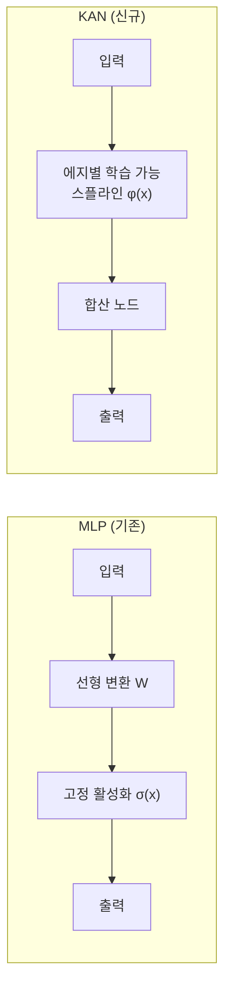
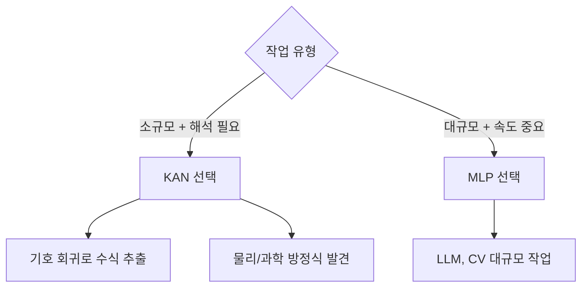

# 콜모고로프-아놀드 네트워크 (KAN)

콜모고로프-아놀드 네트워크(Kolmogorov-Arnold Networks, KAN)는 2024년 MIT 연구진이 제안한 신경망 아키텍처로, 기존 다층 퍼셉트론(MLP)의 근본적인 설계 원칙을 뒤집는다. MLP가 노드(뉴런)에 고정된 활성화 함수를 두는 것과 달리, KAN은 **에지(연결 가중치) 위에 학습 가능한 활성화 함수**를 배치한다.

## 핵심 수학적 기반

KAN은 콜모고로프-아놀드 표현 정리(Kolmogorov-Arnold Representation Theorem)에서 이름을 빌렸다. 이 정리는 임의의 연속 다변수 함수 $f(\mathbf{x})$를 단변수 연속 함수의 합성으로 표현할 수 있음을 보장한다:

$$f(x_1, \ldots, x_n) = \sum_{q=1}^{2n+1} \Phi_q \left( \sum_{p=1}^{n} \phi_{q,p}(x_p) \right)$$

이론적으로 깊이 2, 너비 $2n+1$의 KAN이 임의의 연속 함수를 표현할 수 있다. 실용적인 KAN은 이 구조를 깊게 쌓아 유연성을 높인다.

## MLP와의 구조적 차이

| 속성 | MLP | KAN |
|------|-----|-----|
| 활성화 함수 위치 | 노드 | 에지 |
| 활성화 함수 형태 | 고정 (ReLU, GELU 등) | 학습 가능 (B-스플라인) |
| 선형 가중치 | 있음 | 없음 (스플라인이 대체) |
| 해석 가능성 | 낮음 | 높음 |

## 학습 가능한 활성화: B-스플라인

KAN의 각 에지는 **B-스플라인(B-spline)** 함수로 초기화된다. B-스플라인은 구간별 다항식을 매끄럽게 이어 붙인 함수로, 제어점(grid points)을 조정함으로써 임의의 단변수 함수를 근사할 수 있다. 스플라인의 격자 해상도는 훈련 중 동적으로 정제(grid refinement)될 수 있어, 복잡한 함수를 정밀하게 표현한다.

## 해석 가능성과 기호 회귀

KAN의 가장 강력한 장점은 **해석 가능성**이다. 훈련 후 학습된 각 에지 함수를 시각화하면, 사인 함수나 다항식 등 알려진 수학 함수와 닮았을 때 "기호로 고정(symbolification)"할 수 있다. 이 과정을 통해:

1. 네트워크 전체가 닫힌 형태의 수식으로 표현될 수 있다.
2. 물리 법칙 발견, 과학적 방정식 회귀 등 **기호 회귀(symbolic regression)** 작업에 활용된다.

실제로 KAN 논문에서는 위상 다이어그램의 상경계를 묘사하는 물리 방정식을 KAN이 자동으로 재발견한 사례를 보인다.

## 한계와 실용적 고려사항

KAN이 이론적으로 유망하지만 현재 실용적 한계도 명확하다:

- **훈련 속도**: 스플라인 연산은 단순 행렬 곱보다 비싸므로 대규모 데이터에서 MLP보다 느리다.
- **확장성**: 파라미터 수가 같을 때 LLM 수준의 대규모 작업에서는 MLP가 여전히 우세하다.
- **생태계 미성숙**: PyTorch 등 주요 프레임워크의 최적화가 MLP 중심으로 설계되어 있다.
- **적합 도메인**: 작은 데이터셋, 과학 계산, 해석이 필요한 도메인에서 강점을 발휘한다.

## 실무 적용 관점

KAN은 범용 딥러닝 대체재보다는 **과학적 발견을 위한 도구**로 자리매김하고 있다. 신경과학, 재료과학, 기후 모델링 등 해석 가능성이 중요한 분야에서 연구 도구로 채택이 늘고 있다.

## 관련 문서

- [[perceptron-mlp]] - MLP의 구조와 활성화 함수 위치
- [[activation-functions]] - ReLU, GELU 등 고정 활성화 함수 비교
- [[transformer-architecture]] - 현재 주류 아키텍처와의 비교
- [[self-supervised-learning]] - 해석 가능 표현 학습과의 연관성
