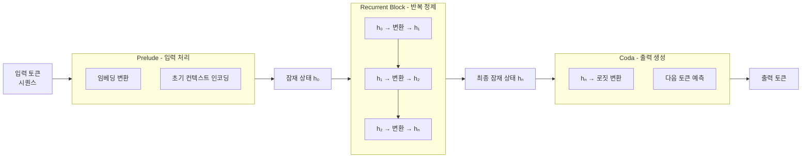

# 잠재 공간 추론 (Latent Space Reasoning)

## 개요

잠재 공간 추론(Latent Space Reasoning)은 토큰을 생성하지 않고 **모델 내부 잠재 공간(latent space)에서 반복적으로 추론**하는 아키텍처 접근법이다. "Thinking in Latent Space"라고도 불리며, NeurIPS 2025 스포트라이트 페이퍼로 발표되었다.

Chain-of-Thought(CoT)가 추론 과정을 텍스트 토큰으로 외재화하는 것과 달리, 잠재 공간 추론은 추론을 모델 내부에서 처리한다.

## CoT vs 잠재 공간 추론 비교

| 항목 | Chain-of-Thought | 잠재 공간 추론 |
|------|-----------------|--------------|
| 추론 위치 | 토큰 시퀀스 (외부) | 잠재 벡터 (내부) |
| 컨텍스트 창 사용 | 추론 단계마다 토큰 소비 | 소비 최소 |
| 해석 가능성 | 높음 (텍스트 가시) | 낮음 (벡터 내부) |
| 학습 데이터 필요 | CoT 데이터 필요 | 특수 데이터 불필요 |
| 속도 | 추론 토큰 수에 비례 | 고정 반복 횟수 |

## 3부 구조 (Prelude - Recurrent Block - Coda)

### Prelude (전처리 블록)

- 입력 토큰을 잠재 표현으로 변환
- 일반 Transformer 레이어 구조와 유사
- 문맥 이해와 초기 상태 구성 담당

### Recurrent Block (반복 블록)

- 동일한 변환 함수를 잠재 상태에 반복 적용: $h_{t+1} = f(h_t)$
- 반복 횟수(depth)를 조절해 컴퓨트를 동적으로 배분 가능
- 각 반복은 추가 "사고(thinking)" 단계에 해당
- 가중치 공유(weight-tying)로 파라미터 수 절감

### Coda (출력 블록)

- 최종 잠재 상태를 토큰 예측으로 변환
- 표준 LM 헤드(head)와 유사

## 핵심 특성

### 컨텍스트 창 독립성

CoT는 추론 단계마다 토큰을 생성해 컨텍스트 창을 소모한다. 잠재 공간 추론은 컨텍스트 창과 무관하게 동작하므로 **짧은 컨텍스트 창으로도 복잡한 추론 가능**.

### 학습 데이터 독립성

CoT 데이터 없이도 학습 가능하다. 잠재 반복 횟수를 보상 신호로 삼는 강화학습 방식도 연구 중이다.

### 적응형 깊이 (Adaptive Depth)

문제 복잡도에 따라 반복 횟수를 동적으로 결정하면 단순 문제에는 적은 컴퓨트, 복잡 문제에는 많은 컴퓨트를 자동 배분할 수 있다.

## NeurIPS 2025 스포트라이트

논문의 핵심 실증 결과:
- 수학 추론, 논리 퍼즐에서 동등 파라미터 CoT 모델 대비 성능 향상
- 같은 반복 횟수에서 더 어려운 문제도 해결
- 반복 횟수를 늘릴수록 성능이 단조 증가하는 스케일링 특성 확인

## 한계

- 잠재 공간 내 추론 과정이 불투명해 **해석 가능성(interpretability)** 낮음
- 반복 횟수 조절 기준이 아직 명확하지 않음
- 표준 Transformer와 달리 최적화 안정성 확보 필요

## 관련 문서

- [[test-time-compute]] - TTC의 아키텍처 레벨 구현 방법론
- [[chain-of-thought]] - 외재화 추론과의 비교 기준
- [[transformer-architecture|Transformer 아키텍처]] - 기반 아키텍처
- [[moe-routing-advances]] - 유사하게 적응형 연산을 추구하는 방향
