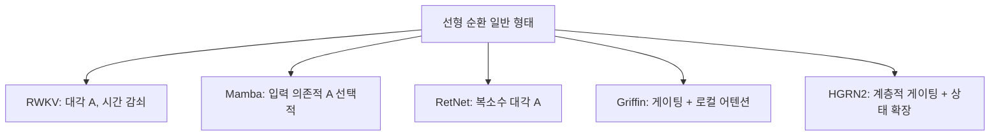

# 선형 RNN 통합 관점

[[rwkv|RWKV]], [[retentive-network|RetNet]], [[mamba-3|Mamba]], [[recurrentgemma-griffin|Griffin]], [[hgrn2|HGRN2]] 등 최근 등장한 효율적 시퀀스 모델들은 표면적으로 다르지만, **선형 순환(linear recurrence)**이라는 공통 프레임워크로 통합할 수 있다.

## 통합 공식

모든 선형 RNN 변형은 다음 일반 형태로 표현된다:

$$h_t = A_t h_{t-1} + B_t x_t$$
$$y_t = C_t h_t$$

여기서 $A_t$(상태 전이), $B_t$(입력 게이트), $C_t$(출력 게이트)의 설계가 각 아키텍처를 구분한다.

## 아키텍처별 차이

| 아키텍처 | 상태 전이 $A_t$ | 특징 |
|---------|----------------|------|
| RWKV | 대각, 고정 감쇠 | 시간 감쇠 + 토큰 시프트 |
| Mamba | 대각, **입력 의존적** (선택적) | 하드웨어 효율 스캔 |
| RetNet | 복소수 대각 | 병렬/순환/청크 3중 표현 |
| Griffin | 대각 게이팅 | 로컬 어텐션 하이브리드 |
| HGRN2 | 계층적 게이팅 | 상태 확장 메커니즘 |

## 핵심 인사이트

1. **병렬 학습**: 모든 변형이 scan/prefix-sum으로 $O(n)$ 병렬 학습 가능
2. **$O(1)$ 추론**: 고정 크기 상태로 토큰당 상수 시간 추론
3. **선택성이 핵심**: Mamba의 성공은 $A_t$를 입력에 의존적으로 만든 것에서 비롯

## 관련 문서

- [[rwkv]] -- RWKV 아키텍처
- [[mamba-3]] -- Mamba-3
- [[retentive-network]] -- RetNet
- [[gated-deltanet]] -- Gated DeltaNet
- [[transformer-architecture]] -- Transformer (비교 대상)
