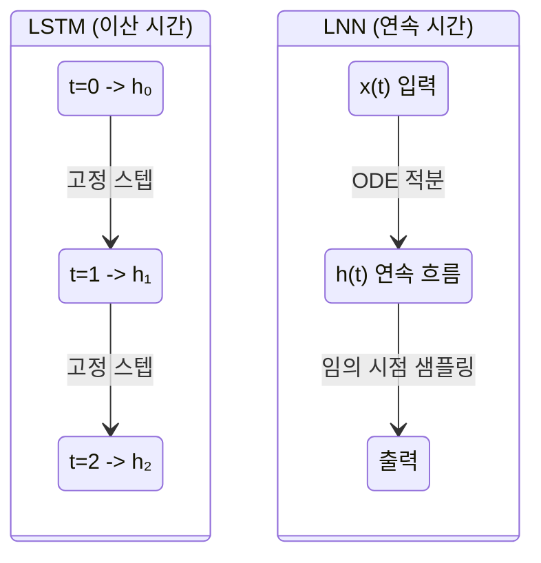

# 리퀴드 신경망 (Liquid Neural Networks)

리퀴드 신경망(Liquid Neural Networks, LNN)은 MIT CSAIL에서 개발한 연속 시간(continuous-time) 신경망 아키텍처로, **훈련 완료 후에도 입력 데이터에 따라 동적으로 동작을 조정**할 수 있는 특성을 지닌다. 선충류(C. elegans)의 신경계에서 영감을 받아 설계되었으며, 적은 수의 뉴런으로도 복잡한 시계열 작업을 처리한다.

## 핵심 개념: 연속 시간 RNN

기존 순환 신경망(RNN)은 고정된 시간 간격(이산 시간 스텝)으로 상태를 업데이트한다. 리퀴드 신경망은 이를 **미분방정식(ODE)** 으로 대체하여 연속 시간에서 상태가 흘러가도록 설계한다:

$$\dot{h}(t) = -\frac{h(t)}{\tau} + f(h(t), x(t), \theta)$$

여기서 $\tau$는 시상수(time constant)로, 각 뉴런이 얼마나 빠르게 반응하는지를 제어한다. 이 시상수가 입력에 따라 **동적으로 변화**한다는 점이 "리퀴드(liquid, 액체)"라는 이름의 유래다. 시상수가 가변적이므로 네트워크의 내부 상태가 입력 맥락에 맞게 흘러가는 것처럼 보인다.

## 아키텍처 구조

```mermaid
flowchart LR
    Input[시계열 입력 x(t)] --> Liquid["리퀴드 셀\n(가변 시상수 τ)"]
    Liquid -->|ODE Solver| State["연속 상태\nh(t)"]
    State --> Output[예측/제어 출력]
    State -->|시간 진행| Liquid

    subgraph Adaptation["훈련 후 적응"]
        Context[새로운 맥락] --> Tau["τ 동적 조정"]
        Tau --> Behavior[행동 변경]
    end
```

핵심 구성 요소:

| 요소 | 역할 |
|------|------|
| 리퀴드 셀 (Liquid Cell) | 가변 시상수로 연속 시간 상태 관리 |
| ODE 솔버 | 연속 미분방정식을 수치적으로 적분 |
| 배선 (Wiring) | C. elegans 신경계처럼 희소하게 연결 |
| 폐쇄형 CfC | 계산 효율을 위한 근사 솔버 |

## Neural ODE와의 관계

리퀴드 신경망은 [[neural-ode]]의 변형으로 볼 수 있다. Neural ODE가 상태 전이를 ODE로 모델링하는 일반 프레임워크라면, LNN은 여기에 **가변 시상수** 메커니즘을 추가하여 훈련 후 적응 능력을 부여한다.

폐쇄형 연속 시간 신경망(Closed-form Continuous-time, CfC)은 LNN의 계산 효율 버전으로, ODE 수치 적분을 근사 공식으로 대체하여 추론 속도를 크게 향상시켰다.

## 기존 RNN/LSTM과의 차이



[[rnn-lstm-gru]]와 비교할 때 LNN의 차별점:

- **비균일 시간 간격** 처리: 센서 데이터처럼 불규칙한 시간 간격을 자연스럽게 수용
- **훈련 후 적응**: 배포 후에도 새로운 환경에 일부 적응 (fine-tuning 불필요)
- **소형화**: 수십-수백 개 뉴런으로 복잡한 제어 가능 (LSTM 대비 10-100배 적은 파라미터)
- **견고성**: 센서 노이즈, 누락 데이터에 강함

## 실용적 강점: 엣지 AI와 자율 시스템

리퀴드 신경망은 다음 도메인에서 특히 주목받는다:

**자율주행**: MIT 연구팀이 실제 자동차 조향 제어에 적용, 19개 뉴런으로 레인 유지 달성

**의료 시계열**: 불규칙하게 수집된 환자 활력징후 데이터 처리에 적합

**로봇 제어**: 드론 자세 제어, 로봇 팔 조작 - 실시간 환경 변화에 적응

**엣지 디바이스**: 소형 모델 크기 덕분에 마이크로컨트롤러 수준 하드웨어에 탑재 가능

## 한계

- ODE 적분의 계산 비용 (CfC로 완화 중)
- 자연어, 이미지 등 비시계열 작업에서는 Transformer보다 열위
- 훈련 안정성: 연속 시간 그래디언트 계산이 불안정할 수 있음

## 관련 문서

- [[neural-ode]] - 연속 시간 신경망의 수학적 기반
- [[rnn-lstm-gru]] - 이산 시간 순환 신경망 계열
- [[transformer-architecture]] - 시계열 처리의 현재 주류 방식
- [[state-space-models-general]] - 또 다른 연속 시간 모델 계열 (Mamba 등)
