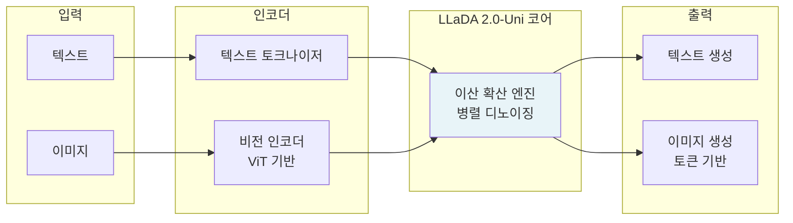

# LLaDA 2.0-Uni - 멀티모달 이해·생성 통합 이산 확산 언어 모델

LLaDA 2.0-Uni는 2026년 4월 22일 Ant Group의 InclusionAI 팀이 출시한 오픈소스 언어 모델이다. 자기회귀(AR, Auto-Regressive) 모델을 이산 확산(discrete diffusion) 언어 모델로 전환하는 LLaDA 패러다임을 100B 파라미터까지 스케일링하고, 멀티모달 이해와 생성을 단일 프레임워크에서 통합한 것이 핵심이다. 병렬 디코딩으로 535 tokens/s를 달성한다.

## 개요

| 항목 | 내용 |
|------|------|
| 출시일 | 2026년 4월 22일 |
| 개발사 | Ant Group, InclusionAI 팀 |
| 기반 논문 | arXiv:2512.15745 |
| 아키텍처 | 이산 확산 LLM (dLLM) |
| 스케일 | 최대 100B 파라미터 |
| 디코딩 속도 | 535 tokens/s (병렬 디코딩) |
| 특징 | 멀티모달 이해 + 생성 단일 프레임워크 |
| 허깅페이스 | `inclusionAI/LLaDA2.0-Uni` |

## 이산 확산 LLM 패러다임

LLaDA는 기존 자기회귀(AR) LLM의 토큰을 순차적으로 예측하는 방식 대신, **이산 확산(discrete diffusion)** 으로 텍스트를 생성한다.

### 자기회귀 vs 이산 확산 비교

```mermaid
flowchart TD
    subgraph AR[자기회귀 LLM]
        direction LR
        T1[토큰1] --> T2[토큰2] --> T3[토큰3] --> TN[...] 
    end

    subgraph Diff[이산 확산 LLM]
        direction TD
        Noise[노이즈 / 마스크된 시퀀스\n전체 길이 동시 초기화]
        Noise --> Step1[디노이징 단계 1\n전체 시퀀스 병렬 갱신]
        Step1 --> Step2[디노이징 단계 2\n전체 시퀀스 병렬 갱신]
        Step2 --> Final[최종 텍스트\n전체 토큰 동시 완성]
    end

    AR -.->|순차 의존성\nO(n) 디코딩 단계| AR
    Diff -.->|병렬 갱신\n적은 디코딩 단계| Diff
```

이산 확산은 연속 확산(이미지 생성)의 개념을 텍스트 토큰에 적용한 것이다. 텍스트를 노이즈(마스크)에서 점진적으로 복원하며, 각 단계에서 전체 시퀀스를 병렬로 갱신한다.

### 핵심 수식

이산 확산의 노이즈 프로세스는 다음과 같이 표현된다:

- **정방향(노이즈 추가)**: $q(x_t | x_0) = \text{Cat}(x_t; (1-\alpha_t)x_0 + \alpha_t \mathbf{m})$
  - $x_0$: 원본 토큰, $\mathbf{m}$: 마스크 토큰, $\alpha_t$: 노이즈 스케줄
- **역방향(디노이징)**: $p_\theta(x_0 | x_t)$를 신경망이 예측

## LLaDA 2.0-Uni 구조: 멀티모달 통합

LLaDA 2.0-Uni의 "Uni"는 **Unified (통합)** 를 의미한다. 텍스트만 처리하던 기존 LLaDA를 멀티모달로 확장했다.



단일 확산 모델이 이미지 이해, 텍스트 이해, 텍스트 생성, 이미지 생성을 모두 담당한다. 이는 자기회귀 모델이 생성 전용이고 별도 인코더-디코더를 필요로 하는 것과 대비된다.

## 100B 스케일링

LLaDA 1.0에서 실증된 dLLM 패러다임을 100B 파라미터까지 스케일링했다. 기존 자기회귀 모델에서 관찰된 [[scaling-laws]]가 dLLM에서도 적용됨을 보여주는 중요한 데이터 포인트다.

스케일링 과정에서의 도전:
1. **훈련 안정성**: 대규모 이산 확산 모델의 훈련 안정성 확보
2. **메모리 효율**: 전체 시퀀스를 병렬로 처리하므로 메모리 요구량이 AR 모델보다 높음
3. **디노이징 단계 최적화**: 품질과 속도의 트레이드오프 조절

## 병렬 디코딩: 535 tokens/s

가장 주목할 실용적 특징은 **535 tokens/s**의 높은 디코딩 속도다. AR 모델은 토큰을 하나씩 생성해 속도에 본질적 한계가 있지만, dLLM은 전체 시퀀스를 병렬로 갱신한다.

이는 [[speculative-decoding]] 없이도 높은 처리량을 달성하는 대안적 접근이다.

| 디코딩 방식 | 특징 | 속도 |
|------------|------|------|
| AR 순차 디코딩 | 토큰 1개씩 | ~50-200 tokens/s (GPU 의존) |
| AR + 스펙디코딩 | 드래프트 모델 활용 | ~200-400 tokens/s |
| dLLM 병렬 디코딩 | 전체 시퀀스 병렬 | ~535 tokens/s (LLaDA 2.0-Uni) |

## [[diffusion-models]]와의 연결

LLaDA는 이미지 생성에서 성공한 [[diffusion-models]] 패러다임을 텍스트로 가져온다. 핵심 차이:

- **연속 확산(이미지)**: 실수값 픽셀 노이즈 추가/제거
- **이산 확산(텍스트)**: 정수 토큰 ID 마스킹/복원

이 연결은 LLaDA가 멀티모달 생성(텍스트 + 이미지)을 단일 확산 프레임워크에서 자연스럽게 통합할 수 있게 한다.

## 한계 및 고려사항

현재 LLaDA 2.0-Uni의 알려진 한계:

1. **긴 시퀀스 메모리**: 전체 시퀀스를 한 번에 처리하므로 AR 대비 메모리 요구량 높음
2. **디노이징 단계 수**: 품질을 높이려면 더 많은 디노이징 단계가 필요 (AR의 greedy/beam search 대비)
3. **생태계 미성숙**: vLLM, llama.cpp 등 AR 기반 서빙 최적화 도구와의 호환성 제한적
4. **텍스트 생성 품질**: 최고 성능 AR 모델 대비 일부 태스크에서 격차 [교차검증 필요]

## 왜 중요한가

LLaDA 2.0-Uni는 다음 관점에서 중요하다:

1. **AR 패러다임 대안 실증**: 100B 규모에서 dLLM이 동작함을 보여주며, "LLM = 자기회귀"라는 가정에 도전
2. **병렬 디코딩의 자연스러운 구현**: 스펙디코딩 없이 535 tokens/s라는 높은 속도 달성
3. **멀티모달 통합의 새 경로**: 확산으로 텍스트+이미지 이해/생성을 단일 프레임워크에서 통합
4. **오픈소스 공개**: Ant Group이 MIT 혹은 유사 라이선스로 공개해 커뮤니티 연구 활성화 기여

## 실무 코드 예시

```python
from transformers import AutoTokenizer, AutoModelForMaskedLM
import torch

# LLaDA 2.0-Uni 로드 (개략, 실제 API는 공식 레포 확인 필요)
tokenizer = AutoTokenizer.from_pretrained("inclusionAI/LLaDA2.0-Uni")
model = AutoModelForMaskedLM.from_pretrained(
    "inclusionAI/LLaDA2.0-Uni",
    torch_dtype=torch.bfloat16,
    device_map="auto"
)

# 텍스트 생성 (이산 확산 방식)
prompt = "이산 확산 언어 모델의 핵심 원리는"
inputs = tokenizer(prompt, return_tensors="pt")

# 마스크된 토큰에서 병렬 디노이징으로 생성
# 실제 생성 API는 공식 문서 참조 [교차검증 필요]
```

## 관련 문서

- [[diffusion-models]] - 확산 모델 기반 개념 (이미지 생성에서 텍스트로)
- [[dflash-block-diffusion-decoding]] - 확산 기반 디코딩 가속 기법
- [[speculative-decoding]] - AR 모델의 병렬 디코딩 가속 비교 대상
- [[scaling-laws]] - 100B 스케일링과 관련된 스케일링 법칙
- [[autoregressive-language-model]] - LLaDA가 대체하고자 하는 기존 패러다임
