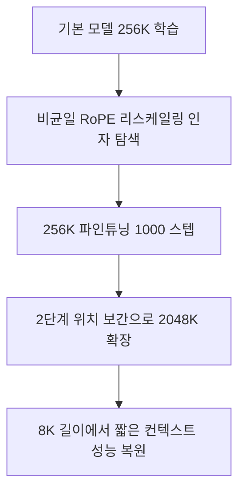

# 장기 컨텍스트 스케일링 (Long Context Scaling)

## 개요

장기 컨텍스트 스케일링은 사전 학습된 LLM의 컨텍스트 윈도우를 원래 학습 길이 이상으로 확장하는 기술이다. 대표 기법인 LongRoPE는 256K 학습 길이에서 2,048K(약 200만) 토큰까지 확장하면서 최소한의 파인튜닝(1,000 스텝)만 필요로 한다. 2026년 현재 NVFP4 KV 캐시 [[ai-inference-quantization-2026|양자화]]와 결합하여 메모리 50% 절감까지 달성하는 것이 실무 표준이 되고 있다.

## 핵심 개념

### RoPE (Rotary Position Embedding)

RoPE는 토큰 위치를 회전 행렬로 인코딩하는 위치 임베딩 방식이다. 학습 시 보지 못한 위치에 대해서는 성능이 급격히 저하되는데, LongRoPE는 이 한계를 비균일 위치 보간(non-uniform positional interpolation)으로 극복한다.

### 비균일 위치 보간 탐색

LongRoPE의 핵심 혁신은 위치 보간에서 두 가지 형태의 비균일성을 효율적 탐색으로 식별하는 것이다. 이를 통해 파인튜닝 없이도 8배 확장의 초기화를 제공하며, 파인튜닝과 결합하면 훨씬 큰 확장 비율을 달성한다.

### 계층적 합성 데이터

긴 컨텍스트 학습에 필요한 데이터를 구성하기 위해 계층적 [[synthetic-data-training|합성 데이터]] 기법을 사용한다. 실제 장문 문서가 부족한 상황에서 구조화된 합성 시퀀스로 효과적인 컨텍스트 확장 학습이 가능하다.

## 작동 원리

LongRoPE는 점진적 확장(progressive extension) 전략을 사용한다.

1. 먼저 최적 RoPE 리스케일링 인자를 효율적으로 탐색
2. 256K 길이 모델을 파인튜닝 (1,000 스텝)
3. 확장된 모델에 2단계 위치 보간을 적용해 2,048K 도달
4. 8K 길이에서 LongRoPE를 재조정하여 짧은 컨텍스트 성능 복원

이 접근법은 원래 모델 아키텍처를 유지하면서 위치 임베딩만 수정하므로, 기존 최적화 기법과 호환된다.

## 메모리 최적화 기법

[[multi-head-latent-attention|Transformer]] 기반 LLM은 시퀀스 길이에 따라 O(n^2) 계산 복잡도(FlashAttention 사용 시 O(n))로 스케일링되어, 장기 컨텍스트 학습은 메모리 최적화 없이는 불가능하다.

### 1. 활성화 재계산 (Activation Recomputation)

학습 중 모든 중간 활성화를 저장하는 대신, 각 트랜스포머 레이어 입력만 체크포인팅하고 [[lora-qlora-finetuning|역전파]] 시 재계산한다. 활성화 메모리가 모델 가중치 + 옵티마이저 상태 메모리를 초과할 수 있기 때문에 필수적인 기법이다.

### 2. 컨텍스트 병렬화 (Context Parallelism, CP)

시퀀스 차원을 여러 GPU에 분할하여, 각 GPU가 시퀀스의 일부만 처리-저장한다:

- 100만 토큰 시퀀스에서는 CP가 **필수** -- CP 없이는 실행 불가
- 32K 토큰부터 베이스라인 대비 **2x 이상 속도 향상** (Llama 3 8B 벤치마크)
- Ring 토폴로지 기반 All-Gather/Reduce-Scatter 통신 최적화
- MQA/GQA 활용으로 KV 텐서 통신량 감소

### 3. 활성화 오프로딩 (Activation Offloading)

중간 활성화와 비활성 가중치를 CPU 메모리로 오프로드하여 GPU 피크 메모리를 절감한다. 역전파 시 필요한 활성화를 동적으로 재로드한다.

## Context Rot 현상

Chroma Research의 기술 리포트(18개 SOTA 모델 평가)에 따르면, 컨텍스트 길이가 증가할수록 **단순 작업에서도 성능이 저하**되는 "[[context-rot|context rot]]" 현상이 발생한다.

### 주요 발견

- **시맨틱 유사도 효과**: 질문-답변 간 시맨틱 유사도가 낮을수록 컨텍스트 길이 증가에 따른 성능 저하가 가속
- **방해 정보 비균일성**: 주제적으로 관련 있지만 부정확한 방해 정보(distractor)가 비균일적 영향 -- 일부 방해 정보가 다른 것보다 훨씬 큰 성능 저하 유발
- **구조 역설**: 정돈된(coherent) 텍스트보다 셔플된(incoherent) 텍스트에서 오히려 검색 성능이 높음 -- 어텐션 메커니즘이 논리적 일관성 패턴에 의해 방해받을 수 있음 시사
- **모델별 행동**: Claude 계열은 불확실할 때 보수적 거부(2.89% 거부율), GPT 계열은 확신 있는 오답 생성, Gemini 계열은 500-750 단어부터 무작위 단어 생성

### LongMemEval 결과

- 포커싱된 입력(~300 토큰): 모든 모델에서 높은 기준 성능
- 전체 입력(~113K 토큰, 비관련 내용 포함): 유의미한 성능 저하
- 사고 모드(thinking mode) 모델도 포커싱-전체 간 성능 격차 잔존

### 완화 전략: 컨텍스트 엔지니어링

- **정보 배치**: 정보가 어디에, 어떻게 나타나는지가 성능에 유의미한 영향
- **사전 필터링**: 비관련 컨텐츠를 제거하는 포커싱된 검색이 신뢰성을 크게 향상
- **방해 정보 최소화**: 주제 관련 오답 정보가 비균일적 비용 발생 -- 일부 방해 정보가 특히 치명적

## 성능/효과

- 사전 학습된 LLM의 컨텍스트를 2,048K 토큰(약 200만)까지 최초 확장 성공
- 파인튜닝 없이 8배 확장 가능, 파인튜닝 시 최대 8배 추가 확장
- LLaMA2, Mistral 등 다양한 모델에서 검증
- NVFP4 KV 캐시 양자화 결합 시 메모리 50% 절감
- 짧은 컨텍스트(원래 학습 길이) 성능 유지 -- context rot 문제 해결
- NeMo Framework: 16K, 64K, 128K 시퀀스 레시피 제공 (Llama 3 8B/70B, Mixtral 8x7B, Nemotron)
- [[deepseek-r1-paper|DeepSeek-R1]] 등 차세대 모델은 128K+ 컨텍스트 지원, 1,000만 토큰 이상 탐색 중

## 관련 문서
- [[yarn-paper]] -- YaRN: Efficient Context Window Extension of Large Language Models (Peng et al., 2024)
- [[transformer-attention-mechanisms]] -- 트랜스포머 어텐션 메커니즘 (Transformer Attention Mechanisms)
- [[llm-long-context-faithfulness]] -- LLM 장문 컨텍스트 충실도
- [[fire-positional-encoding]] -- FIRE / DAPE 위치 인코딩
- [[turboquant]]
- [[superposition-neural-scaling]]
- [[gated-attention]]

- [[kv-cache]] -- 장기 컨텍스트에서 핵심 병목인 KV 캐시
- [[kv-cache-compression]] -- 컨텍스트 확장 시 필수인 캐시 압축
- [[nvfp4-quantization]] -- KV 캐시 양자화 기법
- [[flashattention-4]] -- 장기 컨텍스트 어텐션 연산 최적화
