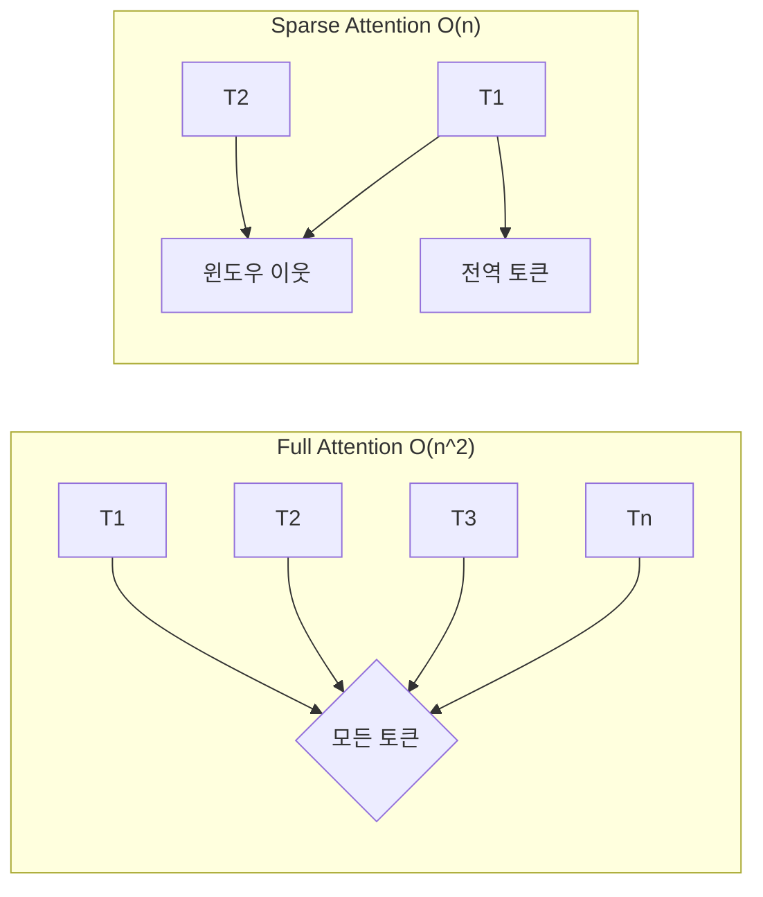
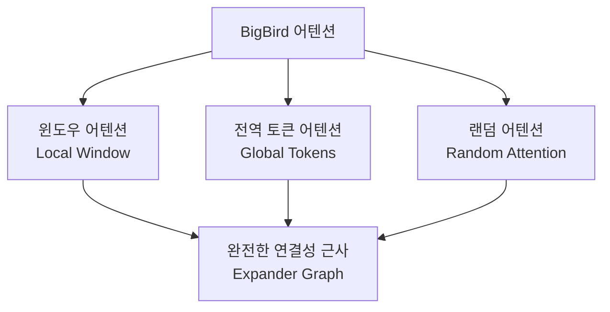

# Longformer / BigBird - 슬라이딩 윈도우 희소 어텐션

## 개요

Longformer(Allen AI, 2020)와 BigBird(Google, 2020)는 긴 문서 처리를 위해 설계된 Transformer 변형이다. 두 모델 모두 표준 어텐션의 O(n^2) 복잡도를 O(n)으로 줄이기 위해 **슬라이딩 윈도우 어텐션 + 전역(global) 토큰 희소 어텐션**을 핵심 전략으로 채택한다. 이 접근은 로컬 문맥(슬라이딩 윈도우)과 전역 정보(글로벌 토큰)를 함께 캡처하여 긴 시퀀스에서도 표현력을 유지한다.

## 표준 어텐션의 한계



4096 토큰 시퀀스에서 Full Attention은 1670만 개의 어텐션 연산이 필요하지만, 슬라이딩 윈도우(w=512)는 약 200만 개로 줄어든다.

## Longformer 설계

Longformer는 세 가지 어텐션 패턴을 조합한다.

### 1. 슬라이딩 윈도우 어텐션 (Sliding Window)

각 토큰은 좌우 w/2개 이웃 토큰에만 어텐션을 수행한다. 창문 크기 w는 하이퍼파라미터다.

```
토큰 위치 i의 어텐션 범위: [i - w/2, i + w/2]
```

레이어를 쌓으면 수용 영역(receptive field)이 레이어 수에 비례해 증가하므로, 깊은 네트워크에서도 전역 문맥을 간접적으로 포착할 수 있다.

### 2. 다이레이티드 슬라이딩 윈도우 (Dilated Sliding Window)

슬라이딩 윈도우에 간격(dilation)을 두어 수용 영역을 더 넓힌다. 연속 레이어에서 서로 다른 dilation 값을 사용하면 로컬-글로벌 정보가 균형 있게 커버된다.

### 3. 전역 어텐션 (Global Attention)

특정 토큰을 **전역 토큰**으로 지정해 모든 토큰과 어텐션을 주고받게 한다. BERT의 `[CLS]` 토큰처럼 전역 요약 역할을 하며, 태스크에 따라 다르게 설정한다.

| 태스크 | 전역 토큰 |
|--------|-----------|
| 분류 | `[CLS]` |
| QA | 질문 토큰 전체 |
| Cloze | `[MASK]` 토큰 |

## BigBird 설계

BigBird는 Longformer의 아이디어를 이론적으로 확장하여 **랜덤 어텐션(random attention)**을 추가한다.



### BigBird의 이론적 보장

BigBird 논문은 희소 어텐션이 다음을 만족하면 완전 어텐션과 **동일한 표현력(universal approximator)**을 가짐을 증명했다:

1. 전역 노드 (Global Nodes) 존재
2. 로컬 윈도우 (Local Window)
3. 무작위 어텐션 (Random Attention)

이 세 조건은 그래프 이론의 **Expander Graph** 성질에 대응된다. 랜덤 에지가 있으면 임의 두 노드 사이의 최단 경로가 O(log n)으로 보장된다.

## Longformer vs BigBird 비교

| 항목 | Longformer | BigBird |
|------|-----------|---------|
| 기관 | Allen AI | Google |
| 어텐션 패턴 | 윈도우 + 글로벌 + 다이레이티드 | 윈도우 + 글로벌 + 랜덤 |
| 이론적 보장 | 없음 (경험적 검증) | Universal Approximator 증명 |
| 최대 시퀀스 | 4096 (기본) | 4096 (기본) |
| 기반 모델 | RoBERTa | BERT, RoBERTa |
| 주요 태스크 | 문서 분류, QA | 유전체 서열, 문서 QA |

## 실험 성과

**Longformer:**
- TriviaQA (긴 문서 QA): 기존 BERT류 모델 대비 F1 +3점
- Hyperpartisan (긴 뉴스 분류): 94.8 F1 (SOTA)
- WikiHop: 67.8 (multi-hop reasoning)

**BigBird:**
- ETC (긴 문서 분류): 전체적으로 Longformer와 유사하거나 소폭 우위
- 게놈 서열 분류: 짧은 윈도우 모델 대비 큰 개선
- Arxiv/PubMed 요약: ROUGE 점수 개선

## 구현 및 실무 고려사항

```python
from transformers import LongformerModel, LongformerTokenizer

tokenizer = LongformerTokenizer.from_pretrained("allenai/longformer-base-4096")
model = LongformerModel.from_pretrained("allenai/longformer-base-4096")

# attention_mask: 1 = 로컬 어텐션, 2 = 글로벌 어텐션
inputs = tokenizer("긴 문서 텍스트...", return_tensors="pt", max_length=4096)
attention_mask = inputs["attention_mask"]

# [CLS] 토큰에 전역 어텐션 부여
attention_mask[0][0] = 2

outputs = model(**inputs, attention_mask=attention_mask)
```

실무에서 주의할 점:
- **전역 토큰 수는 최소화**: 전역 토큰이 많아질수록 O(n * g) 연산이 증가
- **윈도우 크기 조정**: 태스크에 따라 w를 64~1024 범위로 조정
- **FlashAttention과 통합 어려움**: 희소 패턴이 FlashAttention의 연속 메모리 접근 패턴과 충돌

## 한계

- [[long-context-scaling]] 관점에서 Longformer/BigBird는 4K~16K 토큰까지만 확장 가능 - 최신 100K+ 컨텍스트 모델과는 다른 접근
- 사전학습된 BERT/RoBERTa를 파인튜닝할 때 위치 인코딩 범위 불일치 문제 발생
- 랜덤/글로벌 어텐션의 구현이 CUDA에서 비효율적 - 커스텀 커널 없이는 이론 복잡도 달성 어려움

## 관련 문서

- [[sparse-attention-patterns]] - 희소 어텐션의 전반적인 분류와 원리
- [[long-context-scaling]] - 4K를 넘는 초장문 컨텍스트 확장 전략
- [[transformer-architecture]] - Longformer/BigBird가 기반하는 표준 Transformer
- [[attention-mechanism-overview]] - 소프트맥스 어텐션의 수학적 정의
