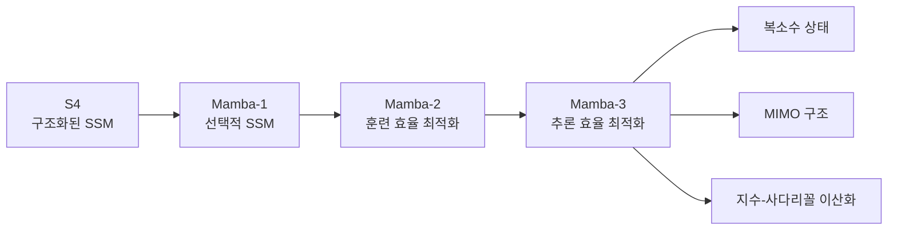
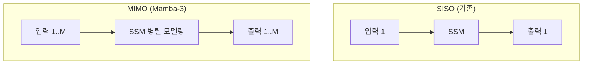

## 개요

Mamba-3는 상태 공간 모델(State Space Model, SSM) 계열의 최신 아키텍처로, Mamba-2의 훈련 효율 중심 설계에서 벗어나 추론 효율성을 주요 목표로 재설계되었다. 복소수 상태 업데이트, MIMO(Multi-Input Multi-Output) 구조, 지수-사다리꼴 이산화라는 세 가지 핵심 혁신을 통해, Mamba-2 대비 절반의 상태 크기로 동등 이상의 성능을 달성한다. 1.5B 스케일에서 모든 시퀀스 길이에서 가장 빠른 prefill+decode 지연시간을 기록했다.

## 핵심 개념

### SSM에서 Mamba-3로의 진화



### Mamba-2 vs Mamba-3

| 항목 | Mamba-2 | Mamba-3 |
|------|---------|---------|
| 설계 초점 | 훈련 속도 | 추론(디코딩) 속도 |
| 상태 크기 | 기준 | 절반 (2x 축소) |
| 상태 값 | 실수 | 복소수 |
| I/O 구조 | SISO | SISO + MIMO |
| 합성곱 레이어 | 포함 | 제거 (재귀로 대체) |

## 기술 상세

### 1. 지수-사다리꼴 이산화 (Exponential-Trapezoidal Discretization)

고전 제어 이론에서 영감을 받은 새로운 이산화 공식이다. 기존 Mamba-2의 1차 오일러 방법(exponential-Euler) 대신, 2차 정확도 O(dt^3)의 사다리꼴 근사를 사용한다:

```
h_t = a_t * h_{t-1} + b_t * B_{t-1} * x_{t-1} + g_t * B_t * x_t
```

여기서 a_t = exp(dt_t * A_t), b_t = (1-lambda_t) * dt_t * exp(dt_t * A_t), g_t = lambda_t * dt_t이다. 파라미터 lambda_t는 [0,1] 범위에서 데이터 의존적으로 두 구간 끝점의 볼록 조합(convex combination)을 결정한다.

이 3항 재귀 구조가 내부적으로 2-band 합성곱 기능을 수행하기 때문에, 기존의 단락 합성곱(short convolution) 레이어를 제거할 수 있다. 실험에서 BC 바이어스 + 사다리꼴 이산화 조합이 15.72 ppl을 달성했고, 외부 합성곱을 추가해도 15.85 ppl로 개선이 미미했다.

### 2. 복소수 상태 업데이트 (Complex-Valued State Tracking)

복소수 값의 SSM 시스템을 모델링하여 상태 업데이트의 표현력을 확장한다. 핵심 정리: 대각 복소 전이 행렬 Diag(A_t + i*theta_t)를 가진 복소 SSM은 블록 대각 2x2 회전 행렬을 사용하는 실수 SSM과 수학적으로 등가다:

```
R(theta) = [cos(theta)  -sin(theta)]
           [sin(theta)   cos(theta)]
```

RoPE 모듈을 통해 복소 전이를 회전(rotation)으로 표현하며, 표준 RoPE의 고정 주파수 스케줄과 달리 Mamba-3의 회전각 theta_t는 네트워크 입력에서 유도되는 데이터 의존적 RoPE다. 동일한 상태 차원에서 실수 대비 2배의 정보를 인코딩할 수 있으며, 합성 상태 추적 태스크(parity)에서 Mamba-2가 0.9%인 반면 100% 정확도를 달성했다.

### 3. MIMO 구조 (Multi-Input Multi-Output)



단일입출력(SISO) 대신 여러 SSM을 병렬로 모델링하는 MIMO 변형을 도입한다. 표준 SISO 디코딩은 ~2.5 FLOPs/byte의 산술 밀도(arithmetic intensity)를 가져 H100의 하드웨어 능력(bfloat16 matmul 기준 ~295)에 한참 못 미친다. MIMO는 B_t를 R^(N x R)로, x_t를 R^(P x R)로 확장하여 외적 B_t * x_t^T가 하드웨어 효율적 matmul이 되도록 한다. 메모리 트래픽은 소규모 R에서 최소한으로 증가하면서 FLOPs는 랭크 R에 비례하여 선형 증가한다. 동일한 상태 크기를 유지하면서도 성능이 1.2% 이상 향상되며, 각 요소가 독립적으로 성능 개선에 기여한다.

### 아키텍처 세부 변경

- **QKNorm 추가**: 훈련 안정성 강화
- **단락 합성곱 제거**: 지수-사다리꼴 재귀가 해당 기능 대체
- **RoPE 및 MIMO 투영**: 독립적 성능 향상 요소로 추가

### 커널 최적화

하드웨어 성능 극대화를 위해 세 가지 커널 백엔드를 사용한다:

| 단계 | 커널 | 용도 |
|------|------|------|
| Prefill | Triton | 입력 시퀀스 전처리 |
| MIMO 연산 | TileLang | 병렬 SSM 계산 |
| Decode | CuTe DSL | 토큰별 디코딩 |

### 성능 결과 (1.5B 스케일, 100B 토큰 학습)

| 모델 | Perplexity | 평균 정확도 | 특이점 |
|------|-----------|-----------|--------|
| Transformer | 10.51 | 55.4% | 기준 |
| Mamba-2 | 10.47 | 55.7% | 기준 SSM |
| Gated DeltaNet | 10.45 | 55.8% | -- |
| **Mamba-3 SISO** | 10.35 | 56.4% | GDN 대비 +0.6pp |
| **Mamba-3 MIMO** | 10.24 | 57.6% | SISO 대비 +1.2pp |

### 추론 속도 (H100, batch 128, 2048 토큰)

| 모델 | Decode (ms) | Prefill+Decode (ms) |
|------|------------|-------------------|
| Mamba-3 SISO (dstate=128) | 0.156 | 17.57 |
| Mamba-3 MIMO R=4 | 0.179 (+15%) | 18.96 |
| Mamba-2 | 0.203 | 18.62 |
| vLLM Llama (어텐션 기반) | -- | 20.37 |

Mamba-3는 dstate=64로 Mamba-2의 dstate=128과 동등한 perplexity를 달성하여, 실질적으로 2배의 디코드 지연시간 감소를 제공한다. 모든 선형 모델이 긴 시퀀스에서 최적화된 어텐션([[vllm-v1-engine|vLLM]]) 대비 유의미하게 빠르다. SSM의 고정 크기 상태 벡터는 에이전트가 장기 대화를 유지할 때 컨텍스트 팽창 없이 과거 정보를 압축하는 특성이 있어, [[context-folding|Context Folding]] 개념과 맞닿아 있다.

## 관련 문서

- [[mamba-architecture]] - Mamba 1/2 기본 구조 및 선택적 스캔 상세
- [[ssm]] - 상태 공간 모델 개념 전반
- [[transformer]] - 비교 기준 아키텍처
- [[positional-encoding]] - 위치 정보 처리 방식 비교 (Mamba는 암묵적 처리)
- [[pre-ln-vs-post-ln]] - 하이브리드 학습 안정성과 관련된 정규화 위치
- [[recurrentgemma-griffin]] -- RecurrentGemma / Griffin
- [[hgrn2]] -- HGRN2 (계층적 게이팅 선형 RNN)
- [[gated-attention]] - 어텐션 변형 기법
- [[multi-head-latent-attention]] - 어텐션 기반 KV 캐시 압축 (트랜스포머 진영의 효율화)
- [[context-folding]] - 에이전트 장기 컨텍스트 관리 (SSM의 압축 특성과 연결)
