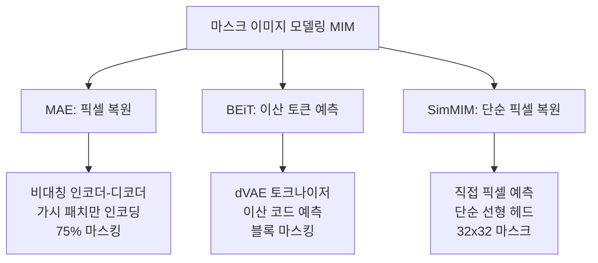
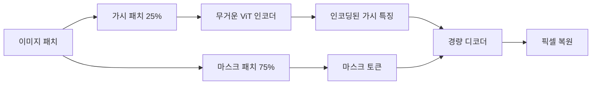
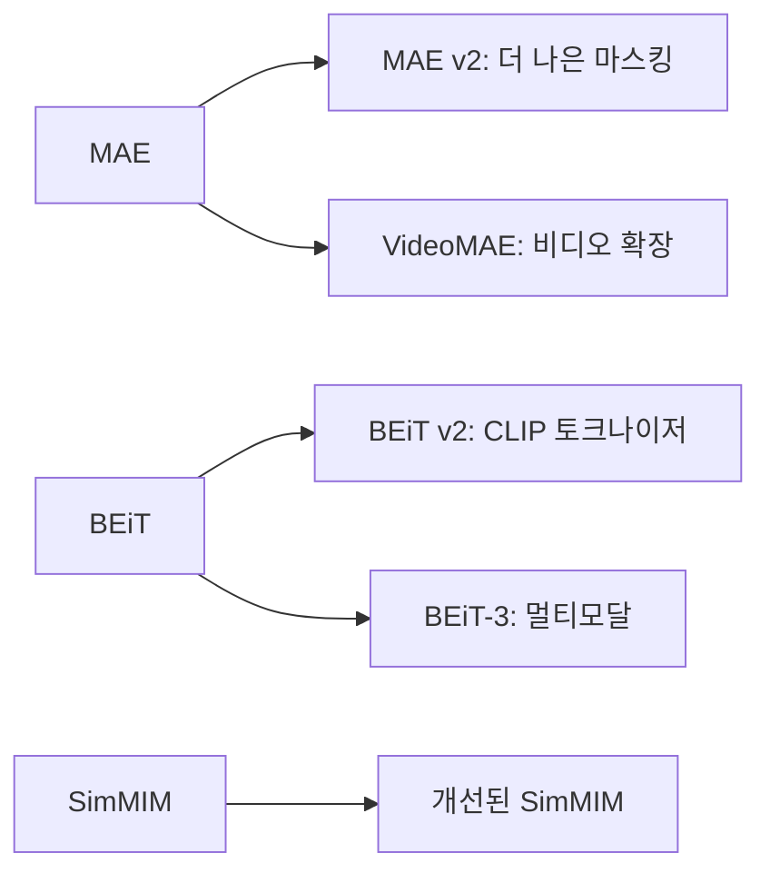

# 마스크 이미지 모델링 비교 - MAE, BEiT, SimMIM

## 개요

마스크 이미지 모델링(Masked Image Modeling, MIM)은 이미지의 일부를 가리고 모델이 이를 복원하도록 학습하는 자기지도(self-supervised) 사전학습 패러다임이다. NLP의 마스크 언어 모델링(BERT)에서 영감을 받아 2021-2022년에 여러 방법론이 동시 다발적으로 등장했다. 이 페이지는 대표적인 세 방법론 [[masked-autoencoder-mae|MAE]], [[beit-bert-pretraining-images|BEiT]], SimMIM을 체계적으로 비교한다.

## 세 방법론 한눈에 보기

## 각 방법론의 핵심 설계 선택

### MAE (Masked Autoencoders, He et al. 2021)

**핵심 아이디어**: 가시 패치만 인코더에 넣어 계산량 절약, 경량 디코더로 픽셀 복원

- 마스킹 비율: 75% (매우 높음)
- 예측 타겟: 정규화된 픽셀 값
- 인코더: 표준 ViT (전체 시퀀스 없이 가시 패치만 처리)
- 디코더: 경량 트랜스포머 (사전학습 후 제거)
- 장점: 계산 효율, 단순한 구현, 강력한 표현

### BEiT (BERT Pre-Training of Image Transformers, Bao et al. 2021)

**핵심 아이디어**: 픽셀 대신 이산 시각 토큰 예측으로 고수준 의미 학습

- 마스킹 비율: ~40% (블록 마스킹)
- 예측 타겟: dVAE 이산 코드 (8192개 어휘)
- 인코더: 표준 ViT (마스크 토큰 포함 전체 시퀀스)
- 외부 토크나이저: dVAE 필요 (별도 학습)
- 장점: 의미론적 표현, BERT와 유사한 패러다임

### SimMIM (Simple Masked Image Modeling, Xie et al. 2021)

**핵심 아이디어**: 별도 디코더 없이 단순 선형 예측 헤드로 픽셀 복원

- 마스킹 비율: ~60% (32x32 블록)
- 예측 타겟: 원시 픽셀 값
- 인코더: ViT 또는 Swin Transformer
- 디코더: 단순 선형 레이어
- 장점: 극단적 단순성, Swin 등 비ViT 아키텍처에도 적용 가능

## 상세 비교표

| 항목 | MAE | BEiT | SimMIM |
|------|-----|------|--------|
| 예측 타겟 | 픽셀 (정규화) | 이산 토큰 | 픽셀 (원시) |
| 마스킹 비율 | 75% | 40% | 60% |
| 마스킹 단위 | 패치 (랜덤) | 패치 (블록) | 32x32 블록 |
| 인코더 입력 | 가시 패치만 | 전체 패치 | 전체 패치 |
| 디코더 | 경량 트랜스포머 | 없음 (분류 헤드) | 선형 레이어 |
| 외부 의존성 | 없음 | dVAE 토크나이저 | 없음 |
| 훈련 비용 | 낮음 | 중간 | 낮음 |
| 주요 아키텍처 | ViT | ViT | ViT, Swin |

## 성능 비교 (ImageNet 파인튜닝)

| 모델 | 백본 | Top-1 Acc | 비고 |
|------|------|----------|------|
| MAE | ViT-B | 83.1% | 1600 에포크 |
| MAE | ViT-L | 85.9% | 1600 에포크 |
| BEiT | ViT-B | 83.2% | 800 에포크 |
| BEiT | ViT-L | 85.2% | |
| SimMIM | Swin-B | 83.8% | 800 에포크 |

세 방법 모두 강력하며, 정확한 비교는 학습 에포크, 데이터셋, 백본에 따라 달라진다.

## 이론적 분석: 왜 각각 동작하는가

### 과제 난이도와 표현 품질

- **높은 마스킹 비율(MAE)**: 더 어려운 과제 → 더 강한 전역 표현 강제
- **이산 토큰(BEiT)**: 고수준 의미 복원 → 의미론적 표현에 유리
- **단순 픽셀(SimMIM)**: 충분히 어려운 과제 + 구현 단순성의 균형

### 지역 vs 전역 표현

각 방법론은 서로 다른 표현 특성을 유도한다:
- MAE: 전역적 문맥 표현에 강함
- BEiT: 의미론적 범주 표현에 강함
- SimMIM: 이 두 방향의 균형

## 후속 발전

마스킹 타겟으로 CLIP 특징을 사용하는 방향(DALL-E CLIP, EVA 등)이 최근 강세다.

## [[self-supervised-learning]]에서의 위치

MIM은 대조학습(contrastive learning, SimCLR, MoCo 등)과 함께 현재 비전 자기지도 학습의 양대 패러다임이다. 두 방향을 결합하거나 MIM 타겟으로 CLIP 임베딩을 사용하는 하이브리드 접근도 활발히 연구되고 있다.

## 관련 문서

- [[masked-autoencoder-mae]] - MAE 상세 설명
- [[beit-bert-pretraining-images]] - BEiT 상세 설명
- [[self-supervised-learning]] - 자기지도 학습 전체 개요
- [[vision-transformer]] - 기반 ViT 아키텍처
- [[hierarchical-vit-design]] - Swin 등 계층적 ViT (SimMIM의 적용 대상)
