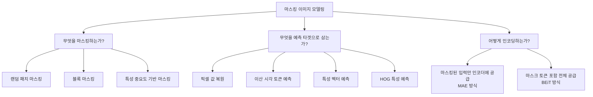
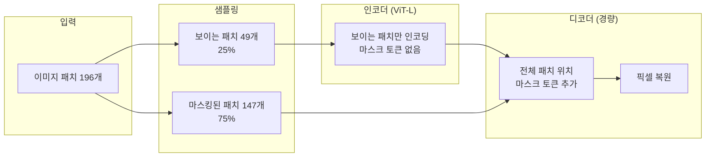
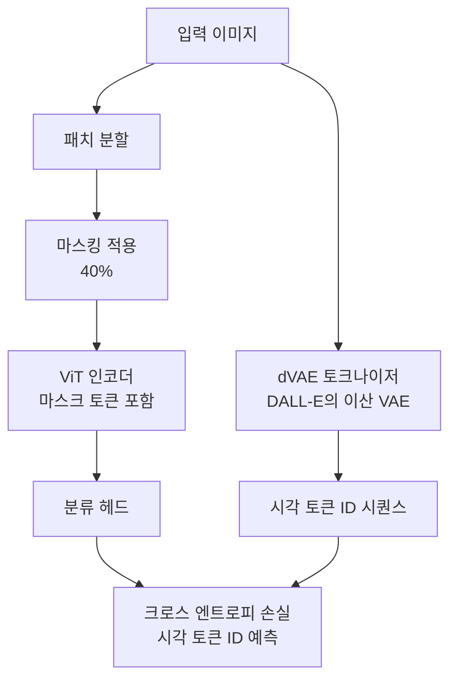
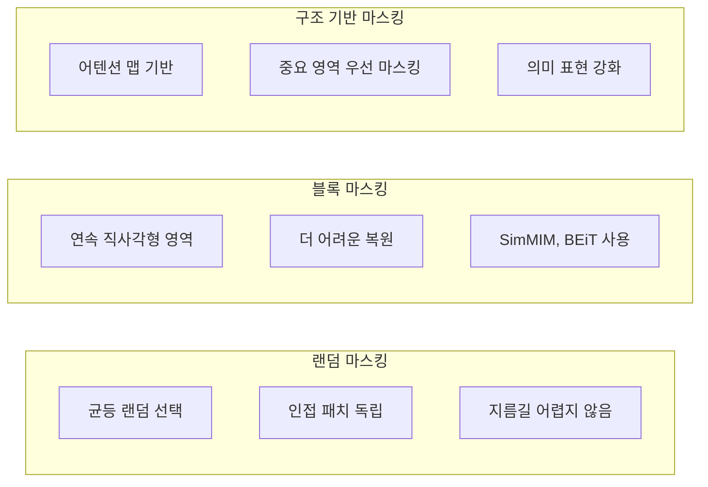

# 마스킹 이미지 모델링 (Masked Image Modeling, MIM)

마스킹 이미지 모델링(Masked Image Modeling, MIM)은 이미지의 일부 패치를 마스킹한 뒤 나머지 패치로 마스킹된 부분을 복원하는 자기지도 사전학습 기법이다. BERT의 Masked Language Modeling(MLM)을 시각 도메인으로 확장한 개념으로, 대규모 레이블 없는 이미지 데이터에서 강력한 표현을 학습한다.

## 배경: MLM에서 MIM으로

[[self-supervised-learning|자기지도 학습 (Self-Supervised Learning)]]에서 BERT는 텍스트 토큰의 15%를 마스킹하고 복원하는 방식으로 언어 표현을 학습했다. MIM은 이 아이디어를 이미지로 옮긴다.

하지만 이미지와 텍스트는 근본적으로 다른 성질을 가진다:

| 특성 | 텍스트 (언어) | 이미지 (시각) |
|------|----------------|---------------|
| 정보 밀도 | 높음 (각 토큰이 의미 있음) | 낮음 (인접 픽셀 상관관계 높음) |
| 어휘 크기 | 유한 (30K~50K) | 연속 값 (사실상 무한) |
| 지역 중복성 | 낮음 | 매우 높음 (스무딩 효과) |
| 예측 난이도 | 의미적 이해 필요 | 저주파 구조 외삽으로 쉽게 예측 가능 |

이 차이 때문에 단순 픽셀 복원은 쉽게 해결되는 지름길(shortcut)이 될 수 있다. 각 방법은 이 문제를 다르게 해결한다.

## 핵심 설계 결정

MIM 방법을 설계할 때 세 가지 핵심 결정이 성능을 좌우한다:



## 주요 방법론

### MAE (Masked Autoencoders, He et al. 2021)

MAE는 비대칭 인코더-디코더 구조로 매우 높은 마스킹 비율(75%)을 사용하는 것이 핵심이다.



**핵심 설계 원칙:**

1. **비대칭 구조**: 인코더는 보이는 패치만 처리 (계산 효율 3x 이상). 디코더는 얕고 좁게 설계
2. **높은 마스킹 비율**: 75%로 지름길(인접 픽셀 복사) 차단. 전체적 구조 이해 강제
3. **픽셀 복원 타겟**: 각 패치를 16x16=256 픽셀 벡터로 정규화 후 MSE 손실

**MAE 손실 함수:**

$$\mathcal{L} = \frac{1}{|\mathcal{M}|} \sum_{p \in \mathcal{M}} \|x_p - \hat{x}_p\|_2^2$$

$\mathcal{M}$은 마스킹된 패치 집합, $x_p$와 $\hat{x}_p$는 원본과 복원 픽셀이다.

**MAE의 의의**: 75% 마스킹에서도 동작한다는 것은 이미지가 매우 중복적이며, 모델이 의미적 이해 없이는 복원이 어렵다는 것을 증명한다.

### BEiT (BERT Pre-Training of Image Transformers, Bao et al. 2021)

BEiT는 이미지를 이산 시각 토큰으로 변환한 뒤 토큰 ID를 예측한다.



**BEiT 특징:**

- **이산 타겟**: 연속 픽셀 대신 8192개 이산 코드북에서 토큰 ID 예측. 의미 있는 예측 단위 제공
- **전체 입력**: 마스크 토큰을 포함한 전체 시퀀스를 인코더에 공급 (BERT와 동일)
- **dVAE 사전학습 필요**: 타겟 토크나이저(DALL-E의 dVAE)를 별도로 사전학습해야 한다는 한계

**BEiT v2**: 이산 dVAE 대신 CLIP 특성을 타겟으로 사용. 의미적 정렬 향상.

### SimMIM (Simple Framework for Masked Image Modeling, Xie et al. 2021)

MAE의 아이디어를 SwinTransformer에 적용하며 단순화를 추구한다.

```mermaid
flowchart LR
    I[이미지] --> M[마스킹<br/>32x32 블록, 60%]
    M --> S[Swin Transformer 인코더<br/>마스크 토큰 [M] 포함]
    S --> H[경량 예측 헤드<br/>단일 선형층]
    H --> R[픽셀 복원]
    R --> L[L1 손실]
```

**SimMIM vs MAE 차이:**

| 항목 | MAE | SimMIM |
|------|-----|--------|
| 인코더 구조 | 보이는 패치만 처리 | 전체 패치 처리 |
| 마스킹 비율 | 75% | 60% |
| 타겟 | 정규화 픽셀 (MSE) | 원본 픽셀 (L1) |
| 예측 헤드 | 경량 디코더 | 단일 선형층 |
| 기반 아키텍처 | ViT | Swin Transformer |

### iBOT (Image BERT Pre-Training with Online Tokenizer, Zhou et al. 2021)

BEiT처럼 이산 타겟을 사용하지만, 오프라인 dVAE 대신 **온라인 토크나이저(교사 네트워크)**를 사용한다.

- 지수이동평균(EMA)으로 업데이트되는 교사 ViT가 타겟 제공
- 마스킹 패치 복원 + 이미지 수준 표현 학습을 동시에
- DINO의 셀프-디스틸레이션과 MIM을 결합한 형태

### MaskFeat (Masked Feature Prediction, He et al. 2022)

픽셀이나 이산 토큰 대신 **HOG(Histogram of Oriented Gradients) 특성**을 타겟으로 사용한다.

$$\text{target} = \text{HOG}(x_p)$$

HOG는 경계선과 텍스처 정보를 인코딩하며, 픽셀보다 의미 있는 중간 수준 표현을 제공한다.

## 마스킹 전략 비교

마스킹 방식도 성능에 큰 영향을 미친다:



MAE 논문의 ablation에 따르면, 블록 마스킹보다 랜덤 마스킹이 다운스트림 성능에서 더 좋거나 비슷하다는 결과가 있다 (도메인과 태스크 의존적).

## 다운스트림 전이 성능

MIM 사전학습 모델은 다양한 시각 태스크에서 지도 학습 기준선을 크게 뛰어넘는다:

| 방법 | ImageNet-1K 정확도 (ViT-L) | 사전학습 데이터 |
|------|--------------------------|----------------|
| 지도 학습 (from scratch) | ~82% | ImageNet-1K |
| BEiT | 87.4% | ImageNet-1K |
| MAE | 87.8% | ImageNet-1K |
| SimMIM | 87.1% | ImageNet-1K |

검출, 분할, 비디오 이해 등에서도 강력한 전이 성능을 보인다.

## MIM과 대조 학습의 관계

[[대조 학습 (Contrastive & Metric Learning)]]과 MIM은 상호 보완적이다:

- **대조 학습**: 다른 뷰(augmented view) 간 유사도를 최대화. 전역 의미 표현에 강함
- **MIM**: 마스킹된 구조 복원. 지역 구조 이해에 강함

CAE (Context Autoencoder), data2vec 등은 두 방법을 결합해 더 풍부한 표현을 학습한다.

**data2vec**: 텍스트, 이미지, 오디오 모두에 동일한 MIM 프레임워크 적용. 타겟은 교사 네트워크의 상위 레이어 표현.

## [[비디오 이해 (Video Understanding)]]와의 연결

VideoMAE는 MAE를 비디오로 확장한다:

- 3D 패치로 시공간 토큰 생성
- 시간적 중복을 고려해 90-95%의 극단적 마스킹 비율 사용
- 제한된 비디오 데이터에서도 효과적

## 멀티모달 응용

MIM은 [[Q-Former (Querying Transformer)]]나 [[Perceiver Resampler]]와 같은 멀티모달 아키텍처의 시각 인코더 사전학습에 사용된다. MAE나 BEiT로 사전학습된 ViT를 언어 모델과 결합하면 시각-언어 정렬이 더 수월해진다.

## 실무 관점

### 어떤 방법을 선택할까

- **일반 목적 시각 표현**: MAE (구현 단순, 성능 우수, 빠른 사전학습)
- **계층적 특성 필요** (검출/분할): SimMIM + Swin Transformer
- **의미적 표현 우선**: BEiT v2 또는 iBOT
- **도메인 특화 데이터**: 작은 데이터셋이라면 MAE보다 대조 학습이 나을 수 있음

### 사전학습 설정

- **마스킹 비율**: MAE 스타일이면 75%, BEiT/SimMIM이면 40-60%
- **에포크**: ImageNet에서 800-1600 에포크 (MAE는 빠른 수렴)
- **패치 크기**: 16x16이 표준. 8x8은 고해상도 이미지에 유리하지만 계산 비용 큼

## 관련 문서

- [[mae-original-paper]] -- MAE 원 논문 (He et al. 2022)
- [[masked-image-modeling-survey]] -- MIM 서베이
- [[vision-transformer]] -- Vision Transformer 기반 아키텍처
- [[self-supervised-learning|자기지도 학습 (Self-Supervised Learning)]] -- MIM의 상위 패러다임
- [[대조 학습 (Contrastive & Metric Learning)]] -- 상호 보완적 자기지도 방법
- [[video-understanding]] -- VideoMAE 등 비디오 응용
