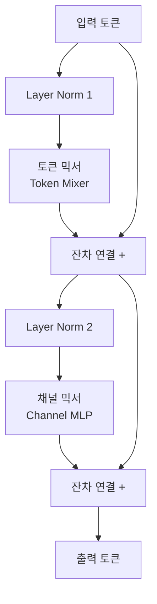
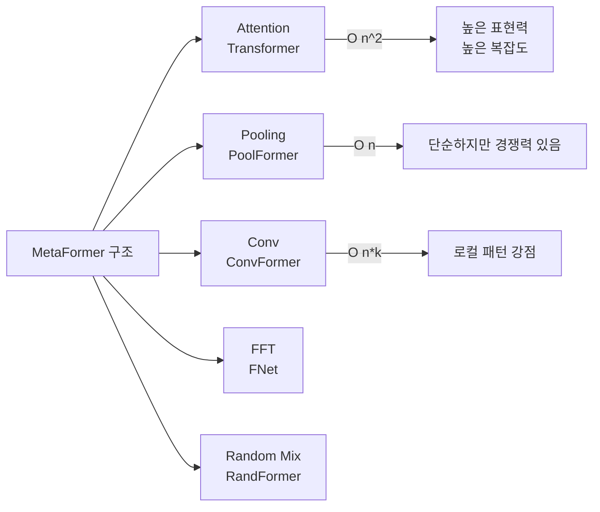

# MetaFormer - 토큰 믹서 추상화 패러다임

## 개요

MetaFormer는 Transformer의 성공 요인을 어텐션 자체가 아닌 **아키텍처 전체 구조(메타 구조)**에서 찾는 패러다임이다. 2022년 Sea AI Lab에서 제안한 이 관점은 "Transformer의 핵심은 셀프 어텐션이 아니라, 토큰 믹서(token mixer) + 채널 믹서(channel MLP)로 구성된 일반 구조"라는 주장에서 출발한다. 어떤 토큰 믹서를 사용하더라도 MetaFormer 구조 자체가 강력한 귀납 편향(inductive bias)을 제공한다는 점이 핵심이다.

## 왜 MetaFormer인가

기존 연구들은 ViT(Vision Transformer)의 성능을 어텐션 메커니즘의 능력으로 설명했다. 그러나 MetaFormer 연구진은 단순한 풀링(pooling)으로 어텐션을 대체한 **PoolFormer**가 동일 파라미터 수의 Transformer 계열 모델보다 이미지넷 분류에서 높은 정확도를 달성함을 보였다. 이는 어텐션 자체보다 전체 아키텍처 구조가 더 중요함을 시사한다.

## MetaFormer 구조



MetaFormer 블록은 다음 두 서브-블록의 조합이다.

| 서브-블록 | 역할 | 복잡도 |
|-----------|------|--------|
| 토큰 믹서 (Token Mixer) | 토큰 간 정보 교환 (공간적 믹싱) | 믹서 종류에 따라 다름 |
| 채널 믹서 (Channel MLP) | 각 토큰 내 채널 차원 변환 | O(n * d^2) |

토큰 믹서 부분만 교체하면 다양한 특성의 모델을 생성할 수 있다.

## 토큰 믹서 변형 비교



### PoolFormer

가장 단순한 MetaFormer 구현이다. 어텐션 대신 **평균 풀링(average pooling)**만으로 토큰 믹싱을 수행한다.

```python
# PoolFormer 토큰 믹서 (개념 코드)
import torch.nn as nn

class PoolMixer(nn.Module):
    def __init__(self, pool_size=3):
        super().__init__()
        self.pool = nn.AvgPool2d(pool_size, stride=1, padding=pool_size // 2)

    def forward(self, x):
        # x: (B, C, H, W) 형식
        return self.pool(x) - x  # 이웃 평균 - 자신 = 로컬 차이 인코딩
```

- ImageNet-1K 기준 PoolFormer-S36: **79.4% top-1** (DeiT-S 79.8%와 유사, 파라미터 수 적음)
- 어텐션이 없으므로 시퀀스 길이에 선형 복잡도

### ConvFormer

풀링 대신 **depthwise separable convolution**을 토큰 믹서로 사용한다. 로컬 공간 패턴에 강하며, 비전 태스크에서 PoolFormer를 상회하는 성능을 보인다.

- ConvFormer-M36: **ImageNet top-1 84.1%** (Swin-B 83.5% 초과)
- 로컬 귀납 편향이 강해 이미지 인식에 유리

## 왜 MetaFormer가 작동하는가

1. **잔차 연결 + 정규화**: 어떤 토큰 믹서를 쓰더라도 잔차 연결이 그래디언트 흐름을 보장
2. **채널 MLP의 표현력**: 채널 차원 변환이 풍부한 표현을 학습
3. **구조적 귀납 편향**: 깊은 레이어 스택 자체가 계층적 특성 추출을 유도
4. **어텐션의 필요성 재평가**: 전역 의존성이 항상 필요한 것은 아님 - 비전 태스크에서는 로컬 패턴으로 충분한 경우가 많다

## 실무적 함의

- **경량 배포**: PoolFormer는 어텐션 연산이 없어 모바일/엣지 추론에 유리
- **아키텍처 탐색**: 토큰 믹서 선택이 NAS(Neural Architecture Search)의 핵심 변수가 됨
- **하이브리드 설계**: 얕은 레이어에 ConvMixer, 깊은 레이어에 Attention을 배치하는 전략 가능 (CvT, CoAtNet 등)
- **비전 이외 확장**: 언어, 오디오, 멀티모달 태스크에도 MetaFormer 관점 적용 중

## 한계

- 풀링/컨볼루션 기반 믹서는 **전역 의존성 모델링에 약함** - NLP 태스크에서 순수 어텐션 대비 열세
- MetaFormer는 아키텍처 설계 원리이지 학습 알고리즘이 아님 - 데이터 증강, 학습률 스케줄 등 외부 요소의 영향이 큼
- [[swin-transformer]]처럼 계층적 특성 맵을 생성하는 구조와의 비교에서 downstream 태스크 성능 차이 존재

## 관련 문서

- [[transformer-architecture]] - MetaFormer가 일반화하는 원본 Transformer 구조
- [[swin-transformer]] - 계층적 윈도우 어텐션 기반 비전 Transformer
- [[vision-transformer]] - ViT: 순수 어텐션 기반 비전 모델
- [[linear-attention]] - 어텐션 복잡도를 O(n)으로 줄이는 방향의 연구
