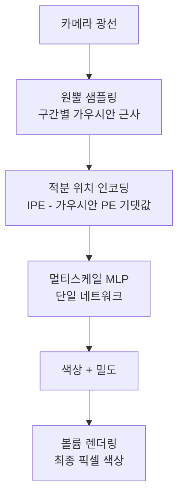
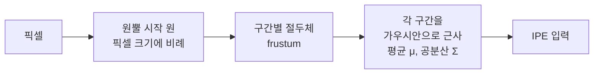
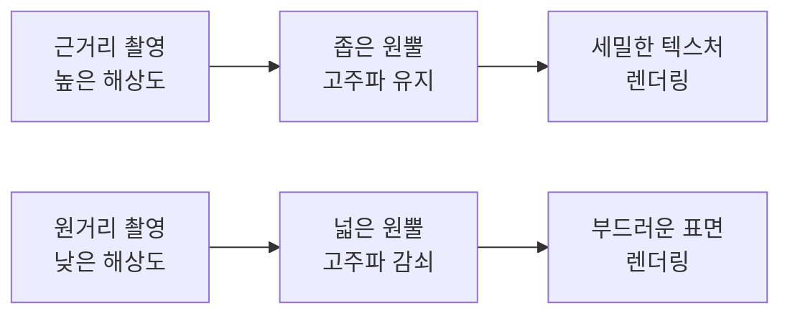
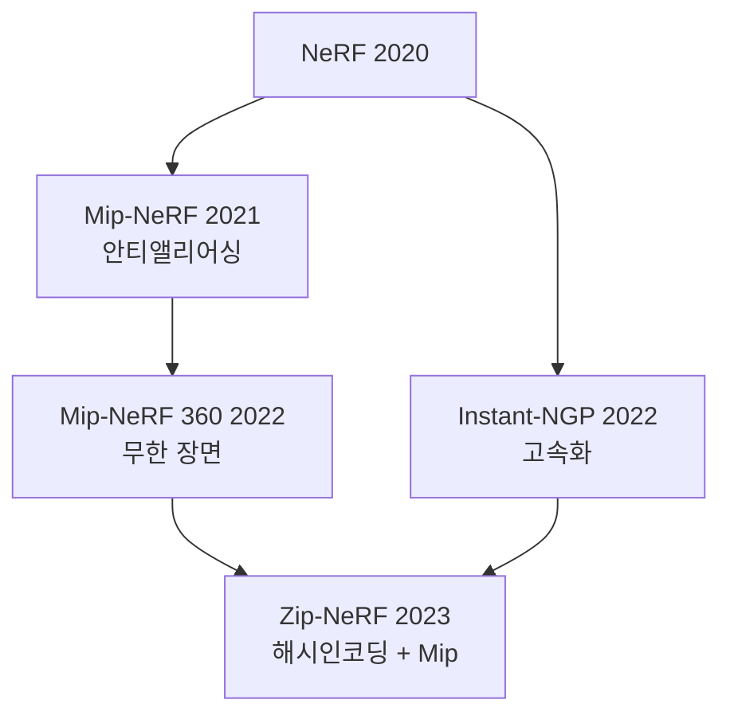

## 개요

Mip-NeRF(Mip-mapped Neural Radiance Fields)는 원본 [[nerf-neural-radiance-fields|NeRF]]의 핵심 한계인 **앨리어싱(aliasing) 현상**을 해결하기 위해 2021년 Google Research가 제안한 NeRF 변형이다. 컴퓨터 그래픽스의 밉맵핑(mipmapping) 개념을 NeRF에 도입하여, 카메라가 객체에 가깝거나 멀 때 발생하는 흐림·계단 현상을 줄인다.

원본 NeRF는 **점(point) 샘플링** 방식으로 각 광선(ray) 위의 점들을 독립적으로 네트워크에 입력하는데, 이는 인접한 픽셀들의 광선이 교차하는 영역의 크기(footprint)를 무시한다. Mip-NeRF는 점 대신 **원뿔(cone) 구간**을 사용하여 실제 렌더링에서 각 픽셀이 나타내는 공간 영역을 정밀하게 모델링한다.

## 핵심 아이디어: IPE (Integrated Positional Encoding)

원본 NeRF는 3D 위치 $\mathbf{x}$에 위치 인코딩(PE)을 적용한다:

$$\gamma(\mathbf{x}) = [\sin(2^k \pi \mathbf{x}), \cos(2^k \pi \mathbf{x})]_{k=0}^{L-1}$$

Mip-NeRF는 점 대신 **가우시안으로 근사된 원뿔 구간**을 표현하고, 이 구간에 걸쳐 PE를 적분(integrate)한다.

$$\text{IPE}(\mu, \Sigma) = \mathbb{E}_{\mathbf{x} \sim \mathcal{N}(\mu, \Sigma)}[\gamma(\mathbf{x})]$$

가우시안에 대한 PE의 기댓값은 닫힌 형태(closed form)로 계산 가능하다:

$$\text{IPE}(\mu, \Sigma) = [\sin(2^k \pi \mu) e^{-2^{2k-1}\pi^2 \Sigma_{ii}}, \cos(2^k \pi \mu) e^{-2^{2k-1}\pi^2 \Sigma_{ii}}]$$

지수 항 $e^{-\text{(분산 항)}}$이 **고주파 성분을 자동으로 감쇠**시켜 스케일에 적합한 표현을 생성한다. 먼 곳(가우시안이 넓음)에서는 세부 텍스처가 자연스럽게 흐려지고, 가까운 곳에서는 선명한 디테일이 보존된다.

## 원뿔 추적(Cone Casting) 방식

원본 NeRF의 레이 캐스팅 대신 원뿔 캐스팅을 사용한다:

픽셀이 나타내는 뷰 방향의 각도 크기(angular extent)에 따라 원뿔의 반지름이 결정된다. 고해상도 렌더링 시 원뿔이 좁고, 저해상도나 원거리 시 원뿔이 넓어진다.

## 단일 MLP vs 계층형 샘플링

원본 NeRF는 Coarse + Fine 두 개의 MLP를 사용하지만, Mip-NeRF는 **단일 MLP**를 Coarse/Fine 샘플 모두에 재사용한다. 이를 통해:

- 파라미터 수 약 절반으로 감소
- Coarse-Fine 간 학습 불균형 문제 해소

## 성능 비교

| 방식 | 다중 스케일 PSNR | 앨리어싱 | 파라미터 수 |
|------|----------------|---------|------------|
| NeRF | 낮음 | 발생 | 2x (Coarse+Fine) |
| Mip-NeRF | 높음 (약 +1 dB PSNR) | 대폭 감소 | 1x (단일 MLP) |

Mip-NeRF는 특히 **다중 해상도(multiscale)** 렌더링 시 성능 격차가 두드러진다.

## 후속 발전: Mip-NeRF 360

Mip-NeRF는 정면이 주요 관심인 제한된 장면(bounded scenes)을 가정한다. **Mip-NeRF 360**은 무한한 실외 장면에서도 Mip-NeRF 원리를 적용하기 위해:

1. **장면 수축(scene contraction)**: 무한 공간을 유한 큐브로 매핑
2. **제안 네트워크(proposal network)**: 중요한 공간 영역을 효율적으로 샘플링
3. **정규화 손실**: 과도한 흐림이나 빈 공간 발생 방지

[[instant-ngp]]는 해시 인코딩으로 Mip-NeRF 계열의 속도를 극적으로 개선하였으나, 안티앨리어싱 처리는 별도의 고려가 필요하다.

## 실무 적용 관점

- **산업 검사**: 다양한 거리에서 촬영된 부품 이미지로 일관된 품질의 3D 모델 생성
- **혼합 해상도 입력 처리**: 드론 촬영(원거리)과 지상 촬영(근거리)이 혼합된 데이터에서 일관된 재구성
- **VR/AR 콘텐츠**: 사용자 거리에 따라 자동으로 적합한 세부 수준(LOD) 렌더링

## NeRF 발전 계보에서의 위치

Mip-NeRF의 IPE 개념은 후속 고품질 NeRF 변형들의 표준 구성 요소로 자리잡았다.

## 관련 문서

- [[nerf-neural-radiance-fields|NeRF]] - 원본 신경 방사 필드, Mip-NeRF의 기반
- [[instant-ngp]] - 해시 인코딩으로 NeRF 속도를 극적으로 개선한 방법론
- [[spatiotemporal-representation]] - 3D 공간 표현 학습과의 연결
