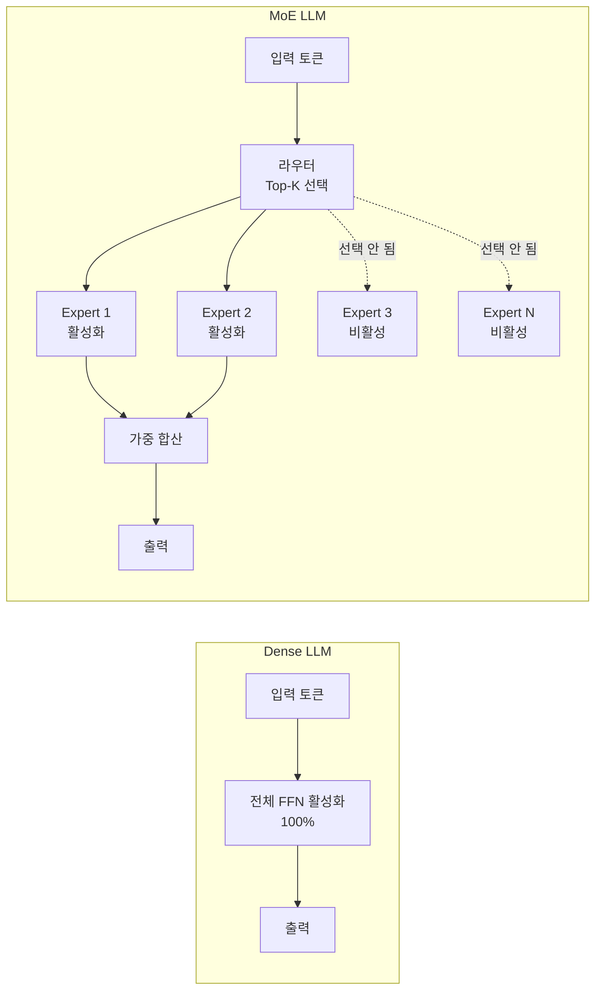
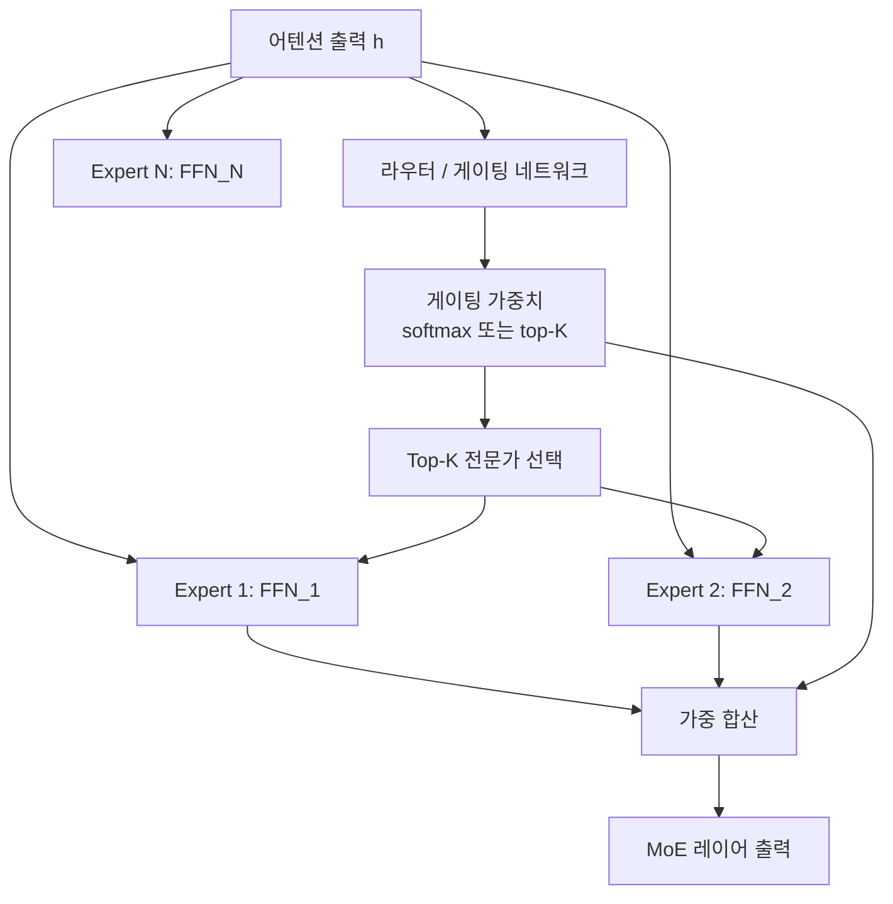
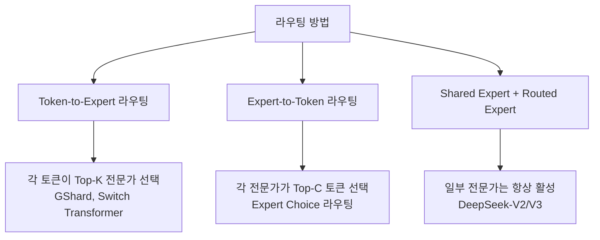
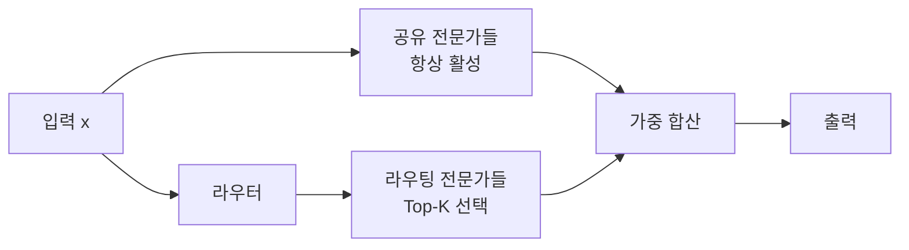
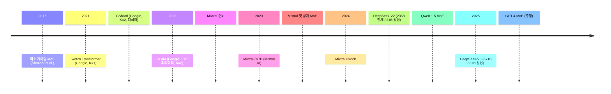
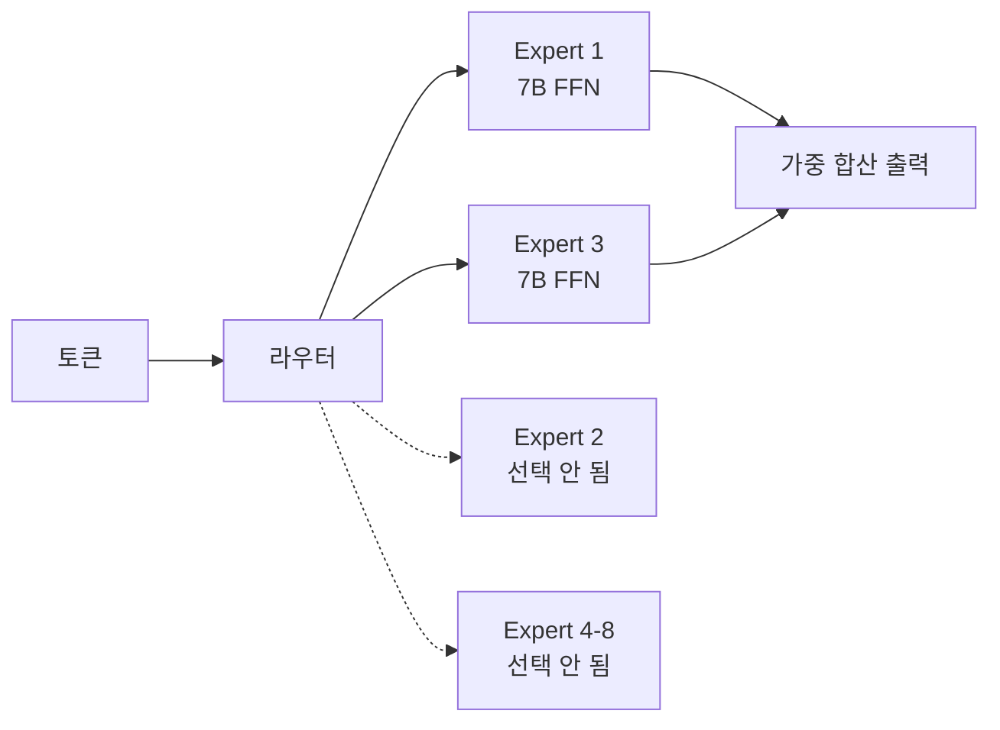
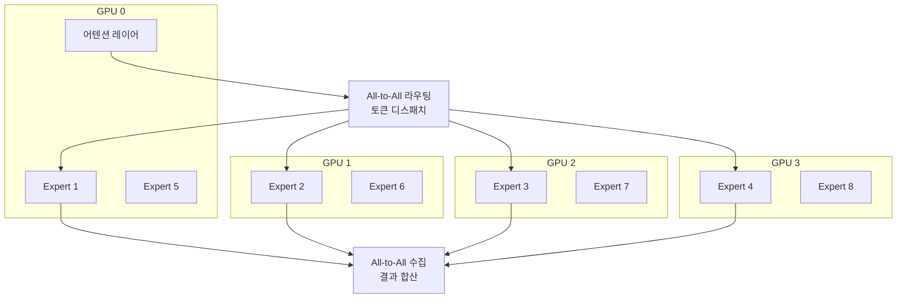

# LLM을 위한 Mixture of Experts (MoE)

Mixture of Experts(MoE)는 모델 전체를 항상 활성화하는 대신, 입력마다 소수의 "전문가(expert)" 서브네트워크만 선택하여 실행하는 조건부 계산(conditional computation) 아키텍처다. 동일한 파라미터 수 대비 추론 비용을 낮추거나, 동일한 계산 비용 대비 파라미터 수(용량)를 크게 늘릴 수 있어, 대형 언어 모델 스케일링의 핵심 기법이 되었다.

## 핵심 직관

핵심 트레이드오프: **파라미터 수 증가 (용량) vs 활성 파라미터 감소 (계산 비용)**

## 기본 MoE 레이어 구조

Transformer에서 MoE는 보통 FFN(Feed-Forward Network) 레이어를 대체한다:

### 수식

입력 토큰 $x$에 대해:

$$\text{MoE}(x) = \sum_{i \in \text{Top-K}} g_i(x) \cdot E_i(x)$$

게이팅 가중치:

$$g_i(x) = \frac{\exp(W_r x)_i}{\sum_{j \in \text{Top-K}} \exp(W_r x)_j}$$

$W_r$은 라우터 행렬, $E_i(x)$는 $i$번째 전문가의 FFN 출력이다.

## 라우팅 메커니즘

라우팅은 MoE 성능의 핵심이며 여러 설계 선택지가 있다.

### Top-K 라우팅 (Token-to-Expert)

가장 일반적인 방법. 각 토큰이 상위 K개 전문가를 선택한다. 실제로 K=1 또는 K=2가 가장 많이 사용된다.

- **K=1 (Switch Transformer)**: 가장 단순. 전문가 당 처리량 예측 쉬움. 훈련 불안정성 있음
- **K=2 (GShard, Mixtral)**: 안정성과 효율 균형. 업계 표준

### Expert Choice 라우팅

방향을 역전: 각 전문가가 담당할 토큰을 선택한다.

$$\text{선택}_{expert_i} = \text{Top-C}_{tokens}(W_r x)$$

모든 전문가가 균등하게 처리하므로 부하 불균형이 없다. 단, 처리되지 않는 토큰이 생길 수 있다.

### Shared Expert + Routed Expert (DeepSeek-MoE)

공유 전문가는 공통 지식을 담당하고, 라우팅 전문가는 특화 지식을 담당하는 분업 구조. DeepSeek-V2/V3에서 사용.

## 부하 균형 문제 (Load Balancing)

MoE의 고질적 문제는 **전문가 붕괴(expert collapse)**: 특정 전문가만 계속 선택되고 나머지는 학습되지 않는 현상.

### 보조 손실 (Auxiliary Loss)

전문가 간 균등 분배를 유도하는 보조 손실을 추가한다:

$$\mathcal{L}_{aux} = \alpha \cdot N \sum_{i=1}^{N} f_i \cdot P_i$$

$f_i$: 전문가 $i$에 라우팅된 토큰 비율, $P_i$: 전문가 $i$의 평균 라우팅 확률, $\alpha$: 균형 조절 계수.

### 전문가 용량 (Expert Capacity)

배치 내에서 각 전문가가 처리할 수 있는 최대 토큰 수를 제한:

$$C = \text{capacity\_factor} \times \frac{\text{tokens\_per\_batch}}{N_{experts}}$$

용량 초과 토큰은 다음 레이어로 바로 전달 (패스스루) 또는 드롭.

## 주요 MoE LLM 모델

### Switch Transformer (Fedus et al. 2021)

- K=1 라우팅으로 극단적 단순화
- T5 대비 7배 빠른 사전학습 (동일 계산 예산)
- 1.6조 파라미터까지 스케일

### GShard (Lepikhin et al. 2021)

- K=2, 다국어 기계번역
- 전문가 용량 팩터 도입
- 600B 파라미터 모델을 분산 처리

### Mixtral 8x7B (Mistral AI, 2023)

- 8개 전문가, 각 7B 크기, K=2 선택
- 활성 파라미터: 13B (추론 시)
- 전체 파라미터: 47B (스토리지)
- GPT-3.5 수준 성능, Llama 2 70B 능가
- 오픈소스 공개로 MoE 대중화

### DeepSeek-V2 / V3

**DeepSeek-V2 (2024)**:
- 236B 전체 / 21B 활성 (Top-6 of 160 experts)
- Multi-head Latent Attention(MLA)과 결합
- $0.01/M 토큰의 극단적 비용 효율

**DeepSeek-V3 (2025)**:
- 671B 전체 / 37B 활성
- 노이즈 없는 Top-K 게이팅 (보조 손실 없이 균형)
- Multi-Token Prediction 보조 목표
- H800 GPU로 278만 GPU-hour에 사전학습 ($5.5M 수준)

## MoE 분산 처리 (Expert Parallelism)

MoE는 특수한 분산 처리 전략이 필요하다:

**전문가 병렬화(Expert Parallelism)**: 전문가들을 서로 다른 GPU에 분산. 토큰 라우팅 시 All-to-All 통신 필요.

**텐서 + 전문가 병렬화**: 각 전문가 내부에도 텐서 병렬화 적용. 복잡한 통신 패턴 발생.

## Dense vs MoE 트레이드오프

| 항목 | Dense LLM | MoE LLM |
|------|-----------|---------|
| 훈련 안정성 | 높음 | 낮음 (전문가 붕괴 위험) |
| 추론 처리량 | 낮음 (전체 파라미터 활성) | 높음 (소수 전문가만 활성) |
| 메모리 요구 | 낮음 | 높음 (전체 파라미터 로드) |
| 통신 오버헤드 | 낮음 | 높음 (All-to-All) |
| 동일 FLOP 대비 성능 | 기준 | 높음 |
| 파인튜닝 용이성 | 높음 | 낮음 |

## 연관 개념: Expert Upcycling

이미 훈련된 Dense 모델에서 MoE 모델을 초기화하는 기법 ([[expert-upcycling-moe]] 참조). Dense FFN 가중치를 여러 전문가에 복사한 뒤 추가 학습.

**장점**: Dense 사전학습의 지식을 보존하면서 MoE의 용량 확장 효율을 얻음  
**단점**: 초기에 모든 전문가가 동일하여 다양성 확보가 느림

## 도메인 전문가 MoE

[[domain-expert-moe]] 참조. 전문가 각각을 특정 도메인 데이터로 전문화하는 접근:

- 의료, 법률, 코드 등 도메인별 전문가 사전학습
- 범용 전문가와 도메인 전문가 혼합
- 라우터가 입력의 도메인을 학습

## Null Expert 문제

[[moe-null-expert-paper]] 에서 다루듯, 일부 전문가는 거의 활성화되지 않는 "사멸(dead)" 상태가 된다. 이를 방지하기 위한 방법들:

- 보조 손실 (균등 분배 유도)
- 전문가 드롭아웃 (학습 시 일부 전문가 강제 활성)
- 파라미터 재초기화

## 실무 관점

### MoE 모델 사용 시 고려사항

1. **메모리**: Mixtral 8x7B는 7B 모델보다 ~6.7배 많은 메모리 필요 (47B 파라미터)
2. **추론 속도**: 활성 파라미터가 13B이므로 추론 속도는 13B Dense와 유사
3. **파인튜닝**: LoRA 등 PEFT 기법 적용 시 전체 전문가에 적용할지, 일부에만 적용할지 선택 필요
4. **양자화**: 전문가마다 양자화 적용 가능. 비활성 전문가는 더 공격적 압축 가능

### 언제 MoE를 선택하는가

- 동일 계산 예산에서 최대 성능이 필요할 때
- 추론 처리량이 중요하고 메모리가 충분할 때
- 여러 GPU에 분산 처리 가능한 인프라가 있을 때

## 관련 문서

- [[moe-null-expert-paper]] -- MoE 사멸 전문가 문제 논문
- [[expert-upcycling-moe]] -- Dense 모델에서 MoE로 업사이클링
- [[domain-expert-moe]] -- 도메인 전문화 MoE
- [[Transformer 아키텍처 (Transformer Architecture)]] -- MoE가 대체하는 FFN 레이어
- [[분산 학습 (Distributed Training)]] -- Expert Parallelism
