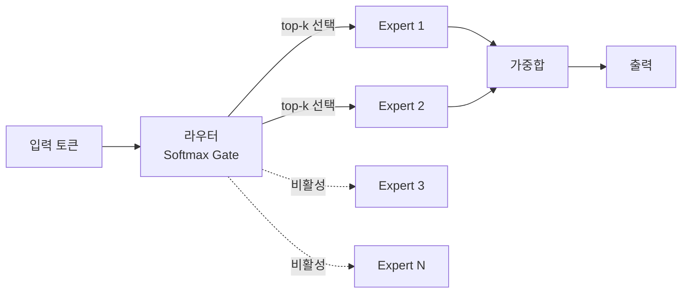
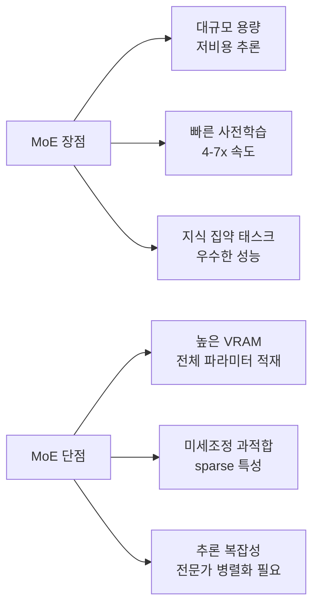

# Mixture of Experts (MoE)

## 개요

Mixture of Experts(MoE)는 Transformer의 피드포워드(FFN) 레이어를 **다수의 독립적 전문가 네트워크(experts)**로 교체하고, 라우터(router/gate)가 각 토큰을 소수의 전문가에게만 배정하는 아키텍처다. 전체 파라미터 수는 크지만 추론 시 활성화되는 파라미터는 일부뿐(sparse activation)이므로 **대규모 모델 용량을 저비용 연산으로 활용**할 수 있다.

## 핵심 구조

### 라우터 (Gate Network)

라우터는 입력 토큰의 hidden state를 받아 각 전문가에 대한 확률 분포를 계산한다. 일반적으로 선형 레이어 + Softmax로 구현되며, 상위 k개 전문가만 선택하고 나머지는 비활성화한다.

**Noisy Top-k Gating:**
입력에 학습 가능한 노이즈를 추가하여 특정 전문가에 토큰이 집중되는 현상을 완화한다. 노이즈는 탐색-활용(exploration-exploitation) 균형을 조절하는 역할을 한다.

### 전문가 (Experts)

각 전문가는 독립적인 FFN이며, 표준 Transformer 블록의 FFN과 동일한 구조를 가진다. 전문가 간 파라미터는 공유되지 않으므로 각각이 서로 다른 패턴을 학습할 수 있다.

## 부하 분산 (Load Balancing)

MoE 학습의 핵심 과제는 **라우터 붕괴(routing collapse)**를 방지하는 것이다. 인기 있는 전문가가 더 많이 선택되고, 더 많이 학습되어, 더 자주 선택되는 자기강화 루프가 발생하면 대부분의 전문가가 유휴 상태에 빠진다.

**보조 손실(Auxiliary Loss):**
- **부하 분산 손실**: 모든 전문가가 비슷한 수의 토큰을 받도록 유도
- **전문가 사용 손실**: 전문가 간 균등한 라우팅 촉진
- **Router Z-Loss** (ST-MoE에서 도입): 게이팅 로짓의 크기를 억제하여 학습 안정성 개선

**전문가 용량 (Expert Capacity):**
각 전문가가 한 배치에서 처리할 수 있는 최대 토큰 수를 제한한다. 용량을 초과한 토큰은 드롭되거나 잔차 연결(residual)만 통과한다.

## Switch Transformer

Fedus et al. (2021)이 제안한 모델로, MoE를 극단적으로 단순화했다.

| 속성 | 기존 MoE | Switch Transformer |
|---|---|---|
| 라우팅 | Top-2 이상 | **Top-1** (단일 전문가) |
| 전문가 수 | 소수 (4-16) | 대규모 (128-2048) |
| 사전학습 속도 | - | T5-XXL 대비 **4x 빠름** |

Top-1 라우팅의 핵심 이점은 라우터 연산량 감소, 전문가 간 통신 비용 절감, 구현 단순성이다. 동일 연산 예산에서 dense 모델 대비 최대 **7x 빠른 사전학습**을 달성했다.

## Mixtral 8x7B

Mistral AI (2023)가 공개한 MoE 모델로, 실용적 MoE 설계의 기준점이 되었다.

**아키텍처:**
- 8개 전문가, 각 약 7B 파라미터
- Top-2 라우팅 (토큰당 2개 전문가 활성화)
- 총 파라미터: ~47B (비전문가 레이어 공유)
- **활성 파라미터: ~13B** (추론 시 실제 연산량)

**성능:** Llama 2 70B과 동등 이상의 성능을 13B급 연산 비용으로 달성했다. 즉 70B 수준 품질을 70B의 1/5 수준 FLOPs로 얻는 것이다.

## 트레이드오프

- **VRAM**: Mixtral 8x7B은 13B급으로 동작하지만 47B 전체를 메모리에 올려야 한다
- **미세조정**: sparse 레이어에 더 높은 드롭아웃 필요, 소규모 데이터셋에서 과적합 위험
- **추론 태스크**: 동일 perplexity에서 dense 모델이 추론(reasoning) 태스크에 더 강한 경향

## 후속 발전

DeepSeek-V2/V3는 MoE에 [[multi-head-latent-attention|MLA]]를 결합하여 전문가 라우팅과 어텐션 효율화를 동시에 달성했다. 최신 모델들(GLM-5, Kimi K2 등)도 MoE를 기본 아키텍처로 채택하는 추세이며, 라우팅 전략은 auxiliary-loss-free(DeepSeek-V3), expert segmentation, shared expert 등으로 계속 진화하고 있다.

## 관련 문서
- [[sparse-mixture-of-experts-theory]] -- 희소 MoE 이론

- [[multi-head-latent-attention]] -- MoE 모델의 어텐션 효율화 (DeepSeek-V2/V3)
- [[kv-cache]] -- MoE 모델에서도 KV 캐시 관리가 추론 병목
- [[sparse-attention-patterns]] -- 어텐션 자체를 희소화하는 다른 접근
- [[flash-attention-fundamentals]] -- 어텐션 연산의 IO 최적화

## 참고 자료

- [Mixture of Experts Explained (Hugging Face Blog)](https://huggingface.co/blog/moe)
- [Switch Transformers: Scaling to Trillion Parameter Models (arXiv)](https://arxiv.org/abs/2101.03961)
- [Mixtral of Experts (arXiv)](https://arxiv.org/abs/2401.04088)
