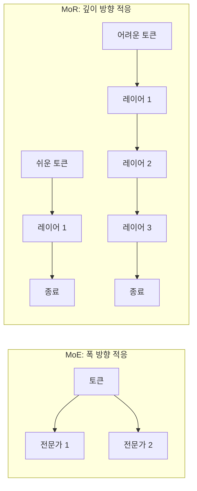

# 재귀 혼합 (Mixture of Recursions)

토큰별로 **적응적 재귀 깊이**를 할당하는 아키텍처. [[mixture-of-experts|MoE]]가 입력별로 다른 전문가를 활성화하듯, MoR은 입력별로 다른 **깊이(레이어 수)**를 적용한다. 파라미터를 공유하면서 동적 컴퓨팅을 실현한다.

## 핵심 아이디어

- **쉬운 토큰**(관사, 전치사 등): 1-2회 재귀로 충분
- **어려운 토큰**(추론, 사실 회상 등): 더 많은 재귀 필요
- 레이어 가중치를 **공유(weight tying)**하므로 파라미터 수는 증가하지 않음

## [[early-exit-networks|조기 종료]]와의 차이

조기 종료는 중간 레이어에서 출력하지만, MoR은 **같은 레이어 블록을 반복 적용**한다는 점이 다르다. 재귀적 정제(iterative refinement) 관점에서 Universal Transformer의 후계.

## 실무 의의

- MoE(폭) + MoR(깊이) 결합으로 2차원 적응적 컴퓨팅 가능
- 추론 비용을 토큰 난이도에 비례하게 조절 -- [[inference-time-scaling|추론 시간 스케일링]]의 아키텍처적 구현

## 관련 문서

- [[mixture-of-experts]] -- MoE (폭 방향 적응)
- [[early-exit-networks]] -- 조기 종료 네트워크
- [[inference-time-scaling]] -- 추론 시간 스케일링
- [[mixture-of-depths]] -- 깊이 혼합
