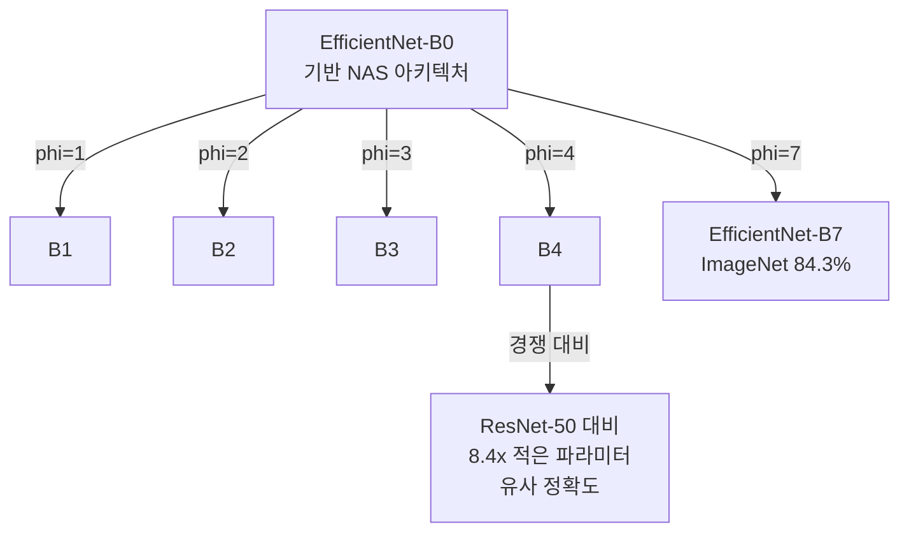

# MobileNet / EfficientNet - 경량 CNN 아키텍처

## 개요

MobileNet과 EfficientNet은 모바일/엣지 디바이스를 위한 경량 합성곱 신경망(CNN) 계열이다. 두 아키텍처 모두 정확도를 크게 희생하지 않으면서 FLOPs(부동소수점 연산 수)와 파라미터 수를 대폭 줄이는 설계 원칙을 공유한다. ImageNet 분류 기준으로 ResNet-50 대비 수십 배 적은 연산으로 유사한 성능을 달성한다.

## MobileNet 시리즈

### MobileNetV1 (2017)

핵심 아이디어는 [[depthwise-separable-conv]](깊이별 분리 합성곱)이다. 표준 합성곱을 두 단계로 분해한다.

1. **깊이별(Depthwise) 합성곱**: 각 채널에 독립적인 3x3 필터 적용
2. **점별(Pointwise) 합성곱**: 1x1 합성곱으로 채널 간 정보 결합

이 분해로 연산량이 표준 합성곱 대비 약 **8-9배** 감소한다.

### MobileNetV2 (2018) - 역전 잔차 블록

V2의 핵심 혁신은 **역전 잔차(Inverted Residual)** 구조다. 기존 ResNet의 bottleneck이 넓은 채널 → 좁은 채널 → 넓은 채널 순서라면, V2는 반대로 좁은 채널 → 넓은 채널 → 좁은 채널로 확장 후 압축한다.

- **선형 병목(Linear Bottleneck)**: 마지막 1x1 conv에서 ReLU 대신 선형 활성화 사용 (정보 손실 방지)
- skip connection은 좁은 레이어 사이에만 연결

### MobileNetV3 (2019)

NAS(신경망 구조 탐색)와 하드스웨시(h-swish) 활성화 함수를 도입. SE(Squeeze-and-Excitation) 모듈로 채널 어텐션을 추가한다.

역전 잔차 블록 구조. 내부에서 채널을 확장(expansion factor t=6)한 뒤 다시 압축하고, 잔차 연결은 좁은 쪽끼리 연결한다.

## EfficientNet - 복합 스케일링

EfficientNet(2019, Tan & Le)은 **복합 스케일링(Compound Scaling)** 이라는 방법론을 제안한다. 기존에는 모델을 키울 때 너비(채널 수), 깊이(레이어 수), 해상도(입력 크기) 중 하나만 늘리는 경향이 있었다. EfficientNet은 세 가지를 균형 있게 동시에 확장해야 최적 성능이 나온다는 것을 실험적으로 증명했다.

### 스케일링 공식

단일 복합 계수 $\phi$를 정의하고 세 축을 동시에 확장한다.

$$\text{depth}: d = \alpha^\phi, \quad \text{width}: w = \beta^\phi, \quad \text{resolution}: r = \gamma^\phi$$

$$\text{subject to} \quad \alpha \cdot \beta^2 \cdot \gamma^2 \approx 2, \quad \alpha \geq 1, \beta \geq 1, \gamma \geq 1$$

$\alpha, \beta, \gamma$는 소규모 그리드 탐색으로 결정한다.

### EfficientNet-B0 ~ B7

- **B0**: NAS로 탐색한 기반 구조 (MBConv 블록 + SE 모듈)
- **B7**: 가장 큰 버전으로 ImageNet 상위권 달성

## 비교 요약

| 모델 | 파라미터 | Top-1 (ImageNet) | 핵심 혁신 |
|------|---------|-----------------|-----------|
| MobileNetV1 | 4.2M | 70.6% | Depthwise Separable Conv |
| MobileNetV2 | 3.4M | 72.0% | Inverted Residual + Linear Bottleneck |
| MobileNetV3-L | 5.4M | 75.2% | NAS + h-swish + SE |
| EfficientNet-B0 | 5.3M | 77.1% | Compound Scaling |
| EfficientNet-B7 | 66M | 84.3% | Compound Scaling (최대) |

## 실무 적용

- **온디바이스 추론**: 스마트폰 카메라, AR 필터, 실시간 분류
- **전이 학습 기반 모델**: EfficientNet-B4를 백본으로 사용하는 검출/분할 파이프라인이 보편화
- **EfficientDet**: EfficientNet 백본 + BiFPN으로 객체 검출에 복합 스케일링 적용
- [[cnn]] 대비 경량 모델이 필요한 모든 엣지 추론 시나리오에 1순위 선택지

## 한계와 후속 발전

- EfficientNetV2(2021)는 학습 속도 최적화를 위해 Fused-MBConv를 도입
- Vision Transformer 계열과의 하이브리드(CoAtNet, EfficientFormer)로 발전 중
- 복합 스케일링 원리는 ViT 스케일링 법칙과 유사한 방향으로 수렴 중

## 관련 문서

- [[depthwise-separable-conv]] - MobileNet 핵심 연산 단위 상세 설명
- [[cnn]] - 합성곱 신경망 기반 개념
- [[vision-transformer]] - 경량 CNN과 대비되는 어텐션 기반 비전 아키텍처
- [[swin-transformer]] - 계층적 비전 트랜스포머와 CNN 비교
