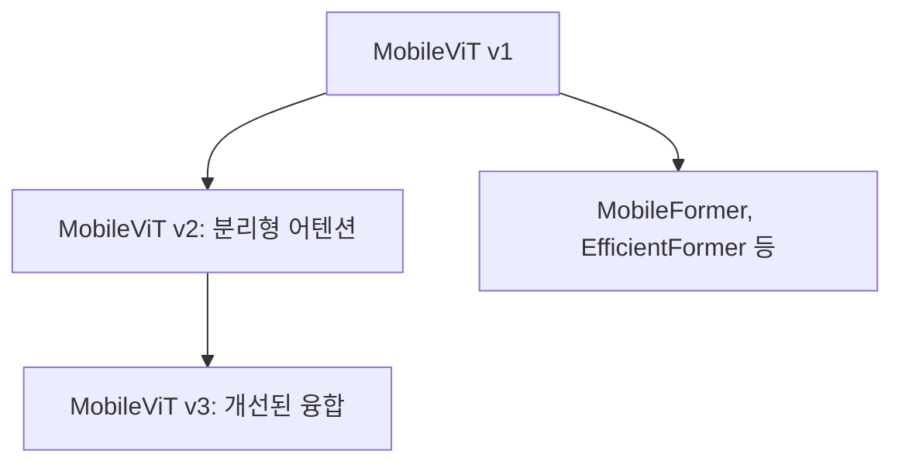

# MobileViT - 모바일을 위한 경량 ViT

## 개요

MobileViT는 Apple이 2021년 발표한 경량 비전 트랜스포머 아키텍처다. CNN과 ViT를 하이브리드 방식으로 결합해 **모바일 기기에서 동작할 수 있는 작은 크기**를 유지하면서도 트랜스포머의 글로벌 처리 능력을 활용한다. MobileNet 계열의 파라미터 효율성과 [[vision-transformer-vit]]의 비국소적(non-local) 표현 학습을 통합한 것이 핵심이다.

## 동기: 왜 CNN-ViT 하이브리드인가

순수 ViT는 강력하지만 모바일 환경에 적합하지 않다:
- 수억 개의 파라미터
- 고해상도 입력에서 이차(quadratic) 어텐션 복잡도
- 배터리와 메모리 제약이 심한 기기에서 실용적이지 않음

CNN([[mobilenet-efficientnet]] 계열)은 경량이지만:
- 수용 영역(receptive field)이 제한적
- 장거리 의존성(long-range dependency) 포착이 어려움

MobileViT는 두 아키텍처의 장점만 취하는 하이브리드를 설계한다.

## 핵심 구성: MobileViT 블록

### 언폴딩-폴딩 메커니즘

MobileViT의 핵심 혁신은 피처맵을 패치로 분할하는 방식이다:

- 피처맵을 $P \times P$ 크기의 공간 패치로 분할
- 같은 상대 위치의 픽셀들을 묶어 트랜스포머 입력 시퀀스 구성
- 이렇게 하면 패치 수가 줄어 어텐션 계산 비용 감소
- 처리 후 원래 공간 구조로 복원(폴딩)

이 방식은 "모든 위치에서 전역 정보"를 처리하면서도 시퀀스 길이를 대폭 줄인다.

## 전체 아키텍처

MobileViT는 MobileNetV2 백본에 MobileViT 블록을 선택적으로 삽입한다:

| 스테이지 | 블록 타입 | 역할 |
|----------|----------|------|
| 초반 스테이지 | MV2 (MobileNetV2) | 로컬 특징, 다운샘플링 |
| 중반 스테이지 | MV2 + MobileViT | 로컬 + 글로벌 혼합 |
| 후반 스테이지 | MobileViT | 글로벌 의미 처리 |

초반에는 CNN으로 비용 효율적으로 로컬 특징을 추출하고, 후반에는 트랜스포머로 글로벌 문맥을 처리한다.

## [[mobilenet-efficientnet]]과의 비교

| 항목 | MobileNetV2 | MobileViT-S |
|------|------------|------------|
| 파라미터 | 3.4M | 5.6M |
| ImageNet Top-1 | 72.0% | 78.4% |
| 연산량 (MAdds) | 300M | 2.0G |
| 장거리 의존성 | 제한적 | 처리 가능 |

MobileViT는 MobileNet 대비 파라미터와 연산량이 증가하지만, 성능 향상폭이 훨씬 크다.

## 다양한 크기 변형

| 모델 | 파라미터 | Top-1 Acc | 비고 |
|------|---------|----------|------|
| MobileViT-XXS | 1.3M | 69.0% | 극소형 |
| MobileViT-XS | 2.3M | 74.7% | 소형 |
| MobileViT-S | 5.6M | 78.4% | 표준 |

모두 ImageNet-1k로 학습, 2.5M 이하 파라미터에서도 경쟁력 있는 성능을 보인다.

## MobileViT v2와 후속 발전

**MobileViT v2**의 핵심 개선:
- **분리형 자기 어텐션(Separable Self-Attention)**: 기존 $O(N^2)$ 어텐션을 선형 복잡도로 변환
- 전체적인 추론 속도 개선
- 동일 파라미터 대비 성능 향상

## 실용적 활용

모바일 환경에서의 실제 배포 패턴:

- **온디바이스 이미지 분류**: 실시간 카메라 피드 처리
- **객체 탐지 백본**: SSD, YOLO 등 탐지 헤드와 결합
- **Core ML / TFLite 변환**: iOS, Android 배포에 최적화
- **엣지 디바이스**: Raspberry Pi, Jetson Nano 등

## 관련 문서

- [[mobilenet-efficientnet]] - MobileNet 계열 경량 CNN
- [[vision-transformer-vit]] - 기반 ViT 아키텍처
- [[hierarchical-vit-design]] - 계층적 ViT 설계 패턴 (Swin 등)
- [[deit-data-efficient-image-transformer]] - 데이터 효율적 ViT 학습
