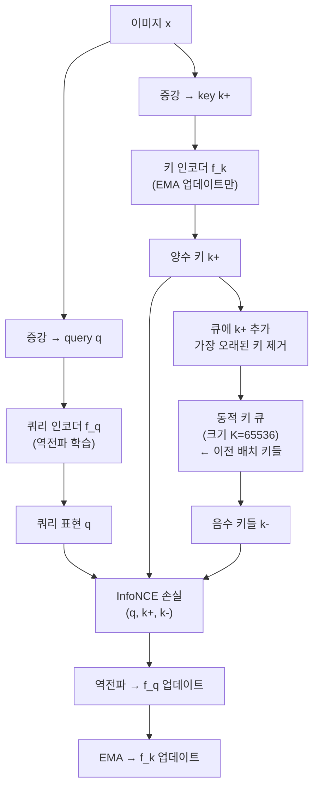

# MoCo - 모멘텀 대조 학습 (Momentum Contrast)

## 동기와 배경

2020년 Facebook AI Research(FAIR)의 Kaiming He 팀이 발표한 MoCo(Momentum Contrast)는 자기지도 시각 표현 학습에서 **메모리 효율적인 대조 학습**을 가능하게 한 방법론이다.

대조 학습의 핵심 원리: 같은 이미지의 서로 다른 증강 뷰(query $q$, positive key $k^+$)는 가깝게, 다른 이미지의 뷰(negative keys $k^-$)는 멀게 만든다.

문제: 효과적인 대조 학습을 위해서는 **대량의 음수 샘플**이 필요하다. 당시 주류 방법들의 단점:

- **End-to-end 방법(SimCLR 초기)**: 현재 배치 내 음수 샘플만 사용 → 음수 품질이 배치 크기에 직접 의존. 큰 배치 = 큰 메모리 필요
- **메모리 뱅크 방법**: 전체 데이터셋 임베딩 저장 → 매 업데이트마다 임베딩이 구식(stale)이 됨

MoCo는 **동적 큐(dynamic queue) + 모멘텀 인코더**로 두 문제를 동시에 해결한다.

## 핵심 메커니즘

### 동적 큐 (Dynamic Queue)

훈련 중 **고정 크기의 음수 샘플 큐**를 유지한다:

- 큐 크기 $K$: 65,536 (배치 크기보다 훨씬 큼)
- 매 배치마다: 현재 배치의 키 임베딩을 큐에 추가, 가장 오래된 키를 제거 (FIFO)
- 손실 계산 시 큐 전체를 음수로 활용

이로써 배치 크기와 독립적으로 대량의 음수를 유지할 수 있다.

### 모멘텀 인코더 (Momentum Encoder)

큐의 키가 일관된(consistent) 인코더로 생성되어야 한다. 배치마다 인코더가 크게 바뀌면 큐의 오래된 키는 현재 인코더와 맞지 않는 구식 임베딩이 된다.

해결책: 키 인코더 $f_k$를 역전파로 직접 학습하지 않고, 쿼리 인코더 $f_q$의 EMA로 업데이트:

$$\theta_k \leftarrow m \cdot \theta_k + (1-m) \cdot \theta_q, \quad m = 0.999$$

높은 모멘텀 $m$으로 인해 $f_k$가 천천히 변하므로, 큐에 쌓인 키들이 비교적 일관된 특징 공간에 있게 된다.

### 손실 함수 (InfoNCE)

$$\mathcal{L}_q = -\log \frac{\exp(q \cdot k^+ / \tau)}{\exp(q \cdot k^+ / \tau) + \sum_{j=0}^{K-1} \exp(q \cdot k_j^- / \tau)}$$

- $\tau = 0.07$: 온도 파라미터
- $q$와 $k$는 L2 정규화된 단위 벡터

이는 $(K+1)$-way 분류 문제: query가 $K+1$개 키 중 positive를 맞추는 문제로 볼 수 있다.

## MoCo v1 → v2 → v3 발전

### MoCo v1 (2020)

- ResNet-50 인코더
- 선형 프로젝션 헤드
- ImageNet 선형 프로빙: 60.6%

### MoCo v2 (2020, 기술 보고서)

SimCLR의 아이디어를 부분 도입:
- **MLP 프로젝션 헤드** (선형 → 2층 MLP)
- **더 강한 데이터 증강** (가우시안 블러 추가)
- 코사인 학습률 스케줄

ImageNet 선형 프로빙: 71.1% (SimCLR 69.3% 능가, 배치 크기 256으로)

### MoCo v3 (2021)

ViT 인코더로 전환 + 안정적 학습을 위한 개선:
- Patch Projection 레이어를 고정해 학습 안정화
- 배치 크기 4096으로 증가
- 온도 파라미터 더 낮게 조정

ImageNet 선형 프로빙: ViT-B/16으로 76.7%

## 성능 비교

ImageNet 자기지도 사전학습 후 선형 프로빙 (ResNet-50 기준):

| 방법 | 배치 크기 | Top-1 | 음수 수 |
|------|---------|-------|--------|
| NPID (메모리 뱅크) | 256 | 54.0% | 65,536 |
| SimCLR v1 | 4096 | 69.3% | 4,095 |
| MoCo v1 | 256 | 60.6% | 65,536 |
| MoCo v2 | 256 | 71.1% | 65,536 |

MoCo v2는 SimCLR보다 16배 작은 배치로 더 높은 성능을 달성한다.

## 다운스트림 성능

당시 가장 인상적인 결과: PASCAL VOC 객체 탐지에서 MoCo로 사전학습한 모델이 ImageNet 지도 학습 사전학습 모델을 **능가**했다. 자기지도 학습이 지도 학습을 실제 다운스트림 태스크에서 이기기 시작한 첫 사례 중 하나.

## 후속 영향

- **동적 큐 패턴**: 이후 많은 자기지도/지식 증류 방법에서 채택
- **모멘텀 인코더**: BYOL, DINO 등 음수 없는 방법에서도 핵심 구성요소로 재활용
- **배치 크기 효율적 대조 학습의 표준**: 작은 GPU 메모리에서도 효과적인 자기지도 학습 가능

## 한계

- **큐 크기 하이퍼파라미터**: $K$를 너무 작게 하면 음수 부족, 너무 크게 하면 큐 내 이질성 증가
- **epoch 수 필요**: 큐 기반 방법은 충분히 다양한 음수를 모으기 위해 더 많은 에폭 필요
- **음수 샘플 품질**: 초기 학습에서 임의의 키들이 음수이므로 품질이 낮을 수 있음

## 관련 문서

- [[self-supervised-learning]]
- [[contrastive-learning]]
- [[simclr-augmentation]]
- [[byol-bootstrap]]
- [[dino-self-distillation]]
- [[representation-learning-theory]]
