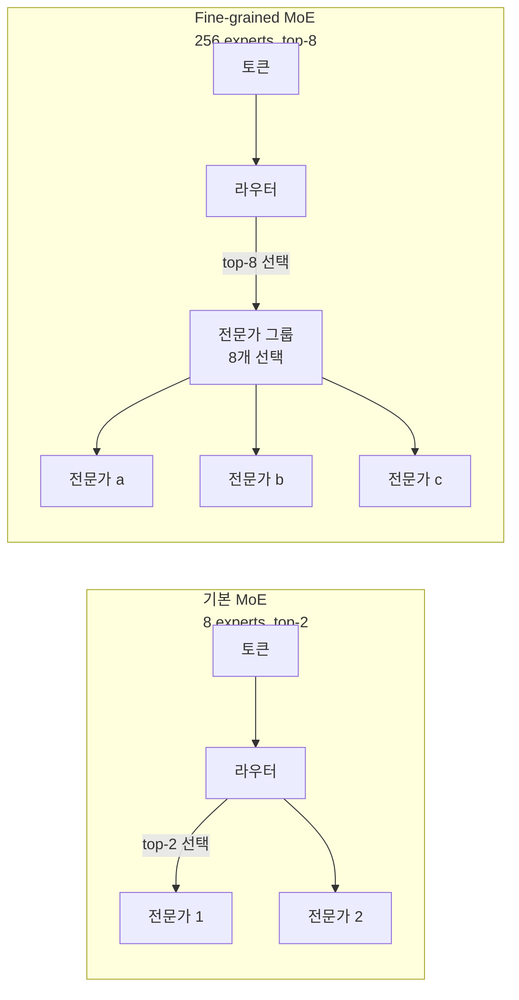
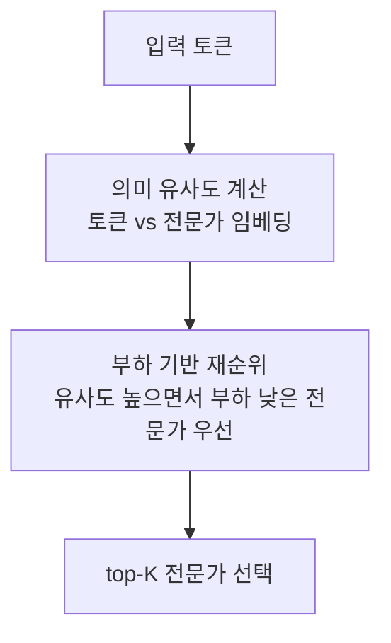
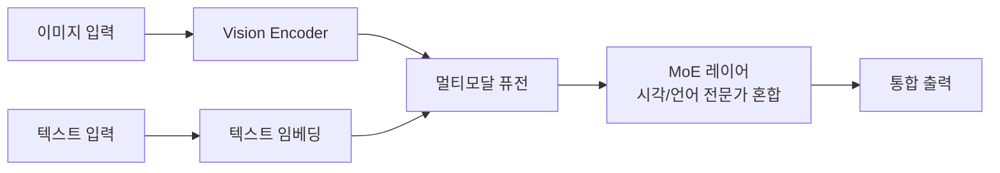

# MoE 라우팅 고도화 (Fine-grained MoE Routing)

## 개요

Mixture of Experts(MoE) 아키텍처에서 **라우팅(routing) 전략의 정교화**가 2025-2026년 핵심 트렌드다. DeepSeek-V3(256 전문가), Qwen3-235B(초세분화) 등이 전문가 수를 급격히 늘리면서, 라우팅 품질이 전체 모델 성능의 병목이 되고 있다.

## 기본 MoE vs Fine-grained MoE

전문가 수가 많아질수록:
- 각 전문가가 더 **세분화된 지식 영역** 담당
- 동일 파라미터 수에서 **더 많은 지식 저장 가능**
- 단, **라우팅 오류** 시 성능 손실이 더 커짐

## DeepSeek-V3 라우팅 혁신

DeepSeek-V3는 256명의 전문가 중 top-8을 선택하는 구조다.

### 보조 손실 없는 부하분산 (Auxiliary-loss-free Load Balancing)

기존 MoE는 부하 균형을 위해 **보조 손실(auxiliary loss)**을 추가했다. 이 손실이 특정 전문가로의 집중(routing collapse)을 막는 역할을 했지만, **주 태스크 손실과 충돌**해 성능을 저해하는 부작용이 있었다.

DeepSeek-V3는 보조 손실 없이 **편향 항(bias term)**을 라우터 로짓에 더하는 방식으로 부하분산을 달성한다:

$$\text{score}_i = \text{logit}_i + b_i$$

여기서 $b_i$는 현재 배치에서 전문가 $i$의 사용률에 따라 동적으로 조절된다. 과부하 전문가는 $b_i$가 낮아져 선택 확률이 감소하고, 저사용 전문가는 $b_i$가 높아진다.

**결과**: 부하분산 효과를 유지하면서 주 태스크 손실을 최적화에 방해하지 않음.

## 유사성 보존 부하분산 목적함수

단순 균등 분배가 아닌 **의미적 유사성(semantic similarity)을 보존**하면서 부하를 균형 잡는 접근법이다.

유사성이 높은 전문가를 우선 선택하되, 과부하 시에는 유사성이 약간 낮더라도 부하가 낮은 전문가를 선택한다.

## Qwen3의 초세분화 접근

Qwen3-235B는 Active Parameter(활성 파라미터)는 22B이지만 전체 파라미터는 235B에 달한다.

| 모델 | 전체 파라미터 | 활성 파라미터 | 전문가 수 |
|------|------------|------------|---------|
| Mixtral 8x7B | 47B | 13B | 8 |
| DeepSeek-V3 | 671B | 37B | 256 |
| Qwen3-235B | 235B | 22B | 128 |

전문가 수와 크기의 **세분화 트레이드오프**: 전문가를 더 많고 작게 만들수록 조합 다양성 증가하지만 개별 전문가의 표현력 감소.

## 멀티모달 MoE 확산

**Qwen3-VL**을 비롯한 비전-언어 모델에서 MoE가 확산되고 있다.

멀티모달 MoE의 전문가 분화 패턴:
- 일부 전문가는 시각 토큰 특화
- 일부 전문가는 텍스트 토큰 특화
- 일부 전문가는 크로스모달 상호작용 특화

이 분화가 자연스럽게 발생한다는 실험적 관찰이 MoE의 **모달리티별 전문화** 가설을 지지한다.

## 라우팅 신뢰성이 파라미터 수보다 중요

2025년의 핵심 교훈: 전문가 수를 늘리는 것보다 **올바른 전문가를 선택하는 것**이 더 중요하다.

- 라우팅 오류 1%가 성능에 미치는 영향이 파라미터 10% 증가 효과를 상쇄할 수 있음
- 전문가 수 확대보다 라우터 품질 개선이 더 비용 효율적인 경우 다수 존재

## 관련 문서

- [[Mixture of Experts]] - MoE 기본 개념
- [[expert-parallelism]] - MoE 분산 학습 방법
- [[DeepSeek V3 학습 상세]] - DeepSeek-V3 전체 학습 파이프라인
- [[latent-space-reasoning]] - 적응형 연산 배분의 다른 접근법
