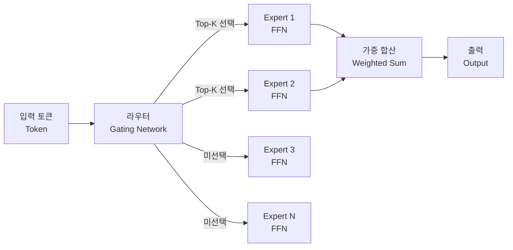

# MoE (Mixture of Experts)

## 정의

MoE(Mixture of Experts)는 모델 내부에 여러 개의 전문가 네트워크(expert network)를 두고, 각 입력 토큰마다 게이팅 함수(gating function / router)가 어떤 전문가를 활성화할지 동적으로 선택하는 신경망 아키텍처다. 전체 파라미터 중 실제로 연산에 참여하는 비율을 낮게 유지하기 때문에 **희소 활성화(sparse activation)** 모델이라고도 부른다.

## 왜 스케일에 유리한가

밀집(dense) 모델은 모든 토큰에 대해 모든 파라미터를 사용한다. 파라미터를 두 배로 늘리면 연산량(FLOPs)도 두 배가 된다. MoE는 파라미터를 늘려도 토큰당 활성화되는 전문가 수(Top-K)를 고정하기 때문에 연산량 증가 없이 총 파라미터 수를 늘릴 수 있다.

| 비교 항목 | Dense 모델 | MoE 모델 |
|-----------|-----------|----------|
| 파라미터 수 | N | E x N (E: 전문가 수) |
| 토큰당 FLOPs | 고정 (N에 비례) | 고정 (Top-K 전문가 분량) |
| 메모리 사용 | 낮음 | 높음 (전체 파라미터 로드) |
| 추론 속도 | 빠름 | 전문가 수에 따라 다름 |

예를 들어 GPT-4 규모의 추론 비용으로 8배 많은 파라미터를 운영할 수 있다면, 같은 연산 예산 안에서 훨씬 풍부한 지식 용량을 확보하는 셈이다.

## 기본 구조

Transformer 아키텍처에서 MoE는 보통 FFN(Feed-Forward Network) 레이어를 대체한다. Self-Attention 레이어는 그대로 두고, FFN 자리에 여러 전문가 FFN을 배치하는 방식이 일반적이다.

## Top-K 라우팅

라우터는 각 전문가에 대한 소프트맥스 확률을 계산하고 상위 K개의 전문가만 활성화한다. K=1이면 Hard MoE(토큰이 단 하나의 전문가에 배정), K=2가 가장 흔한 설정이다. 선택된 각 전문가의 출력은 라우터 확률로 가중 합산된다.

$$y = \sum_{i \in \text{Top-K}} g_i \cdot E_i(x)$$

여기서 $g_i$는 게이팅 스코어, $E_i(x)$는 i번째 전문가의 출력이다.

## 로드 밸런싱 문제

훈련 초기에는 라우터가 일부 전문가에만 토큰을 과도하게 몰아주는 **전문가 붕괴(expert collapse)** 현상이 발생하기 쉽다. 이를 방지하기 위해 보조 손실(auxiliary loss)로 부하 균등화를 유도한다.

- **전문가별 최대 토큰 수(expert capacity)** 제한으로 오버플로우 방지
- **보조 부하 균형 손실(load balancing loss)**: 전문가별 라우팅 비율이 균일해지도록 정규화 항 추가

## 주요 변형

| 모델/기법 | 특징 |
|-----------|------|
| Switch Transformer (2021) | Top-1 라우팅, 단순화된 설계로 학습 안정성 확보 |
| GShard | 분산 학습을 위한 MoE 파티셔닝, 수천억 파라미터 스케일 |
| GLaM (Google) | 언어 모델에 MoE 적용, GPT-3 대비 에너지 효율 향상 |
| Mixtral 8x7B | 오픈소스 고성능 MoE, Top-2 라우팅, 실용적 배포 기준점 |
| DeepSeek-V2/V3 | Multi-head Latent Attention + Fine-grained MoE 결합 |

상세한 라우팅 고도화 방법은 [[moe-routing-advances]] 참조.

## 이론적 기반

MoE의 스케일링 특성과 이론적 한계에 대한 심층 분석은 다음 논문 요약 페이지에서 확인할 수 있다:

- [[moe-original-paper]] - MoE 원논문 (Shazeer et al. 2017)
- [[moe-scaling-laws-paper]] - MoE 스케일링 법칙
- [[moe-null-expert-paper]] - 비활성 전문가(null expert) 현상 분석

## 훈련 및 분산 처리

전문가별로 다른 디바이스에 배치하는 **전문가 병렬화(expert parallelism)** 가 MoE의 핵심 분산 전략이다. 자세한 내용은 [[expert-parallelism]] 참조.

## 관련 아키텍처 변형

- [[mixture-of-depths]] - 레이어 깊이를 동적으로 조정하는 변형
- [[mixture-of-recursions]] - 재귀 구조와 MoE 결합
- [[wide-expert-parallelism]] - 광역 전문가 병렬화 추론 전략
- [[sparse-mixture-of-experts-theory]] - 희소 MoE 이론 정리
- [[mixture-of-agents]] - 에이전트 계층에서의 MoE 아이디어 적용

## 실무 고려사항

- **메모리**: 전체 전문가를 VRAM에 올려야 하므로 단일 GPU 배포가 어렵다. 멀티 GPU 또는 CPU offloading 필요
- **배치 효율**: 배치 내 토큰이 고르게 분산될수록 전문가 활용률이 높아짐
- **추론 레이턴시**: Top-K 전문가만 실행하지만 all-reduce 통신 오버헤드가 발생할 수 있음

## 관련 문서

- [[mixture-of-experts]] - 기존 MoE entity 페이지
- [[moe-routing-advances]] - 라우팅 고도화
- [[moe-original-paper]] - 원논문 요약
- [[moe-scaling-laws-paper]] - 스케일링 법칙
- [[moe-null-expert-paper]] - null expert 논문
- [[expert-parallelism]] - 분산 훈련
- [[sparse-mixture-of-experts-theory]] - 희소 MoE 이론
- [[mixture-of-depths]] - 깊이 혼합 변형
