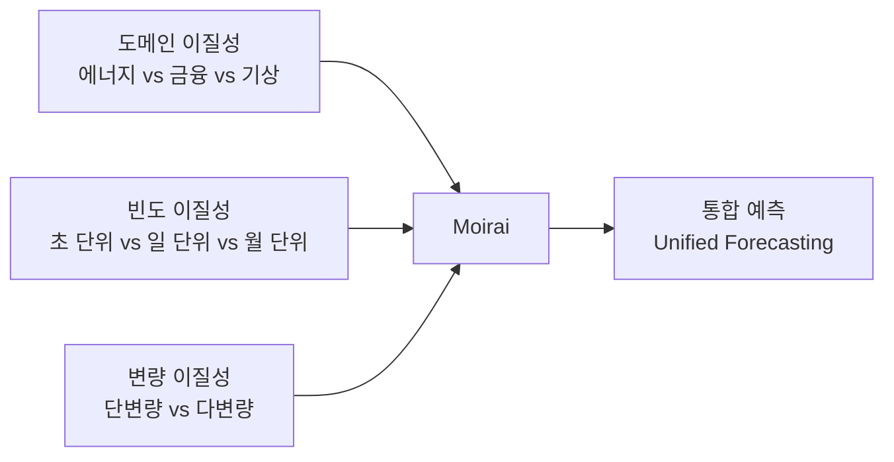
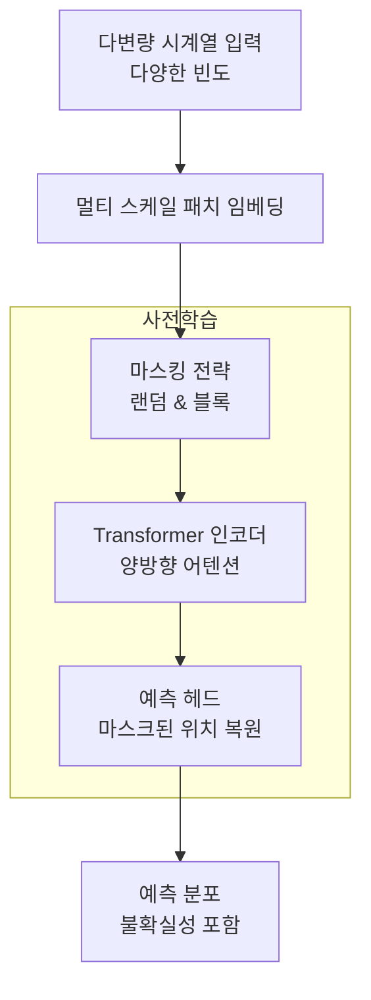

# Moirai 통합 예측 모델

## 개요

Moirai(Masked Encoder-based Universal Time-Series Forecasting Transformer)는 Salesforce AI Research가 개발한 시계열 파운데이션 모델이다. 핵심 목표는 **하나의 단일 모델로 다양한 도메인, 다양한 측정 빈도(주기), 다변량(multivariate) 시계열을 동시에 처리**하는 것이다.

기존 [[time-series-forecasting-dl|딥러닝 기반 시계열 예측]] 모델들이 단일 도메인·단일 빈도에 특화되는 경향이 있었던 것과 달리, Moirai는 통합(universal) 예측 모델을 지향한다.

## 설계 원칙

### 문제 정의

시계열 예측에서 "통합" 모델을 만들기 어려운 이유는 세 가지 이질성(heterogeneity)이다:

### 핵심 설계 결정

1. **마스크 인코더(Masked Encoder)**: 디코더-only 모델 대신 양방향 어텐션 인코더를 사용. 입력 시계열의 일부를 마스킹하고 복원하는 방식으로 사전학습(BERT 스타일)
2. **다중 패치 크기**: 다양한 빈도의 시계열을 동일 모델로 처리하기 위해 여러 크기의 패치(patch)를 동시에 처리할 수 있는 메커니즘 도입
3. **임의 변량 어텐션**: 다변량 입력에서 각 변량(channel) 간의 상관관계를 유연하게 모델링

## 아키텍처

### 패치 임베딩 전략

[[temporal-fusion-transformer|TFT(Temporal Fusion Transformer)]]가 정교한 게이팅 메커니즘으로 빈도 차이를 처리하는 것과 달리, Moirai는 여러 패치 크기를 동시에 학습하는 방식을 취한다. 분 단위 시계열은 작은 패치, 월 단위 시계열은 큰 패치가 자연스럽게 적합해지도록 모델이 학습 과정에서 스스로 조정한다.

## LOTSA 데이터셋

Moirai 논문의 핵심 기여 중 하나는 **LOTSA(Large-scale Open Time-Series Archive)** 데이터셋 구축이다.

| 특성 | 내용 |
|------|------|
| 포함 도메인 | 에너지, 교통, 날씨, 웹 트래픽, 경제 등 9개 이상 |
| 시계열 수 | 수억 개 이상 |
| 빈도 다양성 | 초 단위부터 연 단위까지 |
| 공개 여부 | 오픈소스로 공개 |

## 성능 벤치마크

Moirai는 단일 모델이 다양한 데이터셋에서 전문화 모델과 경쟁하는 수준임을 보여줬다. Monash 벤치마크와 Gift-eval 등의 다중 도메인 벤치마크에서 [[timegpt-foundation|TimeGPT]], Chronos 등과 경쟁력 있는 결과를 달성했다고 보고된다. [교차검증 필요]

## 모델 변형 및 오픈소스

Moirai-MoE(Mixture of Experts) 변형도 개발되어 모델 용량 대비 추론 비용을 절감한다. Salesforce는 Moirai를 HuggingFace Hub와 자체 GitHub 리포지토리를 통해 공개했다.

## 의의

Moirai는 시계열 예측에서 "단일 파운데이션 모델이 가능한가"라는 질문에 긍정적 답을 제시한 중요한 연구다. 특히 다변량과 가변 빈도를 단일 아키텍처로 통합한 점이 후속 연구에 영향을 주고 있다.

## 관련 문서

- [[time-series-forecasting-dl]] - 딥러닝 기반 시계열 예측 전반
- [[temporal-fusion-fusion-transformer]] - 정교한 빈도 처리 방식 비교
- [[timegpt-foundation]] - 유사한 통합 FM 접근법 (Nixtla)
- [[chronos-amazon]] - T5 기반 시계열 FM (Amazon)
- [[patchtst]] - 패치 기반 시계열 Transformer
