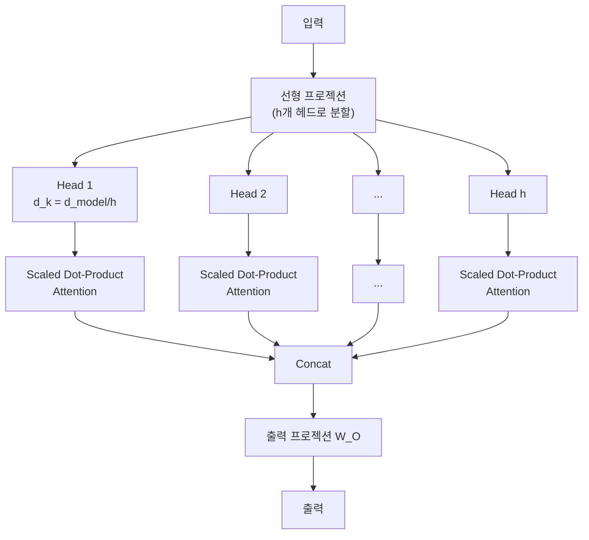
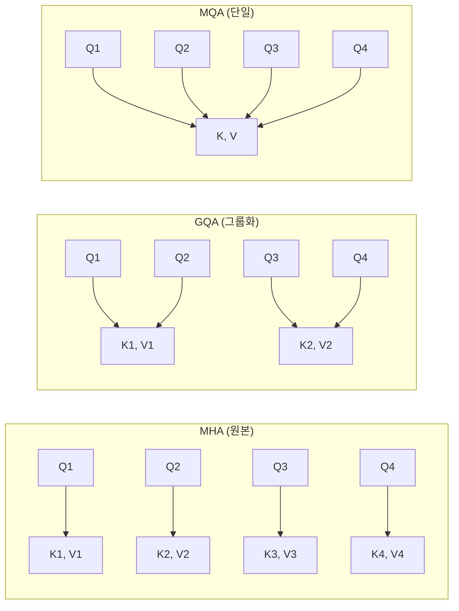

## 개요

멀티헤드 어텐션(Multi-Head Attention, MHA)은 [[self-attention-mechanism]]을 h개의 독립적 헤드에서 병렬로 수행한 뒤 결합하는 메커니즘이다. 단일 어텐션이 하나의 관계 패턴만 포착하는 반면, 멀티헤드 어텐션은 다양한 부분 공간(subspace)에서 서로 다른 유형의 관계를 동시에 학습한다. "Attention Is All You Need"(2017)에서 h=8 헤드를 사용했으며, 현대 LLM은 32-128개 헤드를 사용한다. KV 캐시 효율화를 위해 GQA(Grouped Query Attention), MQA(Multi-Query Attention), [[multi-head-latent-attention|MLA]]로 진화하고 있다.

## 동작 원리

### 수식

```
MultiHead(Q, K, V) = Concat(head_1, ..., head_h) * W_O

head_i = Attention(Q * W_Q_i, K * W_K_i, V * W_V_i)
```

각 헤드 i는 독립적인 프로젝션 행렬 W_Q_i, W_K_i, W_V_i를 가진다. 헤드당 차원 d_k = d_model / h로 분할하므로, 총 연산량은 단일 풀차원 어텐션과 거의 동일하다.

### 구조 다이어그램



## 왜 다중 헤드인가

### 다양한 관계 패턴 포착

실험적으로 서로 다른 헤드가 서로 다른 언어적 패턴을 학습하는 것이 관찰된다:

- 특정 헤드: 구문적 의존성 (주어-동사 일치)
- 특정 헤드: 인접 토큰 관계 (로컬 문맥)
- 특정 헤드: 위치 패턴 (첫 번째 토큰, 구분자 참조)
- 특정 헤드: 의미적 유사성

### 표현력 증가

단일 풀차원 어텐션은 하나의 어텐션 분포만 생성한다. 동일 연산 예산으로 h개의 서로 다른 어텐션 분포를 생성하면, 모델이 입력의 다양한 측면을 동시에 고려할 수 있다. Vaswani et al.은 h=8이 h=1 대비 일관된 성능 향상을 보이며, 헤드 수를 늘려도 수확 체감이 발생함을 보였다.

## 효율적 변형: MQA와 GQA

추론 시 KV 캐시는 모든 헤드의 K, V를 저장해야 하므로 메모리 병목이 된다. 이를 해결하기 위한 변형:



| 방식 | Q 헤드 수 | KV 헤드 수 | KV 캐시 크기 | 성능 |
|------|----------|-----------|-------------|------|
| MHA | h | h | 기준 (1x) | 최고 |
| GQA | h | g (1 < g < h) | g/h (감소) | MHA에 근접 |
| MQA | h | 1 | 1/h (최소) | 약간 하락 |
| [[multi-head-latent-attention|MLA]] | h | 압축 벡터 | 최소 | MHA에 근접 |

### GQA (Grouped Query Attention)

Ainslie et al.(2023)이 제안했으며, LLaMA 2/3, Mistral 등 현대 LLM의 표준이다. Q 헤드를 g개 그룹으로 나누고, 각 그룹이 하나의 KV 쌍을 공유한다. g=1이면 MQA, g=h이면 MHA와 동일하다. MHA에 근접한 성능을 유지하면서 KV 캐시를 g/h로 축소한다.

### MQA (Multi-Query Attention)

Shazeer(2019)가 제안한 극단적 변형으로, 모든 Q 헤드가 단일 KV 쌍을 공유한다. KV 캐시가 1/h로 축소되지만 성능 하락이 있다.

## 헤드 프루닝 (Head Pruning)

학습된 모델에서 중요도가 낮은 헤드를 제거하는 기법이다. Michel et al.(2019)은 대부분의 헤드가 개별적으로 제거 가능하며, 일부 헤드만으로도 성능의 대부분을 유지할 수 있음을 보였다. 이는 MHA에 상당한 중복성(redundancy)이 존재함을 시사하며, GQA/MQA의 이론적 근거이기도 하다.

## 대표 자료

- [Vaswani et al., "Attention Is All You Need" (arXiv:1706.03762)](https://arxiv.org/abs/1706.03762)
- [Shazeer, "Fast Transformer Decoding: One Write-Head is All You Need (MQA)" (arXiv:1911.02150)](https://arxiv.org/abs/1911.02150)
- [Ainslie et al., "GQA: Training Generalized Multi-Query Transformer Models" (arXiv:2305.13245)](https://arxiv.org/abs/2305.13245)

## 관련 문서

- [[self-attention-mechanism]] -- 각 헤드 내부의 Scaled Dot-Product Attention
- [[transformer-architecture]] -- MHA가 핵심 구성 요소인 전체 아키텍처
- [[multi-head-latent-attention]] -- 저랭크 팩터화로 KV 캐시를 더욱 압축
- [[gated-attention]] -- 어텐션 출력에 시그모이드 게이트 적용
- [[positional-encoding]] -- 어텐션에 위치 정보를 주입하는 방법
- [[encoder-decoder-architectures]] -- 교차 어텐션에서의 MHA 활용
