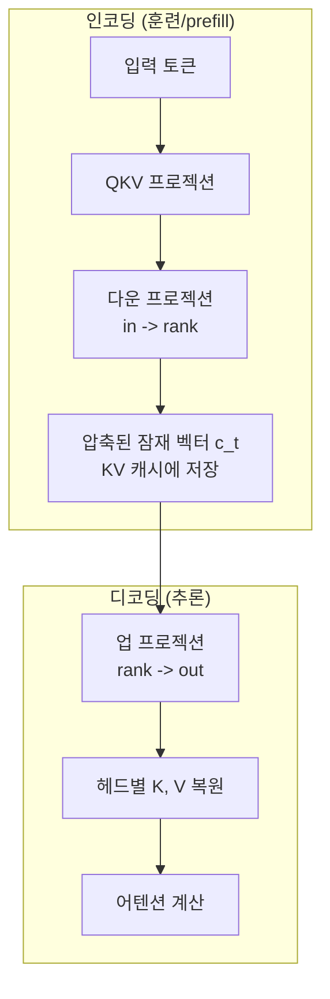

## 개요

Multi-Head Latent Attention(MLA)은 DeepSeek-V2에서 도입된 어텐션 메커니즘 변형으로, 저랭크 팩터화(low-rank factorization)를 통해 KV 캐시를 최대 93.3% 축소하면서 성능을 유지하는 기술이다. 기존 MHA(Multi-Head Attention)의 각 헤드별 독립 K, V 벡터 대신, 압축된 잠재 벡터([[embedding-layers|latent]] vector)를 캐시에 저장하고 추론 시 동적으로 복원한다. MTLA(Multi-Token Latent Attention)는 여기에 시간 축 추가 압축을 적용한 확장 변형이다.

## 핵심 개념

### KV 캐시 문제

자동회귀(autoregressive) 생성에서 매 토큰 예측마다 이전 모든 토큰의 K, V 값을 참조해야 한다. 이를 캐시에 저장하면 재계산을 피할 수 있지만, 모델 크기와 컨텍스트 길이가 증가할수록 [[kv-cache|KV 캐시]] 메모리가 심각한 병목이 된다.

### 어텐션 메커니즘 비교

| 방식 | 특징 | 성능 | KV 캐시 크기 |
|------|------|------|------------|
| MHA | 모든 Q에 독립 K, V | 최고 | 매우 큼 |
| GQA | Q 그룹이 K, V 공유 | 중간 | 감소 |
| MQA | 전체 Q가 단일 K, V 공유 | 낮음 | 최소 |
| **MLA** | 압축 벡터에서 동적 생성 | MHA에 근접 | 최소 |

MQA와 GQA는 성능-메모리 트레이드오프인 반면, MLA는 메모리 절감과 성능 유지를 동시에 달성한다.

## 기술 상세

### MLA의 동작 원리

1. **다운 프로젝션**: 원래 크기 $(in, out)$의 QKV 행렬을 $(in, rank)$로 압축
2. **잠재 벡터 캐싱**: 전체 K, V 대신 저랭크 압축 벡터 $c_t$만 캐시에 저장
3. **업 프로젝션**: 추론 시 $(rank, out)$ 행렬로 각 헤드의 K, V를 동적 복원
4. **어텐션 수행**: 복원된 K, V로 표준 어텐션 계산

### 프로젝션 차원 상세

MLA의 저랭크 분해는 다음과 같은 차원 구조를 따른다:

- **Q 프로젝션**: $(d_{model}, d_{model})$ -> $(d_{model}, rank)$ + $(rank, d_{model})$, rank = $d_{model}/2$
- **KV 프로젝션**: $(d_{model}, 2 \times d_{model})$ -> $(d_{model}, 2d_{model}/3)$ + $(2d_{model}/3, 2 \times d_{model})$
- **압축 KV 벡터 차원**: 약 $0.33 \times d_{model}$ -- 전체 K, V 저장 대비 66% 감소

파라미터 동일 조건에서 MHA와 비교 시, 추론 메모리만 감소하고 모델 용량은 유지된다.

### 대규모 모델에서의 압축률

| 규모 | KV 캐시/토큰 | 압축률 |
|------|-------------|-------|
| 35M (실험) | 2,856 bytes (MHA: 8,192) | 65% 감소 |
| DeepSeek-V2 (실적용) | 1.15 kB (MHA: 81.92 kB) | **98.6% 감소** |

모델 규모가 커질수록 압축 효율이 극적으로 향상되며, DeepSeek-V2에서 보고된 93.3% KV 캐시 축소는 이 메커니즘의 결과다.

### Decoupled RoPE

MLA는 압축된 KV 벡터에서 K 헤드가 직접 존재하지 않아 RoPE(Rotary Position Embedding)와 호환되지 않는 문제가 있다. 이를 해결하기 위해 Decoupled RoPE를 도입한다:

- 각 헤드에서 **위치 정보 없는 서브헤드**와 **RoPE 전담 서브헤드** 두 유형을 추출
- RoPE 전담 부분은 별도의 소형 캐시에 저장
- 콘텐츠 기반 어텐션과 위치 기반 어텐션의 역할을 분리
- 각 헤드에서 위치 인코딩에 할당되는 비율을 세밀하게 제어할 수 있는 유연성 제공

Decoupled RoPE는 MLA와 결합될 때 MHA에 적용된 표준 Decoupled RoPE(perplexity 98.76)보다 우수한 성능(96.70)을 보이며, 행렬 분해와 디커플링 사이의 시너지 효과를 시사한다.

### 이론적 기반: 저랭크 분해의 정당성

신경망의 야코비안(Jacobian)은 소수의 큰 특이값(정보 공간)과 많은 작은 특이값(노이즈 공간)으로 구성된다. 저랭크 제약은 노이즈 공간을 자연스럽게 무시하여, 일반화 가능한 학습만 강제하는 효과가 있다.

### 실험 결과

| 모델 | Perplexity | KV 캐시/토큰 | 비고 |
|------|-----------|------------|------|
| MHA 35M (RoPE) | 94.31 | 8,192 | 기준 |
| MLA 35M (RoPE) | 96.70 | 2,856 | 캐시 65% 감소 |
| MQA 32M (RoPE) | 102.18 | 512 | 성능 저하 큼 |
| MHA 35M (비RoPE) | 147.83 | 8,192 | - |
| MLA 35M (비RoPE) | 142.77 | 2,728 | MHA 능가 |

- RoPE 없는 조건에서 MLA가 MHA를 능가
- RoPE 포함 시 MHA가 약간 우세하나 차이 미미
- KV 캐시 66% 감소 (매개변수 동일 조건)
- DeepSeek-V2 실적용에서는 93.3% KV 캐시 축소 보고

### 행렬 흡수(Matrix Absorption)

MLA의 추론 최적화 기법으로, 인접한 행렬 곱셈을 중간 비선형 없이 하나로 합친다. 이론적으로 압축 해제 오버헤드를 제거할 수 있지만, 실제 DeepSeek-V2 오픈소스 구현에서는 전체 KV 캐싱(regular full KV caching)을 사용하고 있어 구현 정교화가 필요하다.

### 트레이드오프

- 압축 해제 레이어 추가로 매트릭스 곱셈 증가 -> 압축 캐싱 시 처리량이 정규 어텐션보다 낮음
- 전체 KV 캐싱 사용 시 속도는 빠르지만 메모리 이점 상실
- 100B+ 규모에서 최적 효과 -- 소형 모델에서는 단순한 GQA가 더 실용적일 수 있음
- DeepSeek V3, Kimi K2, GLM-5 등 최신 대형 모델에서 MLA를 표준으로 채택하는 추세

### 저랭크 제약의 정규화 효과

저랭크 분해는 가중치 섭동을 전체 파라미터 공간 내 매니폴드로 제한한다. 신경망이 큰 특이값(정보 공간)을 먼저 학습하고 작은 특이값(노이즈 공간)을 나중에 학습한다는 발견과 일치하여, 저랭크 제약이 노이즈 공간을 자연스럽게 무시하고 일반화 가능한 학습만 강제하는 정규화(regularization) 효과를 제공한다. 에이전트 추론 효율 관점에서 MLA의 KV 캐시 축소는 [[tool-calling-optimization|Tool Calling Optimization]]에 직접 기여한다 -- 긴 도구 호출 이력을 컨텍스트에 유지하면서도 메모리 병목을 피할 수 있다.

## 관련 문서
- [[superposition-neural-scaling]]
- [[sparse-attention-patterns]]
- [[gated-attention]]
- [[mixture-of-experts]]

- [[deepseek-mhc]] - DeepSeek의 매니폴드 제약 하이퍼-연결
- [[mamba-3]] - 어텐션 없는 시퀀스 모델링 (SSM 대안)
- [[ai-reasoning-models]] - 추론 모델에서의 효율적 어텐션 필요성
- [[test-time-compute-scaling]] - 추론 시 계산 확장 (KV 캐시 효율의 중요성)
- [[tool-calling-optimization]] - 에이전트 추론에서의 도구 호출 최적화
