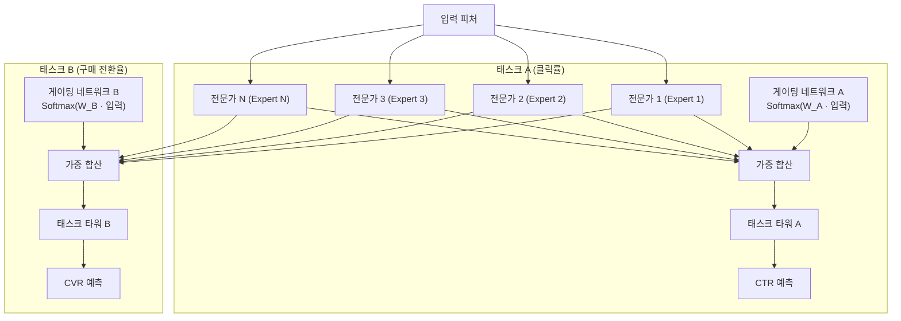
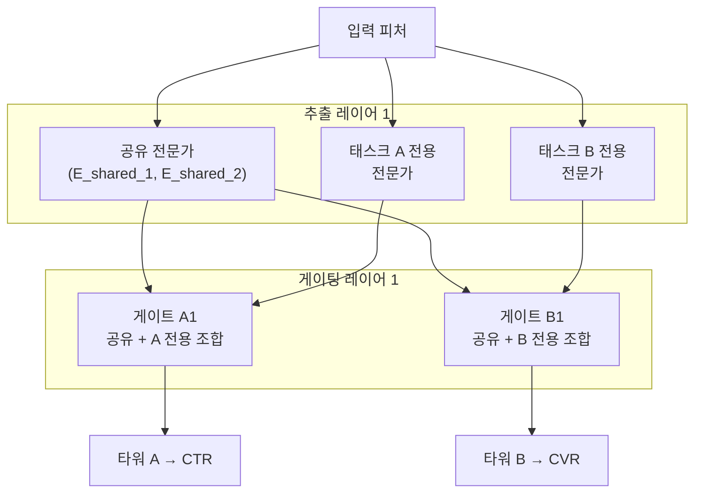

# 다중 태스크 추천 순위 (MMOE/PLE)

추천 시스템의 순위 결정(ranking) 단계에서는 클릭률(CTR), 구매 전환율(CVR), 시청 시간, 좋아요 등 여러 목표를 동시에 최적화해야 한다. 다중 태스크 학습(Multi-Task Learning, MTL)은 이 여러 목표를 하나의 모델로 동시에 학습해, 태스크 간 지식 공유로 각 태스크의 성능을 향상시키는 접근법이다. MMOE와 PLE가 현재 산업계 표준에 가장 가까운 아키텍처다.

## 단순 공유 구조의 한계: 시소 현상

초기 MTL 모델은 하위 레이어를 모든 태스크가 공유하고 상위 레이어만 태스크별로 분리하는 "하드 파라미터 공유(hard parameter sharing)"를 사용했다. 이 방식의 문제는 **시소 현상(seesaw effect)**이다.

시소 현상: 한 태스크의 성능을 올리면 다른 태스크의 성능이 떨어지는 현상. 클릭율 최적화 집중 시 구매 전환율이 하락하는 식이다. 태스크 간 그래디언트가 충돌(negative transfer)하기 때문이다.

## MMOE: 전문가 혼합 게이팅

Google이 2018년 발표한 MMOE(Multi-gate Mixture-of-Experts)는 N개의 "전문가(expert)" 네트워크를 두고, 각 태스크가 독립적인 게이팅 네트워크(gating network)를 통해 전문가들을 다른 비율로 조합한다.

- 전문가: FFN(Feed-Forward Network) 블록. 각 전문가는 다른 특징적 패턴을 전문화할 수 있다
- 게이팅: softmax로 정규화된 N차원 가중치. 태스크마다 별도의 게이트
- 조합: 게이트 가중치로 가중 평균한 전문가 출력이 태스크 타워의 입력

이로써 각 태스크가 "어떤 전문가에 의존할지"를 유연하게 학습해 태스크 간 충돌을 완화한다.

## PLE: 공유/전용 전문가 분리

Tencent가 2020년 발표한 PLE(Progressive Layered Extraction)는 MMOE를 한 단계 발전시켰다. MMOE에서 모든 전문가가 모든 태스크에 공유되는 반면, PLE는 **공유 전문가**와 **태스크 전용 전문가**를 명시적으로 분리한다.

공유 전문가는 두 태스크가 공통으로 필요한 표현을 학습하고, 전용 전문가는 각 태스크의 특유한 신호를 학습한다. 이 분리 덕분에 음성 전이(negative transfer)가 크게 줄고, 시소 현상이 완화된다.

## YouTube, TikTok의 실제 적용

**YouTube**: 영상 추천에서 클릭, 재생 시간(watch time), 좋아요, 공유를 동시에 최적화. 재생 시간이 긴 영상이 클릭을 유도하지 않거나, 클릭이 많아도 이탈이 많은 경우를 균형 잡기 위해 MMOE 계열 사용.

**TikTok/ByteDance**: 좋아요, 댓글, 팔로우, 부정적 피드백("관심 없음")을 동시에 고려. 여러 긍정/부정 신호를 균형 있게 최적화해 장기 사용자 만족도를 높이는 데 MTL이 핵심.

**Alibaba/Taobao**: CTR + 구매 전환 동시 최적화. ESMM(Entire Space Multi-Task Model)이 이 도메인에서 자주 언급되는 변형.

## 태스크 가중치 조절

여러 태스크의 손실을 합산할 때 가중치 설정이 중요하다. 방법:

- **고정 가중치**: $\mathcal{L}_{total} = w_A \mathcal{L}_A + w_B \mathcal{L}_B$ 형태. 단순하지만 도메인 지식 필요
- **불확실도 가중치 (Kendall et al.)**: 각 태스크의 측정 불확실도를 자동 학습
- **GradNorm**: 태스크별 그래디언트 크기를 균일하게 맞추도록 가중치 동적 조정

## MMOE vs PLE 비교

| 항목 | MMOE | PLE |
|------|------|-----|
| 전문가 구분 | 없음 (모두 공유) | 공유/전용 명시적 분리 |
| 시소 현상 완화 | 중간 | 높음 |
| 파라미터 수 | 적음 | 많음 |
| 구현 복잡도 | 낮음 | 중간 |
| 태스크 수 확장 | 비교적 쉬움 | 각 태스크마다 전용 전문가 필요 |

## 관련 문서

- [[cold-start-problem]] - MTL이 해결을 돕는 추천 시스템의 핵심 과제
- [[explore-exploit-bandit]] - 추천 시스템에서 탐험-활용 트레이드오프
- [[sequential-recommendation]] - 순차적 행동 패턴을 활용한 추천 모델
