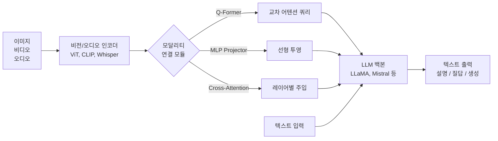
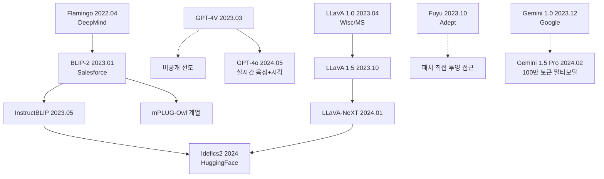
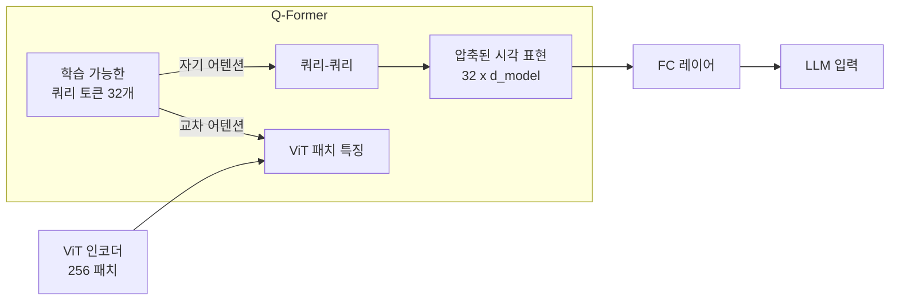
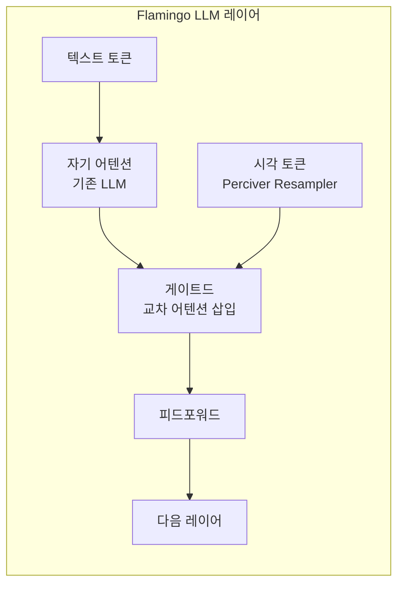
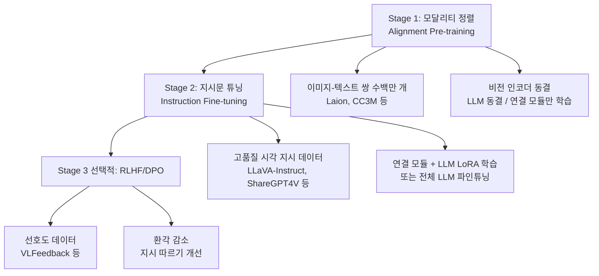

# 멀티모달 LLM (Multimodal Large Language Model)

멀티모달 LLM(Multimodal Large Language Model, MLLM)은 텍스트 이외의 모달리티 - 특히 이미지, 비디오, 오디오 - 를 함께 이해하고 생성할 수 있는 대형 언어 모델이다. 핵심 과제는 서로 다른 표현 공간에 있는 모달리티를 어떻게 연결하느냐다.

## 개념적 아키텍처



위 다이어그램은 비전 인코더에서 추출한 특징을 LLM 백본에 연결하는 세 가지 주요 방식을 보여준다.

## 계보와 역사



## 모달리티 연결 방식 3대 패러다임

### 1. Q-Former (BLIP-2 방식)

[[blip-2-paper|BLIP-2]](2023)이 도입한 경량 쿼리 기반 트랜스포머. 고정된 비전 인코더와 고정된 LLM 사이의 병목 모듈 역할을 한다.



**Q-Former 특징**:
- 쿼리 토큰 수(보통 32개)를 고정해 이미지 해상도와 무관한 고정 길이 표현 생성
- 비전 인코더와 LLM을 모두 동결(freeze), Q-Former만 학습
- 2단계 학습: (1) 이미지-텍스트 표현 학습 -> (2) LLM에 연결 학습

```python
# Q-Former 개념적 구현
class QFormer(nn.Module):
    def __init__(self, num_queries: int = 32, d_model: int = 768):
        super().__init__()
        self.queries = nn.Parameter(torch.randn(num_queries, d_model))
        self.cross_attn = nn.MultiheadAttention(d_model, num_heads=8)
        self.self_attn = nn.MultiheadAttention(d_model, num_heads=8)

    def forward(self, vision_features: torch.Tensor) -> torch.Tensor:
        # vision_features: (batch, num_patches, d_model)
        q = self.queries.unsqueeze(0).expand(vision_features.size(0), -1, -1)
        # 자기 어텐션
        q, _ = self.self_attn(q, q, q)
        # 교차 어텐션: 쿼리가 비전 특징에서 정보 추출
        q, _ = self.cross_attn(q, vision_features, vision_features)
        return q  # (batch, 32, d_model)
```

### 2. MLP 프로젝터 (LLaVA 방식)

[[llava-original-paper|LLaVA]](2023)가 제안한 단순하지만 강력한 방식. CLIP 비전 인코더의 출력을 간단한 선형 레이어 또는 2층 MLP로 LLM의 임베딩 공간에 투영한다.

```python
class LLaVAConnector(nn.Module):
    def __init__(self, vision_dim: int = 1024, llm_dim: int = 4096):
        super().__init__()
        # LLaVA 1.5: 2층 MLP + GELU
        self.mlp = nn.Sequential(
            nn.Linear(vision_dim, llm_dim),
            nn.GELU(),
            nn.Linear(llm_dim, llm_dim),
        )

    def forward(self, vision_features: torch.Tensor) -> torch.Tensor:
        # vision_features: (batch, num_patches, vision_dim)
        # CLIP ViT-L/14@336px: 576 패치
        return self.mlp(vision_features)  # (batch, 576, llm_dim)
```

**LLaVA 방식 특징**:
- Q-Former보다 단순, 구현 용이
- 패치 수만큼 토큰이 LLM에 입력 -> 높은 해상도에서 토큰 수 증가
- LLaVA 1.5: 336px 이미지 -> 576 시각 토큰
- **LLaVA-NeXT**: 동적 해상도, 이미지를 4개 서브이미지로 분할 -> 고해상도 지원

### 3. 교차 어텐션 주입 (Flamingo 방식)

[[flamingo-paper|Flamingo]](2022, DeepMind)는 사전학습 LLM의 각 레이어에 교차 어텐션 레이어를 삽입하는 방식을 사용한다. LLM의 자기회귀 텍스트 생성에 시각 정보를 점진적으로 주입한다.



**Flamingo 특징**:
- Perceiver Resampler: 가변 길이 이미지 특징을 고정 64 토큰으로 압축
- `tanh` 게이팅으로 시각 정보 주입량 조절 (초기값 0 -> 점진적 활성화)
- 인터리빙된 이미지-텍스트 시퀀스 처리 가능 (멀티 이미지 few-shot)
- LLM 가중치 동결, 교차 어텐션 레이어만 학습

## 주요 모델 상세

### LLaVA 계열

| 버전 | 비전 인코더 | LLM | 연결 방식 | 특징 |
|------|-------------|-----|-----------|------|
| LLaVA 1.0 (2023.04) | CLIP ViT-L/14 | LLaMA-13B | Linear | 최초 오픈소스 VLM |
| LLaVA 1.5 (2023.10) | CLIP ViT-L/14@336 | Vicuna-7/13B | 2-MLP | MLP 교체만으로 SOTA |
| LLaVA-NeXT (2024.01) | CLIP ViT-L/14@336 | Mistral/Mixtral | 2-MLP + 동적 해상도 | 4배 해상도 향상 |
| LLaVA-OneVision (2024) | SigLIP | Qwen2-7/72B | 2-MLP | 단일/다중 이미지+비디오 |

### BLIP 계열 ([[blip-paper|BLIP-1]] -> [[blip-2-paper|BLIP-2]])

BLIP-1 (2022): 이미지-텍스트 이해와 생성을 통합 프레임워크로 학습. CapFilter로 노이즈 캡션 필터링.

BLIP-2 (2023): 사전학습 모델 재사용 효율 극대화.
- ViT(2억 파라미터) + Q-Former(1억) + LLM(수십B) 조합
- Q-Former만 학습하여 최소 학습 비용으로 강력한 성능
- OPT, FlanT5 등 다양한 LLM에 플러그인 가능

InstructBLIP (2023): BLIP-2에 지시문 튜닝 추가. Q-Former가 지시문 조건부로 쿼리를 생성하도록 학습.

### Fuyu ([[fuyu-paper]])

Adept의 Fuyu-8B는 별도의 비전 인코더 없이 이미지 패치를 직접 LLM에 투영하는 혁신적 접근을 취했다.

```
이미지 패치 -> 선형 투영 -> LLM 토큰 (텍스트 토큰과 동일 공간)
```

장점: 구조 단순, 임의 해상도 지원, 빠른 추론  
단점: 이미지 인코더가 없어 표현 품질이 상대적으로 낮을 수 있음

## 학습 파이프라인



## 멀티모달 벤치마크

| 벤치마크 | 평가 항목 | 대표 테스트 |
|----------|-----------|-------------|
| MMBench | 종합 시각 이해 | 객체 인식, 관계, 추론 |
| MME | 지각 + 인지 | 14개 하위 태스크 |
| SEED-Bench | 12개 차원 | 이미지/비디오 이해 |
| LLaVA-Bench (in-the-wild) | 실세계 질문 | 복잡한 장면 이해 |
| MathVista | 수학 시각 추론 | 차트/기하학 문제 |
| ChartQA | 차트 이해 | 수치 추론 |
| DocVQA | 문서 이해 | OCR + 추론 |
| TextVQA | 이미지 내 텍스트 읽기 | Scene Text |

## 환각 (Hallucination) 문제

멀티모달 LLM의 고질적 문제는 이미지에 없는 객체를 설명하거나 잘못된 시각 정보를 생성하는 환각이다.

**원인**:
1. **언어 편향**: LLM이 이미지보다 언어 통계를 과도하게 활용
2. **위치 무시**: 객체 존재는 파악하지만 위치/수량 오류
3. **학습 데이터 불균형**: 특정 객체 조합이 더 자주 등장

**완화 방법**:
- RLHF/DPO로 환각 선호도 학습 ([[llava-original-paper]])
- POPE 벤치마크로 객체 환각 정량 측정
- 체인-오브-소트(Chain-of-Thought) 강제로 근거 기반 응답
- Visual Grounding (바운딩 박스) 명시적 학습

## 비디오 멀티모달

이미지에서 비디오로의 확장 시 핵심 과제는 시간 정보 인코딩과 토큰 수 관리다.

```python
# 비디오 프레임 샘플링 전략
def sample_video_frames(video_path: str, num_frames: int = 8) -> list:
    """비디오에서 균등 간격으로 프레임 샘플링."""
    import cv2
    cap = cv2.VideoCapture(video_path)
    total_frames = int(cap.get(cv2.CAP_PROP_FRAME_COUNT))
    indices = np.linspace(0, total_frames - 1, num_frames, dtype=int)

    frames = []
    for idx in indices:
        cap.set(cv2.CAP_PROP_POS_FRAMES, idx)
        ret, frame = cap.read()
        if ret:
            frames.append(frame)
    cap.release()
    return frames
```

**비디오 MLLM 모델들**:
- Video-LLaMA, VideoChat, TimeChat
- [[cogvideox-architecture|CogVideoX]] - 비디오 생성 특화
- Gemini 1.5 Pro - 100만 토큰 컨텍스트로 긴 비디오 이해

## 실무 사용 예시

```python
# transformers 라이브러리로 LLaVA 사용
from transformers import LlavaNextProcessor, LlavaNextForConditionalGeneration
from PIL import Image
import torch

processor = LlavaNextProcessor.from_pretrained("llava-hf/llava-v1.6-mistral-7b-hf")
model = LlavaNextForConditionalGeneration.from_pretrained(
    "llava-hf/llava-v1.6-mistral-7b-hf",
    torch_dtype=torch.float16,
    device_map="auto",
)

# 이미지 + 텍스트 입력
image = Image.open("chart.png")
conversation = [
    {
        "role": "user",
        "content": [
            {"type": "image"},
            {"type": "text", "text": "이 차트에서 가장 높은 값은 무엇인가요?"},
        ],
    },
]

prompt = processor.apply_chat_template(conversation, add_generation_prompt=True)
inputs = processor(images=image, text=prompt, return_tensors="pt").to(model.device)

output = model.generate(**inputs, max_new_tokens=200)
response = processor.decode(output[0], skip_special_tokens=True)
```

## 트렌드와 전망

1. **Any-to-Any 모델**: 이미지/텍스트뿐 아니라 오디오, 비디오, 3D를 모두 이해하고 생성. GPT-4o, Gemini 1.5가 선도.
2. **고해상도 처리**: 동적 해상도 분할(LLaVA-NeXT), 타일링으로 세부 정보 인식 향상.
3. **효율화**: 시각 토큰 압축(Token Compression), 프루닝으로 추론 속도 향상.
4. **비디오 이해**: 장시간 비디오 이해를 위한 효율적 시간 인코딩.
5. **그라운딩**: 참조 객체의 정확한 위치 예측(Grounding DINO, Florence-2 통합).

## 관련 문서

- [[blip-paper]] - BLIP-1 논문 (이미지-텍스트 부트스트래핑 학습)
- [[blip-2-paper]] - BLIP-2 논문 (Q-Former 도입)
- [[llava-original-paper]] - LLaVA 원본 논문 (MLP 프로젝터)
- [[flamingo-paper]] - Flamingo 논문 (교차 어텐션 주입)
- [[fuyu-paper]] - Fuyu-8B (패치 직접 투영)
- [[clip]] - CLIP 비전 인코더 (대부분의 MLLM이 사용)
- [[transformer-architecture]] - 기반 아키텍처
- [[cogvideox-architecture]] - 비디오 생성 멀티모달 모델
- [[dalle-3-architecture]] - 텍스트-이미지 생성
